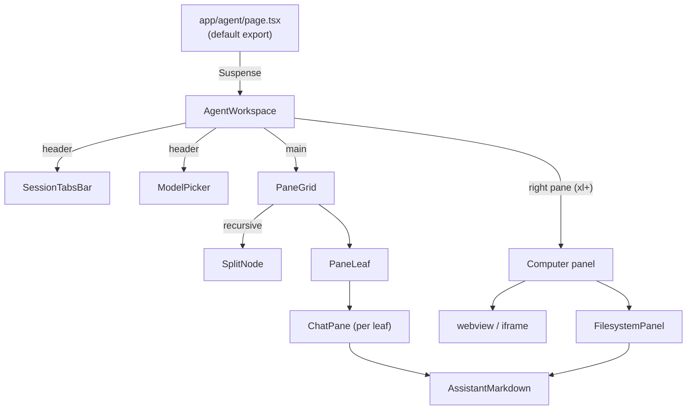

# Agent surface architecture

The agent UI lives at `/agent` and replaces the old `/chat` route. It is the
only interactive surface that talks to the new pi-runtime backend.

## Component tree



## Files at a glance

| File | Lines | Purpose |
| ---- | -----:| ------- |
| `frontend/src/app/agent/page.tsx` | 9 | Default export, wraps `<AgentWorkspace />` in `<Suspense>` because the workspace calls `useSearchParams`. |
| `frontend/src/app/agent/_components/agent-workspace.tsx` | 1,145 | Top-level layout, pane state, project state, browser bridge. |
| `frontend/src/app/agent/_components/chat-pane.tsx` | 1,231 | Per-pane chat thread, composer, replay, tabs. |
| `frontend/src/app/agent/_components/filesystem-panel.tsx` | 547 | Project file tree + viewer + per-line comments. |
| `frontend/src/app/agent/_components/pane-grid.tsx` | 213 | Recursive split tree renderer + edge drop zones. |
| `frontend/src/app/agent/_components/pane-layout.ts` | 95 | Pure data ops on `Layout` tree (split / remove / replace / setRatio). |
| `frontend/src/app/agent/_components/assistant-markdown.tsx` | 155 | `react-markdown` + `remark-gfm` + `rehype-highlight` renderer with copy button. |
| `frontend/src/app/agent/_components/chat-pane.test.ts` | 74 | Vitest unit test for `replaySessionEvents`. |

## `page.tsx`

```tsx
// frontend/src/app/agent/page.tsx
import { Suspense } from "react";
import { AgentWorkspace } from "./_components/agent-workspace";

export default function AgentPage() {
  return (
    <Suspense fallback={null}>
      <AgentWorkspace />
    </Suspense>
  );
}
```

The Suspense boundary exists solely because `AgentWorkspace` calls
`useSearchParams()` (Next 16 demands a Suspense parent for it). Commit
`6de110e1` is the one that added it.

## URL parameters consumed by the workspace

| Param | Meaning | Behavior |
| ----- | ------- | -------- |
| `project` | Project id from `loadAgentProjects()`. | If present and projects loaded, switches the workspace to that project (`selectProject`) and resets pane tabs to fresh sessions in that project's cwd. |
| `session` | Pi session UUID. | After projects/panes settle, hands the id to the focused pane's external loader (`registerExternalLoader`). The loader fetches `/api/agent/sessions/[id]?cwd=...` and replays events into the active tab. |
| `new` (`=1`) | Force a brand-new tab. | Same project switch, but skips replay and resets the focused pane to a single fresh tab. |

A `handledNavRef` (string built as `${project}|${session}|${new}`) prevents
re-firing on re-renders. Loader retries up to 30× with 50 ms backoff in case
the new pane hasn't called `registerExternalLoader` yet — see
`agent-workspace.tsx:441-453`.

## Pane state model

`panesById: Map<PaneId, PaneState>` lives on the workspace. Each `PaneState`
carries:

```ts
type PaneState = {
  tabs: SessionTab[];
  activeTabId: string;
  runtimeSessionId: string;
};
```

Each `SessionTab` carries its own `runtimeSessionId` (used as the
`PiRpcSession` key on the server), `piSessionId` (the pi UUID), `messages`,
`status`, and a token-stats record. **Per-tab runtime keys** were the change
introduced by `88371e55` ("scope new session to projects + per-tab pi
runtime") — before that, all tabs in a pane shared one server-side pi
process.

Pane layout shape is persisted under
`localStorage["vllm-studio.agent.paneLayout"]`; tab content is **not**
persisted because pi sessions live in their own JSONL files and re-load via
the sidebar URL navigation flow.

## Header chrome

The header (`agent-workspace.tsx:660-720`) shows:

- `Agent` brand label.
- Active project name + git branch chip (when `activeProject.hasGit`).
- `<SessionTabsBar>` for the focused pane.
- `<ModelPicker>` (a custom dropdown over the `/api/agent/models` payload).
- A `Computer` toggle visible only at `xl` breakpoint.

## Empty state

When `projectsLoaded && !selectedProjectId && projects.length === 0`, the
main panel shows a centered "Add a project to get started" CTA bound to
`triggerAddProjectFlow()` (a window event consumed by the
`ProjectsNavSection` in the sidebar) — see `agent-workspace.tsx:780-810`.

## Computer panel

Rendered when `rightPanelOpen === true` (only at `xl` breakpoint). It hosts
two tabs:

- **Browser**: an `<webview>` (Electron) or sandboxed `<iframe>` (dev),
  driven by `runBrowserCommand`.
- **Files**: `<FilesystemPanel cwd={activeProject.path} />`.

Width is restored from `localStorage["vllm-studio.agent.computer.width"]`
(clamped 320–960 px) and persisted on mouseup.

## See also

- [chat-pane-deep-dive.md](./chat-pane-deep-dive.md)
- [agent-workspace-deep-dive.md](./agent-workspace-deep-dive.md)
- [pi-runtime.md](./pi-runtime.md)
