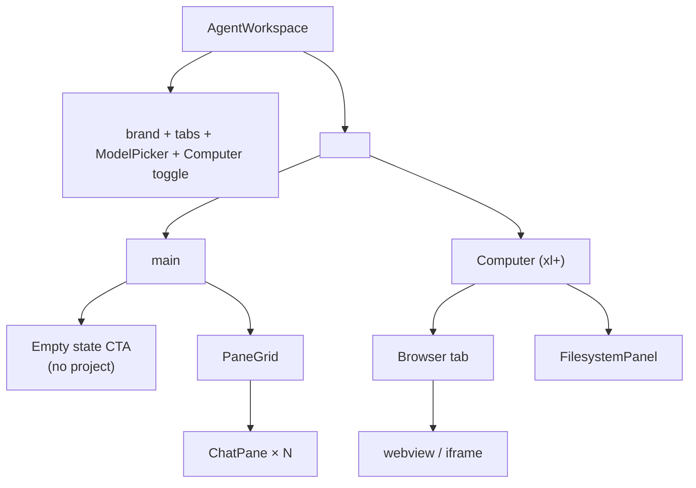

# `agent-workspace.tsx` — deep dive

> File: `frontend/src/app/agent/_components/agent-workspace.tsx`
> Size: **1,145 lines / ~45 KB**.

`<AgentWorkspace>` is the orchestrator for the agent surface. It owns:

- Project selection and the active `cwd`.
- Models loaded from `/api/agent/models` and the active selection.
- The full pane layout tree and per-pane state.
- The browser tool toggle, and the renderer-side dispatcher that runs
  agent-issued browser commands against the embedded `<webview>`.
- The "Computer" right-side panel (Browser tab + Files tab) and its width.

## High-level structure



## State

| State | Type | Notes |
| ----- | ---- | ----- |
| `models` | `AgentModel[]` | From `GET /api/agent/models`. |
| `selectedModel` | `string` | Defaults to the first `active` model, then the first model. |
| `agentCwd` | `string` | Either the active project path or `""`. Passed into every `ChatPane`. |
| `error`, `loadingModels` | strings/bools | UI banners. |
| `rightPanelOpen` | `boolean` | Toggles the Computer aside (xl+ breakpoint). |
| `browserUrl`, `browserInput` | `string` | Embedded browser address bar. Default `https://www.google.com`. |
| `projects`, `projectsLoaded`, `selectedProjectId` | project state | Hydrated from `loadAgentProjects()` (Electron IPC or `/api/agent/projects`). |
| `browserToolEnabled` | `boolean` | Persisted under `localStorage["vllm-studio.agent.browserToolEnabled"]`. Defaulted to OFF via a one-time migration key. |
| `activeComputerTab` | `"browser" | "files"` | Persisted under two boolean keys (`computer.browserOpen`, `computer.filesOpen`). |
| `computerWidth` | `number` | Persisted under `localStorage["vllm-studio.agent.computer.width"]`, clamped 320–960. |
| `layout` | `Layout` | Pane tree (see `pane-layout.ts`). Persisted under `localStorage["vllm-studio.agent.paneLayout"]` (shape only). |
| `panesById` | `Map<PaneId, PaneState>` | Per-pane tabs + runtime session id. |
| `focusedPaneId` | `PaneId` | The pane whose tabs render in the header. |

## Refs

- `webviewRef` — Electron `<webview>` element with `goBack`, `goForward`,
  `reload`, `loadURL`, `getURL`, `getTitle`, `executeJavaScript`,
  `capturePage`.
- `iframeRef` — fallback `<iframe>` for dev mode.
- `paneLoadersRef: Map<PaneId, (sessionId: string) => void>` — registry of
  per-pane "replay this session" callbacks. Each `<ChatPane>` registers via
  `registerExternalLoader` on mount; the workspace dispatches `loader(id)`
  when a sidebar URL navigation arrives or when a session pill is dropped on
  a pane edge.
- `handledNavRef` — guards URL-param replay against re-renders.

## Pane lifecycle

### Initial state

```ts
const [layout, setLayout] = useState<Layout>(() => ({
  kind: "leaf",
  paneId: "p-init",
}));
const [panesById, setPanesById] = useState<Map<PaneId, PaneState>>(() => {
  const tab = makeFreshTab();
  return new Map([
    ["p-init", { tabs: [tab], activeTabId: tab.id, runtimeSessionId: `rt-${...}` }],
  ]);
});
```

### Restore

A single layout-restore effect runs on mount (`agent-workspace.tsx:296-353`,
approx). It:

1. Cleans up legacy keys (`vllm-studio.agent.sessionsCollapsed`).
2. Performs a one-time migration that forces `browserToolEnabled` to
   `false` (`BROWSER_TOOL_DEFAULT_OFF_MIGRATION_KEY`).
3. Performs a one-time migration that closes both Computer sub-tabs
   (`COMPUTER_DEFAULT_CLOSED_MIGRATION_KEY`) — commit `cc12258f`.
4. Reads back the persisted layout shape, allocates a fresh `PaneState` per
   leaf, and selects the first leaf as focused.

### Split

```ts
onSplit={(paneId, direction, side, payload) => {
  const id = newPaneId();
  const runtime = newRuntimeId();
  const baseTab = makeFreshTab();
  setPanesById(...);                          // add new pane state
  setLayout(prev => splitLeaf(prev, paneId, id, direction, side));
  setFocusedPaneId(id);
  if (payload.piSessionId) {
    // poll until the new ChatPane registers its loader, then replay.
  }
}}
```

`splitLeaf` (in `pane-layout.ts`) replaces the target leaf with a
`{ kind: "split", direction, ratio: 0.5, a, b }` node. `removeLeaf` collapses
the orphan split when a pane is closed.

### Drag-and-drop replay

`<PaneGrid>` adds four invisible 6 px edge zones to every leaf. While a
session-pill drag (mime `application/x-vllm-session`) is held over an edge,
that half of the pane lights up in `--accent`. On drop:

1. Workspace receives `(paneId, direction, side, { piSessionId })`.
2. Splits, focuses the new pane.
3. After ~16 ms (waits for the new pane to register its loader), invokes
   `loader(piSessionId)` which calls `loadAndReplay` inside the new
   `<ChatPane>`.

## Browser tool dispatcher

When `browserToolEnabled === true`, an `EventSource("/api/agent/browser/events")`
is opened (commit `c5c6894e`). Each command JSON received is dispatched to
`runBrowserCommand(verb, payload)`; the result is POSTed back to
`/api/agent/browser/result`.

`runBrowserCommand` supports the eight verbs (`navigate`, `get-url`,
`get-text`, `get-html`, `screenshot`, `click`, `scroll`, `fill`). It runs
each verb against `webviewRef.current.executeJavaScript(...)` for Electron,
or falls back to limited iframe ops (only `navigate` and `get-url` work
cross-origin). Every operation goes through `withBrowserTimeout` (12 s) so a
wedged page can't hang the agent indefinitely.

`detectBotProtection` scans the returned text/HTML for "unusual traffic",
"/sorry/", "captcha", "not a robot" and returns a refusal string the model
can read (commit `e0ad6ac2`).

## Address bar — `normalizeBrowserInput`

The agent and the user share the address bar. To make `cd`-aware paths
work, the function tries multiple shapes in order:

1. Already-`file://` URLs → returned as-is.
2. `~/foo` → expanded against the cwd's home prefix (Mac `/Users/<u>/`,
   Linux `/home/<u>/`).
3. Absolute path `/foo` → wrapped as `file://`.
4. `./foo` / `../foo` → resolved relative to cwd, then wrapped as `file://`.
5. `http(s)://` → forwarded.
6. `localhost` / `127.0.0.1` / `[::1]` (with optional port/path) →
   prefixed with `http://`.
7. `host:port` → prefixed with `http://`.
8. `domain.tld[/path]` → prefixed with `https://`.
9. Anything else with `/` → resolved relative to cwd.
10. Fallback → `https://www.google.com/search?q=...` (commit `eb0cf285`).

## URL-param consumption

Implemented at `agent-workspace.tsx:418-468`. Triggered by `?project=` /
`?session=` / `?new=1` from the sidebar links. Idempotent via
`handledNavRef`. Project param waits for `projects` to load; if the project
is found and not already selected, calls `selectProject` (which resets every
pane to a fresh tab so a new pi child starts with the right cwd).

## Active sessions broadcast

```ts
useEffect(() => {
  const sessions = [...panesById.entries()].flatMap(...);
  window.dispatchEvent(new CustomEvent(ACTIVE_AGENT_SESSIONS_EVENT, {
    detail: { sessions },
  }));
}, [activeProject, panesById]);
```

The sidebar listens for this event (`projects-nav-section.tsx:240-252`) and
overlays the running tabs above each project's recent sessions list — so an
in-progress chat shows up as "current" with the live status.

## Computer panel

Renders inside `<aside>` at `xl` breakpoint. The aside is resizable via a
`role="separator"` strip on the left edge; mousedown installs `mousemove`
and `mouseup` listeners, persisting on mouseup. Two tabs:

- **Browser**: address bar form + back/forward/reload + `<webview>` (or
  `<iframe>` with `sandbox="allow-scripts allow-same-origin allow-forms allow-popups"`).
- **Files**: `<FilesystemPanel cwd={activeProject?.path ?? null} />`.

## ModelPicker

A small dropdown at the bottom of the file. Lists model `name`, `· reasoning`
when `model.reasoning`, and `· {ctx}k` when `contextWindow` is set. Closes
on outside click via a `mousedown` listener installed when `open`.

## Notable env wiring

The workspace itself doesn't read env vars — but it relies on the server
side env that pi-runtime sets. See [pi-runtime.md](./pi-runtime.md) for the
`VLLM_STUDIO_FRONTEND_BASE` / `PI_CODING_AGENT_DIR` / `VLLM_STUDIO_DATA_DIR`
plumbing.
