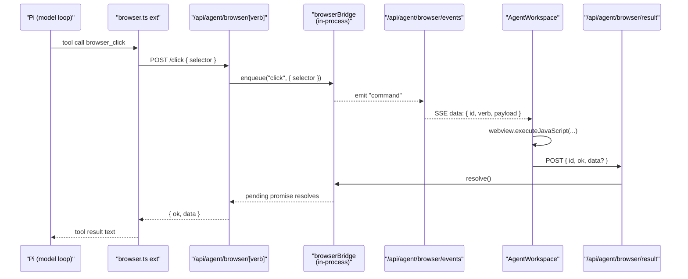

# Electron desktop changes

The Electron layer received its first major changes in this PR. Stats:
**10 files / +382 / −14**.

| File | Status | Highlights |
| ---- | ------ | ---------- |
| `frontend/desktop/main.ts` | M | Five new IPC handlers for the project picker. Imports `addProject`, `listProjectsWithMeta`, `removeProject`. |
| `frontend/desktop/preload.ts` | M | Exposes `openDirectory`, `getPathForFile`, `listProjects`, `addProject`, `removeProject` on `window.vllmStudioDesktop`. |
| `frontend/desktop/interfaces.ts` | M | Adds `ProjectEntry`, extends `DesktopBridge` and `IpcRequestMap`. |
| `frontend/desktop/logic/projects-store.ts` | A | Brand-new store at `app.getPath("userData")/projects.json`. |
| `frontend/desktop/logic/security.ts` | M | Refines navigation policy: top-level `BrowserWindow` only. |
| `frontend/desktop/logic/window-manager.ts` | M | `webviewTag: true` + harden flags. |
| `frontend/desktop/logic/app-server.ts` | M | Sets `VLLM_STUDIO_FRONTEND_BASE` and `VLLM_STUDIO_AGENT_CWD` for the embedded server. |
| `frontend/desktop/electron-builder.yml` | M | Ships pi extensions in `extraResources`. |
| `frontend/desktop/resources/entitlements.mac.plist` | M | Tightened mac entitlements. |
| `frontend/desktop/resources/pi-extensions/browser.ts` | A | New 8-tool extension for the pi child. |

## IPC channels (allowlist)

| Channel | Direction | Implementation |
| ------- | --------- | -------------- |
| `desktop:get-runtime` | invoke | Returns `{ platform, appVersion, chromeVersion, electronVersion }`. (existing) |
| `desktop:open-external` | invoke | `shell.openExternal(url)` — only for http(s). (existing) |
| `desktop:get-update-status` | invoke | Auto-update snapshot. (existing) |
| `desktop:check-for-updates` | invoke | Force update check. (existing) |
| `desktop:open-directory` | invoke | **New.** Opens `dialog.showOpenDialog({ properties: ["openDirectory"] })`. On success calls `addProject(selected)` and returns the `ProjectListEntry`. |
| `desktop:list-projects` | invoke | **New.** `listProjectsWithMeta()`. |
| `desktop:add-project` | invoke | **New.** `addProject(path)`. |
| `desktop:remove-project` | invoke | **New.** `removeProject(id)`. |

`preload.ts` exposes exactly this set on `window.vllmStudioDesktop` via
`contextBridge.exposeInMainWorld`. It also exposes `getPathForFile(file)`
which wraps Electron's `webUtils.getPathForFile` so the renderer can resolve
the absolute path of a `<File>` from the directory picker (for the dev/web
fallback path).

## `DesktopBridge` interface

```ts
export interface DesktopBridge {
  getRuntime(): Promise<{ platform, appVersion, chromeVersion, electronVersion }>;
  openExternal(url: string): Promise<boolean>;
  getUpdateStatus(): Promise<DesktopUpdateSnapshot>;
  checkForUpdates(): Promise<DesktopUpdateSnapshot>;
  openDirectory(): Promise<ProjectEntry | null>;
  getPathForFile(file: File): string;
  listProjects(): Promise<ProjectEntry[]>;
  addProject(directoryPath: string): Promise<ProjectEntry>;
  removeProject(id: string): Promise<{ ok: true }>;
}
```

`ProjectEntry` matches the renderer's view: `{ id, name, path, addedAt,
exists, hasGit, branch }`.

## `desktop/logic/projects-store.ts`

Persists at `path.join(app.getPath("userData"), "projects.json")` — i.e.

- macOS: `~/Library/Application Support/vLLM Studio/projects.json`
- Linux: `~/.config/vLLM Studio/projects.json`
- Windows: `%APPDATA%/vLLM Studio/projects.json`

Implementation mirrors `lib/agent/projects-store.ts` (atomic temp+rename,
`gitBranchFor`, dedupe by path) — they're independent but kept in sync.

The renderer prefers the IPC bridge whenever any of `openDirectory`,
`getPathForFile`, `listProjects`, `removeProject` is present
(`projects-nav-section.tsx:getDesktopBridge()`).

## `desktop/logic/security.ts`

Two functions, both updated:

```ts
export function hardenWebContents(window, appOrigin) {
  window.webContents.setWindowOpenHandler(({ url }) => {
    if (isHttpUrl(url)) void shell.openExternal(url);
    return { action: "deny" };
  });
  window.webContents.on("will-navigate", (event) => {
    const targetOrigin = safeOrigin(event.url);
    if (!targetOrigin || targetOrigin !== appOrigin) {
      event.preventDefault();
      if (isHttpUrl(event.url)) void shell.openExternal(event.url);
    }
  });
}

export function registerNavigationPolicy(appOrigin) {
  app.on("web-contents-created", (_, contents) => {
    contents.on("will-attach-webview", (_e, webPreferences) => {
      delete webPreferences.preload;
      webPreferences.nodeIntegration = false;
      webPreferences.contextIsolation = true;
      webPreferences.sandbox = true;
    });
    contents.on("will-navigate", (event) => {
      // Guest (cross-origin / OOPIF) WebContents are not owned by a
      // BrowserWindow — origin-locking those would leave the Computer
      // sidebar iframe permanently blank.
      if (BrowserWindow.fromWebContents(contents) == null) return;
      const targetOrigin = safeOrigin(event.url);
      if (!targetOrigin || targetOrigin !== appOrigin) event.preventDefault();
    });
  });
}
```

The "guest WebContents" exception is the change that lets the Computer
panel's `<webview>` actually navigate to arbitrary URLs (commit `e0ad6ac2`).

## `desktop/logic/window-manager.ts`

```ts
webPreferences: {
  preload: path.join(__dirname, "../preload.js"),
  contextIsolation: true,
  nodeIntegration: false,
  sandbox: true,
  webviewTag: true,                       // <-- enables the Computer browser
  webSecurity: true,
  devTools: !process.env.VLLM_STUDIO_DESKTOP_DISABLE_DEVTOOLS,
  allowRunningInsecureContent: false,
  navigateOnDragDrop: false,
}
```

`webviewTag: true` is required for the embedded `<webview>` element used by
the Computer panel.

## `desktop/logic/app-server.ts`

Two new env vars passed into the embedded standalone Next server child:

```ts
VLLM_STUDIO_DATA_DIR: DESKTOP_CONFIG.userDataDir,
VLLM_STUDIO_AGENT_CWD: process.env.VLLM_STUDIO_AGENT_CWD || app.getPath("home"),
VLLM_STUDIO_FRONTEND_BASE: url, // 127.0.0.1:<port>
```

The `VLLM_STUDIO_AGENT_CWD` default of `$HOME` is what makes the packaged
app stop running pi from `/`. `VLLM_STUDIO_FRONTEND_BASE` is what lets the
pi browser extension call back via an absolute URL.

## `electron-builder.yml`

```yaml
extraResources:
  - from: .next/standalone
    to: app/frontend/.next/standalone
  - from: .next/standalone/node_modules
    to: app/frontend/.next/standalone/node_modules
  - from: .next/static
    to: app/frontend/.next/standalone/frontend/.next/static
  - from: public
    to: app/frontend/.next/standalone/frontend/public
  - from: desktop/resources/pi-extensions    # <-- new
    to: desktop/resources/pi-extensions
```

The pi extension ships at `process.resourcesPath/desktop/resources/pi-extensions/browser.ts`,
which is exactly the second candidate `pi-runtime.ts:resolveBrowserExtensionPath()`
checks.

## `resources/entitlements.mac.plist`

The mac entitlements file was tightened. Final state:

```xml
<key>com.apple.security.app-sandbox</key>            <false/>
<key>com.apple.security.cs.allow-jit</key>           <true/>
<key>com.apple.security.cs.allow-unsigned-executable-memory</key> <false/>
<key>com.apple.security.cs.disable-library-validation</key> <true/>
<key>com.apple.security.cs.allow-dyld-environment-variables</key> <false/>
<key>com.apple.security.network.client</key>         <true/>
```

`disable-library-validation: true` is required because pi (a Bun/Node
binary) and its extensions must load unsigned dylibs.

## Pi browser extension (`pi-extensions/browser.ts`)

Loaded via `--extension <path>` only when the user has the browser tool
toggled on. Imports from `@mariozechner/pi-coding-agent` and `typebox`. Reads
`VLLM_STUDIO_FRONTEND_BASE` (set by both pi-runtime and the Electron
app-server) and POSTs each tool call to `/api/agent/browser/<verb>`.

The eight registered tools and their pi-side names:

| Pi tool name | Verb sent | Parameters | What it does |
| ------------ | --------- | ---------- | ------------ |
| `browser_navigate` | `navigate` | `{ url: string }` | Loads a URL in the embedded webview. |
| `browser_get_url` | `get-url` | `{}` | Returns `{ url, title }`. |
| `browser_get_text` | `get-text` | `{}` | Returns `document.body.innerText`. |
| `browser_get_html` | `get-html` | `{}` | Returns `documentElement.outerHTML`. |
| `browser_screenshot` | `screenshot` | `{}` | Returns a PNG data URI. |
| `browser_click` | `click` | `{ selector: string }` | Clicks the first matching element. |
| `browser_scroll` | `scroll` | `{ deltaY: number }` | Scrolls the page vertically. |
| `browser_fill` | `fill` | `{ selector, value }` | Sets value + fires `input` and `change`. |

Each tool wraps `callBrowserAction(verb, payload, signal)` which throws if
the HTTP response is not `ok` or if the JSON `{ ok: false, error }`. The
result text is either `result.data` (when string) or pretty-printed JSON.

Round trip:


