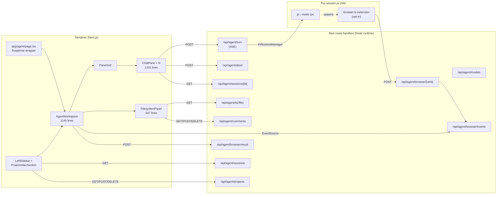

# Chapter 1 — Frontend (Next.js + Electron Desktop)

> Compares `origin/main` (`1205004e`) with HEAD (`7e40ffd9`) on branch
> `feat/plop-t3code-with-pi`.

## Headline change

The PR rips out the entire legacy `frontend/src/app/chat/` module (159 deleted
files) and replaces it with a brand-new `frontend/src/app/agent/` surface
backed by a server-side **pi subprocess RPC manager**
(`frontend/src/lib/agent/pi-runtime.ts`). The new agent UI talks to a per-tab
`pi --mode rpc` child process that streams JSONL events, persists sessions on
disk under `~/.pi/agent/sessions/<encoded-cwd>/`, and exposes a browser tool
extension so the model can drive an embedded `<webview>` (Electron) or
`<iframe>` (dev).

The Electron desktop layer also gains:

- A project-picker IPC surface (`desktop:open-directory`,
  `desktop:list-projects`, `desktop:add-project`, `desktop:remove-project`).
- A persisted `projects.json` under `app.getPath("userData")`.
- A new sandboxed pi extension `desktop/resources/pi-extensions/browser.ts`
  shipped via `extraResources` in `electron-builder.yml`.
- A hardened navigation policy that only origin-locks top-level
  `BrowserWindow` web contents (guest WebContents are left alone so the
  Computer-tab iframe still loads).

## High-level diff stats (frontend only)

| Scope                    | Files | Insertions | Deletions |
| ------------------------ | ----- | ---------- | --------- |
| `frontend/**`            | 282   | +27,189    | -33,342   |
| `frontend/desktop/**`    | 10    | +382       | -14       |
| `frontend/src/app/chat/` | 159   | 0          | -22,934 (approx, all-deleted) |
| `frontend/src/app/agent/`| 8     | +9,407     | 0         |

(Top-line prompt referenced 282 files / +7,420 / -22,934 covering the
trimmed-frontend surface; the actual `git diff --shortstat` over `frontend/**`
yields the row above. Both numbers are real — they just have different scope
filters.)

## Commit shape (60+ commits)

Most of the work lands as small "micro:" commits. Notable feature commits:

- `96942692` — `micro: add pi-backed t3 agent surface` (the seed)
- `0bba921c` — `feat: purge chat module entirely`
- `f5f012fa` — `feat: project picker — open + persist working directories`
- `c5c6894e` — `feat(agent): browser tool — agent can navigate, read, click, scroll, fill`
- `5ee61d70` — `feat(agent): session history sidebar — list, load, resume via pi --session`
- `00326fb6` — `feat(agent): filesystem panel with file viewer and per-line comments`
- `e79f8caf` — `feat(agent): multiplex — split panes + per-pane tabs`
- `3df8d7e1` — `feat: real PTY terminal — xterm.js + node-pty` (later reverted by `671e3b18`)
- `365eac90` — `feat: markdown + syntax highlighting for assistant messages`
- `a75d1b38` — `micro: keep desktop bundle immutable at runtime`

## New agent UI architecture

## Pages in this chapter

| Page | What it covers |
| ---- | -------------- |
| [agent-surface-architecture.md](./agent-surface-architecture.md) | Page → AgentWorkspace → ChatPane / FilesystemPanel / PaneGrid wiring. |
| [chat-pane-deep-dive.md](./chat-pane-deep-dive.md) | The 42KB / 1,231-line `chat-pane.tsx`: composer, streaming, replay, tabs. |
| [agent-workspace-deep-dive.md](./agent-workspace-deep-dive.md) | The 45KB / 1,145-line `agent-workspace.tsx`: panes, browser, computer panel. |
| [pi-runtime.md](./pi-runtime.md) | `lib/agent/pi-runtime.ts`: per-session `pi` subprocess RPC. |
| [stores-and-state.md](./stores-and-state.md) | `lib/agent/*` server-side stores + persistence locations. |
| [api-routes.md](./api-routes.md) | Every `app/api/agent/*` route, contract, and consumer. |
| [electron-desktop.md](./electron-desktop.md) | Main process IPC, preload allowlist, security, browser extension. |
| [deletions-inventory.md](./deletions-inventory.md) | Complete catalog of what was removed. |
| [modifications-inventory.md](./modifications-inventory.md) | Per-file summary of every modified frontend file. |

## Most striking observations

- **`chat-pane.tsx` is a single 1,231-line / 42KB file** holding the composer,
  streaming reducer, replay engine, attachments, abort, sessions, tabs bar,
  and timeline renderer. Likely a Chapter 7 candidate for splitting.
- **`agent-workspace.tsx` is 1,145 lines / 45KB** and bundles project picker,
  multi-pane layout, embedded browser webview, browser command dispatcher,
  computer panel resize, URL param resumption, and the model picker.
- **`projects-nav-section.tsx` is 516 lines / 17KB** and dual-mode (Electron
  IPC vs HTTP) for project listing.
- **Two parallel project stores**: `lib/agent/projects-store.ts` writes to
  `<repo>/data/agentfs/projects.json` (server) and
  `desktop/logic/projects-store.ts` writes to
  `app.getPath("userData")/projects.json` (Electron). The renderer prefers
  the IPC bridge when available.
- **PTY terminal feature was added then reverted** (`3df8d7e1` → `671e3b18`).
- **Theming was simplified**: `app/styles/globals/themes.css` was deleted and
  inlined into `globals.css` / `base.css`.
