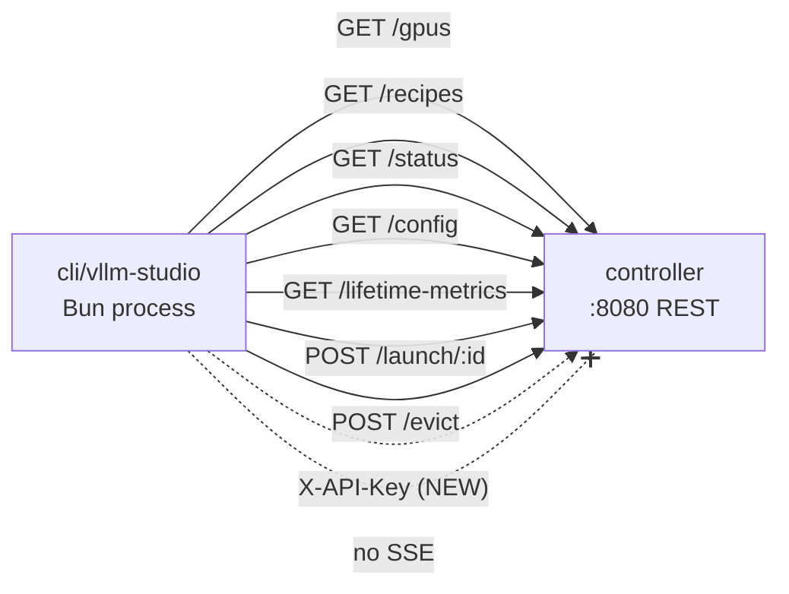

# CLI Architecture Overview

This page exists so a reviewer who has never opened `cli/` can understand the surface area without reading every file. None of what follows is novel to this PR — it's context.

## Two modes, one entry point

`cli/src/main.ts` decides at startup which mode to run in:

```ts
// cli/src/main.ts
if (process.argv.length > 2) {
  const { runHeadless } = await import("./headless");
  await runHeadless();
  process.exit(process.exitCode ?? 0);
}
// ...otherwise fall through to the TUI loop
```

| Mode | Trigger | Output |
|---|---|---|
| Interactive TUI | `vllm-studio` (no args) | Full-screen ANSI UI, requires TTY |
| Headless | `vllm-studio <command>` | JSON to stdout, exit code 0/1 |

## TUI render loop

`main.ts` keeps a single `AppState` object (`cli/src/types.ts`) and re-renders the whole screen on every change:

```text
+-----------+      poll every 2s      +-----------------+
|  AppState | <---------------------- | controller REST |
+-----------+                         +-----------------+
      |
      v
+-----------+    keypress (raw)
|  render() | <----------------- input.ts
+-----------+
      |
      v
  views/dashboard | recipes | status | config
      |
      v
   stdout (ANSI)
```

Concretely:

- `setInterval(refresh, 2000)` in `main.ts` calls `Promise.allSettled([fetchGPUs, fetchRecipes, fetchStatus, fetchConfig, fetchLifetimeMetrics])` and assigns into `AppState`.
- `setupInput()` in `input.ts` puts stdin in raw mode and maps escape sequences (`\x1b[A` → `up`, `\r` → `enter`, etc.) to a small string vocabulary.
- `render()` in `render.ts` clears the screen, prints the tab header, dispatches to one of four view renderers, and prints a footer hint line.
- View renderers (`cli/src/views/*.ts`) are pure: they take `AppState` and return a string.

## Headless dispatch

`cli/src/headless.ts` is a flat command table:

```ts
const COMMANDS: Record<string, CommandHandler> = {
  status:  async () => console.log(JSON.stringify(await api.fetchStatus(), null, 2)),
  gpus:    async () => console.log(JSON.stringify(await api.fetchGPUs(), null, 2)),
  recipes: async () => console.log(JSON.stringify(await api.fetchRecipes(), null, 2)),
  config:  async () => console.log(JSON.stringify(await api.fetchConfig(), null, 2)),
  metrics: async () => console.log(JSON.stringify(await api.fetchLifetimeMetrics(), null, 2)),
  evict:   async () => { /* POST /evict, exit code 0/1 */ },
  launch:  async () => { /* POST /launch/:id, exit code 0/1 */ },
  help:    async () => { /* prints usage */ },
};
```

Errors are caught at the top of `runHeadless`, printed to stderr, and exit with code `1`. Successful queries print pretty-printed JSON and exit `0`. Mutations (`launch`, `evict`) print `{ "success": <bool> }` and use that bool as the exit code.

## Network topology



Things to note:

- The CLI does **not** open SSE connections. It does not consume `/events` or any of the new `engineService` channels — see `gaps.md`.
- All HTTP traffic flows through one wrapper (`requestJson` in `cli/src/api.ts`), which is the sole place that knows about base URL and (now) API key. This is good single-chokepoint design.
- The CLI does not talk to anything other than the controller. There is no direct GPU/process inspection on the CLI side.

## Build & distribution

`cli/package.json` defines:

```json
"scripts": {
  "start": "bun src/main.ts",
  "build": "bun build src/main.ts --compile --outfile vllm-studio",
  "test":  "vitest run",
  "lint":  "eslint .",
  "typecheck": "tsc --noEmit",
  "check": "knip && jscpd src && depcheck"
}
```

`bun build --compile` produces a self-contained executable (the 60 MB `cli/vllm-studio` artifact). The CLI also has its own ESLint config, Prettier config, husky setup, knip config, jscpd config, and depcheck config — all separate from the root and from `controller/`.

## Type sharing

`cli/src/types.ts` defines local TUI-only types (`View`, `AppState`, view-specific `GPU`, `Status`, `Config`, `LifetimeMetrics`) and re-exports two from the controller's shared module:

```ts
import type { Backend as SharedBackend, RecipePayload } from "../../controller/src/modules/shared/recipe-types";
export type Backend = SharedBackend;
export type Recipe = Pick<RecipePayload, "id" | "name" | "model_path" | "backend" | "tensor_parallel_size" | "max_model_len">;
```

After this PR (post-`shared/` purge), the CLI is the only top-level workspace that imports across workspace boundaries via a relative path. See Chapter 8.

## File map summary

| Layer | File(s) |
|---|---|
| Entry / orchestration | `src/main.ts`, `src/headless.ts` |
| HTTP client | `src/api.ts` (+ `src/api.test.ts`) |
| Render / view | `src/render.ts`, `src/views/{dashboard,recipes,status,config}.ts` |
| Terminal primitives | `src/ansi.ts`, `src/input.ts` |
| Types | `src/types.ts` |
| Tooling | `package.json`, `tsconfig.json`, `eslint.config.mjs`, `vitest.config.ts`, `knip.ts`, `.depcheckrc.json`, `.jscpd.json`, `.prettierrc.json`, `.lintstagedrc.json` |
| Build artifact | `vllm-studio` (60 MB, committed) |
