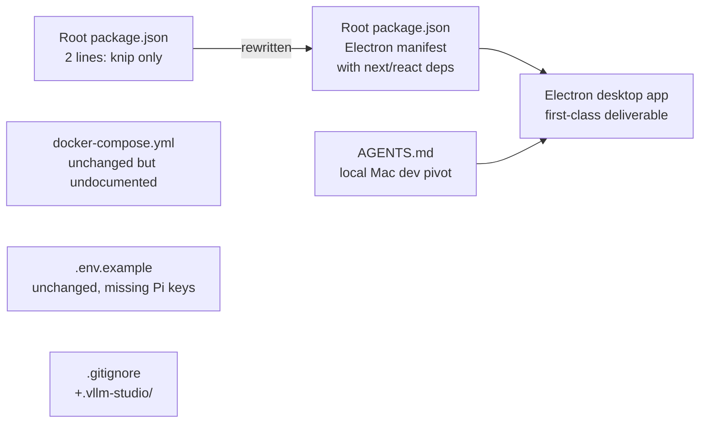

# 4.3 — Build, Package, and Environment

This page covers the root-level build/package files. The most consequential
change here is the **complete rewrite of the root `package.json`**: it has
flipped from a near-empty workspace placeholder into the descriptor for the
**Electron desktop app**.

| File | Status | Significance |
|---|---|---|
| `package.json` (root) | Modified | Repurposed as Electron app manifest |
| `package-lock.json` | Unchanged in this PR's diff | — |
| `release.config.cjs` | Unchanged | Still tags + GitHub Release only |
| `docker-compose.yml` | Unchanged | postgres + litellm still defined, no longer mentioned in `AGENTS.md` |
| `.env.example` | Unchanged | — |
| `.gitignore` | Modified | Added `.vllm-studio/` per-project agent comments |

---

## Root `package.json` — From Placeholder to Electron Manifest

### Before (`origin/main`)

```json
{
  "devDependencies": {
    "knip": "^6.4.1"
  }
}
```

That was the entire file. No name, no version, no scripts — just a knip
devDependency for the unused-code linter.

### After (HEAD)

```json
{
  "name": "frontend",
  "version": "0.2.1",
  "private": true,
  "dependencies": {
    "electron-updater": "^6.6.2",
    "framer-motion": "^12.24.10",
    "lucide-react": "^0.561.0",
    "markdown-it": "^14.1.0",
    "mermaid": "^10.9.5",
    "next": "^16.1.6",
    "react": "19.2.1",
    "react-dom": "19.2.1",
    "react-syntax-highlighter": "^16.1.0",
    "react-virtuoso": "^4.18.1",
    "zustand": "^4.5.4"
  },
  "main": "desktop/dist/main.js"
}
```

### What this is

The repo root `package.json` is now (effectively) a **mirror of
`frontend/package.json`** with:

- `"name": "frontend"` (yes, the *root* package is named "frontend")
- `"main": "desktop/dist/main.js"` — the Electron entry point lives under
  `frontend/desktop/`, but the path is rooted at the repo root because Electron
  is invoked from that root when packaging
- Runtime deps: `next`, `react`, `react-dom`, `electron-updater`, plus the
  same UI libs the frontend uses (`framer-motion`, `lucide-react`, `mermaid`,
  `markdown-it`, `react-virtuoso`, `zustand`)

### Why "name": "frontend" at the root?

Because `npm run desktop:dist` (per `AGENTS.md`) runs from `frontend/` and
references the root via `..`. The `electron-builder` config inside
`frontend/` treats the whole repo root as the Electron app's root — including
the parent `package.json`. Naming the root package "frontend" lines up
identifiers across `electron-builder`, the dock title, and the bundle id
(`org.vllm.studio.desktop`).

### Trade-offs

| Concern | Status |
|---|---|
| Two `package.json` files with overlapping deps | Yes — root + `frontend/`. `npm install` at root duplicates from `frontend/`. |
| `knip` config gone | The previous `devDependencies: { knip }` is removed; dead-code linting at the root is no longer wired. |
| Trailing newline | The new file lacks a trailing newline (`\ No newline at end of file`). Cosmetic but trips some linters. |
| Workspaces declaration | Not present — confirms Section 4.1's hypothesis that the workspace package model is gone with `shared/`. |

This is one of the more **structurally aggressive** edits in the PR. Reviewers
should be sure the root `package.json` is intentional and not a stray
`npm init` artifact.

---

## `docker-compose.yml` — Unchanged but Demoted

The file is byte-identical to `origin/main`. It still defines two services:

```yaml
services:
  postgres:
    image: postgres:16
    container_name: vllm-studio-postgres
    ports: [ "5432:5432" ]
    volumes: [ ./data/postgres:/var/lib/postgresql/data ]
    ...

  litellm:
    image: ghcr.io/berriai/litellm:main-latest
    container_name: vllm-studio-litellm
    ports: [ "4100:4000" ]
    volumes:
      - ./config/litellm.yaml:/app/config.yaml
      - ./config/think_parser.py:/app/think_parser.py
      - ./data:/app/data
    ...
```

But `AGENTS.md` no longer mentions Docker for staging *or* for prod
(`AGENTS.md` on `main` had: "Controller (bun :8080) and frontend (next :3000)
run natively; postgres + litellm in Docker"; now: "...run natively."). The
compose file is therefore in a **mild orphan state**:

- Still functional if invoked manually (`docker compose up postgres litellm`)
- No longer referenced by the documented workflow
- The deploy script (`scripts/deploy-remote.sh` — see
  [4.5](./scripts-and-tooling.md)) does not invoke compose either

This is a Chapter 7 nudge: either bring `docker-compose.yml` back into the
documented flow, or delete it (and `config/litellm.yaml`,
`config/think_parser.py` — both consumed only by the LiteLLM container).

---

## `.env.example` — Unchanged

105 lines of documented environment variables, organised into sections:

| Section | Sample vars |
|---|---|
| Controller Settings | `VLLM_STUDIO_HOST`, `VLLM_STUDIO_PORT`, `VLLM_STUDIO_API_KEY`, `VLLM_STUDIO_INFERENCE_PORT` |
| Paths | `VLLM_STUDIO_MODELS_DIR`, `VLLM_STUDIO_DATA_DIR` |
| Backend-specific | `VLLM_STUDIO_SGLANG_PYTHON`, `VLLM_STUDIO_TABBY_API_DIR`, `VLLM_STUDIO_LLAMA_BIN`, `VLLM_STUDIO_EXLLAMAV3_COMMAND` |
| LiteLLM Gateway | `LITELLM_MASTER_KEY`, `VLLM_STUDIO_LITELLM_DATABASE_URL`, `INFERENCE_API_BASE` |
| Frontend Settings | `NEXT_PUBLIC_LITELLM_URL`, `VLLM_STUDIO_UID`, `VLLM_STUDIO_GID` |
| Search Integration | `EXA_API_KEY` |

The header reads:

> # CRITICAL
> # vLLM Studio Configuration
> # Copy this file to .env and modify as needed

This file is **not** updated to reflect the new Pi agent surface. There is no
`PI_*` env, no `OPENAI_API_KEY`, no `ANTHROPIC_API_KEY` — even though
`scope.md` discusses cross-provider OAuth and external API providers. That's
either:

1. Intentional (`.env.local` carries those, kept off-tree), or
2. A documentation gap

Cross-link to **Chapter 7**: `.env.example` should grow PI-related entries if
the agent surface is now first-class.

---

## `.gitignore` — One Addition

The diff is small:

```diff
 .factory

+# Per-project agent comments (created when the user adds comments via the
+# vLLM Studio agent surface). Project-local, not shared.
+.vllm-studio/
+
 website-dist
```

### Why

The new agent surface (`/agent` in the frontend, see Chapter 1) lets users
attach comments to files in *the project they have open*. Those comments are
written under `.vllm-studio/` in whichever project the user is browsing. The
ignore rule is therefore not about the vllm-studio repo itself — it's
defensive against the agent dropping `.vllm-studio/` in *another* repo's tree
when developers test the agent locally against their own projects.

### Pre-existing `.factory` ignore

The `.factory` directory was already ignored on `main`. This PR **deletes the
checked-in contents** of that directory (`security-config.json`,
`threat-model.md`) — see [4.4](./factory-config-removal.md) — meaning the
ignore rule was either always slightly inconsistent (ignoring a checked-in
directory) or the deletion is the consistency fix.

---

## `release.config.cjs` — Unchanged

```js
/**
 * Monorepo, protected `main`: no npm publish, no direct commits to main.
 * Creates Git tag + GitHub Release only (release notes from commits).
 * @type {import("semantic-release").GlobalConfig}
 */
module.exports = {
  branches: ["main"],
  plugins: [
    "@semantic-release/commit-analyzer",
    "@semantic-release/release-notes-generator",
    "@semantic-release/github",
  ],
};
```

Important context: `semantic-release` reads commit messages from `main` to
produce a tag + release. Most of the commits on this branch are
`micro: ...` style (per `git log origin/main..HEAD`):

```
7e40ffd9 micro: refine agent session UI
002540bd micro: render file previews
9badd86a micro: improve agent browser navigation
...
```

`micro:` is **not** a `commit-analyzer` recognized prefix (it expects
`feat:`, `fix:`, `BREAKING CHANGE:`, etc.). When this branch lands on `main`,
`semantic-release` will likely produce **no release** unless one squash commit
uses a recognised type. This isn't a code defect, but it is a release-process
note worth flagging.

---

## `package-lock.json` — Unchanged in this PR

The root `package-lock.json` was not modified by the diff scope this chapter
covers. (Frontend/controller lockfiles are handled in their own chapters.) If
the new root `package.json` was added without re-running `npm install` at
root, the root tree may be in a "no-lock" state. That's a Chapter 6
correctness concern.

---

## Bottom line



The shape of the change: **the root of the repo is being repurposed for
Electron packaging**, while the previously-documented Docker compose flow is
quietly demoted. Reviewers should confirm that's deliberate.
