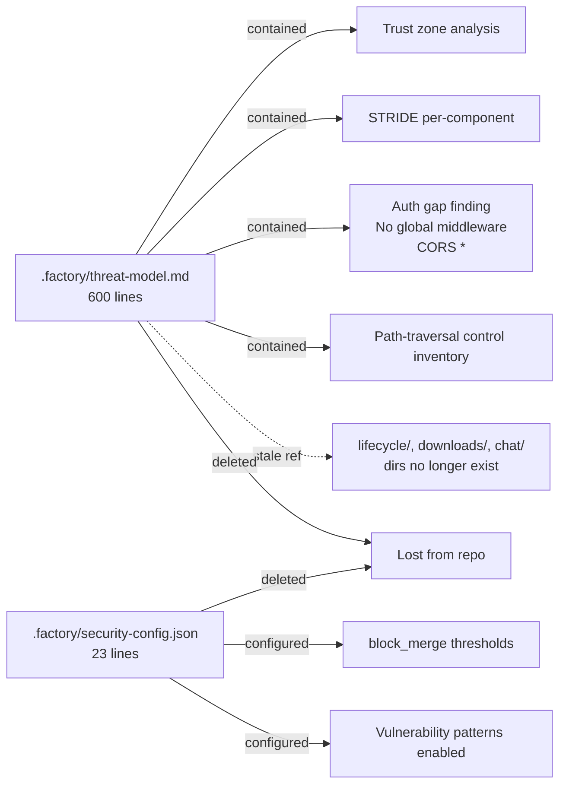

# 4.4 — `.factory/` Security Artifacts Removed

This PR **deletes** two checked-in files from `.factory/`:

| Path | Lines | Status |
|---|---|---|
| `.factory/security-config.json` | 23 | Deleted |
| `.factory/threat-model.md` | 600 | Deleted |

`.factory/` was already in `.gitignore` on `main` (`.gitignore` line: `.factory`),
so the deletion brings the working tree in line with the ignore rule. But the
*contents* of those files were non-trivial and represented a real security
artifact. This page documents what was lost so reviewers can decide whether
to restore it elsewhere.

> **Cross-reference:** This is flagged in **Chapter 6 (Complexity / Risk)**
> and **Chapter 7 (Files to Improve)**. The deletion itself is a low-risk
> code change but has high *governance* impact.

---

## `.factory/security-config.json`

The full deleted file (23 lines):

```json
{
  "threat_model_version": "1.0.0",
  "last_updated": "2026-03-01T18:33:22Z",
  "security_team_contacts": [],
  "compliance_requirements": [],
  "scan_frequency": "on_commit",
  "severity_thresholds": {
    "block_merge": ["CRITICAL"],
    "require_review": ["HIGH", "CRITICAL"],
    "notify_security_team": ["CRITICAL"]
  },
  "vulnerability_patterns": {
    "enabled": [
      "sql_injection",
      "xss",
      "command_injection",
      "path_traversal",
      "auth_bypass",
      "idor"
    ],
    "custom_patterns_path": null
  }
}
```

### What it configured

- **Pinned threat-model version** (`1.0.0`) — version stamped against the
  threat-model.md file
- **Scan frequency** — `on_commit` (i.e., this was meant to run on every
  commit, presumably via a Factory droid or pre-commit hook)
- **Severity thresholds**:
  - `block_merge`: only `CRITICAL` issues block merges
  - `require_review`: `HIGH` and `CRITICAL` require explicit review
  - `notify_security_team`: `CRITICAL` issues page someone (but the
    `security_team_contacts` array was empty)
- **Vulnerability patterns**: SQL injection, XSS, command injection, path
  traversal, auth bypass, IDOR — six classic OWASP categories

### What deleting it means

If a Factory droid (or any other security scanner) was reading this config,
it now has nothing to read. The thresholds and patterns are gone from the
repo. Either:

1. The scanner is no longer in use (config was orphaned),
2. The scanner has moved to a different config file outside `.factory/`, or
3. The config now lives in a Factory cloud workspace and was checked in by
   accident on `main`

Without a follow-up commit migrating these settings, **nothing in the repo
enforces the thresholds anymore**. That's a Chapter 6 risk.

---

## `.factory/threat-model.md`

A 600-line STRIDE-based threat model. It was clearly authored with rigor —
likely by a Factory security review droid against an earlier state of the
repo. The header reads:

> # Threat Model for vLLM Studio
>
> **Last Updated:** 2026-03-01
> **Version:** 1.0.0
> **Methodology:** STRIDE + Natural Language Analysis

### Structure

| §   | Section | Approx. lines |
|-----|---------|----------|
| 1   | System Overview (architecture, components, data flow) | ~70 |
| 2   | Trust Boundaries & Security Zones | ~30 |
| 3   | Attack Surface Inventory (HTTP endpoints, file uploads, input vectors) | ~70 |
| 4   | Critical Assets & Data Classification (PII, credentials, business-critical) | ~30 |
| 5   | Threat Analysis (STRIDE Framework) — Spoofing, Tampering, Repudiation, Information Disclosure, DoS, Elevation of Privilege | ~350 |
| 6+  | Recommendations / mitigations (truncated in our read) | ~50 |

### What it actually catalogued (key components table)

> | Component | Purpose | Security Criticality | Attack Surface |
> | --------- | ------- | -------------------- | -------------- |
> | Controller (`controller/src/http/app.ts`) | Main API and orchestration engine | HIGH | HTTP routes under `/v1/*`, `/chats/*`, `/studio/*`, `/runtime/*`, `/logs/*` |
> | Frontend proxy routes (`frontend/src/app/api/proxy/[...path]/route.ts`) | Forwards browser traffic to backend | HIGH | Header/cookie URL override, auth forwarding, SSE proxy |
> | Chat + Agent runtime (`controller/src/modules/chat`) | Stores chat state, executes agent runs/tools | HIGH | `/chats/:sessionId/*`, tool execution, file operations |
> | Agent filesystem + Daytona | Read/write/move/delete files in per-session workspace | HIGH | Path parameters, sandbox lifecycle endpoints |
> | Lifecycle/process manager (`controller/src/modules/lifecycle`) | Spawns and kills model runtime processes | HIGH | Recipe create/update, launch/evict, runtime upgrade commands |
> | Downloads (`controller/src/modules/downloads`) | Pulls model artifacts from Hugging Face | MEDIUM | User-supplied model IDs/patterns/path fragments |
> | Monitoring/log streams (`controller/src/modules/monitoring`) | Streams logs/events/metrics/usage | MEDIUM | SSE streams, log session IDs, service status endpoints |
> | Studio settings/model file ops (`controller/src/modules/studio/routes.ts`) | Persists config, moves/deletes model files | HIGH | Filesystem paths and mutating endpoints |
> | CLI (`cli/src`) | Local terminal client to controller | LOW | Reads and invokes controller endpoints |

Notice the references to `controller/src/modules/lifecycle`,
`controller/src/modules/downloads`, `controller/src/modules/monitoring`,
`controller/src/modules/chat` — **those directories no longer exist** as of
this PR (lifecycle/downloads → engines, monitoring → system, chat → deleted).
The threat model would have been **stale by design** the moment Phase 1
landed.

### What it documented in detail

A representative quote from §3 — Attack Surface Inventory:

> - `POST /chats/:sessionId/turn`
>   - **Input:** User content, images, model/provider controls, agent flags
>   - **Validation:** Basic type checks, content-or-image requirement
>   - **Risk:** Prompt/tool abuse, event stream flooding, unauthorized access to other sessions
>
> - `GET|PUT|DELETE /chats/:sessionId/files/*`, `POST /chats/:sessionId/files/dir|move`
>   - **Input:** Wildcard file paths and file contents
>   - **Validation:** Path normalization + invalid-path rejection
>   - **Risk:** Unauthorized workspace modification/read, destructive file operations
>
> - `POST /runtime/*/upgrade`
>   - **Input:** Optional command + args from request body
>   - **Validation:** args must be string array
>   - **Risk:** Command execution misuse/privilege escalation by untrusted callers

A quote from §2 — Authentication & Authorization (the most concerning
finding):

> Authentication is largely optional and route-specific. There is no global
> controller middleware enforcing API key/session authorization in
> `controller/src/http/app.ts`; CORS allows all origins (`origin: "*"`). The
> frontend proxy may forward Authorization headers or configured API keys, but
> this is not equivalent to controller-side authorization enforcement.
> Authorization checks for object ownership/role boundaries are generally
> absent for mutable resources (chat sessions, files, recipes, and runtime
> upgrades).

That finding was a **HIGH-severity, repo-wide** issue documented before this
PR. Deleting the file does not fix the issue; it just removes the
documentation of the issue.

### Critical-controls quote

> **Critical Security Controls:**
>
> - Path normalization for agent files rejects `..` traversal
>   (`normalizeAgentPath` in `controller/src/modules/chat/agent-files/helpers.ts`).
> - Download path resolution constrains destination under `models_dir`
>   (`resolveDownloadRoot` in `controller/src/modules/downloads/download-paths.ts`).
> - Runtime route argument type checks for command args arrays
>   (`controller/src/modules/lifecycle/routes/runtime-routes.ts`).

Two of those three controls live in **deleted directories** after this PR
(`controller/src/modules/chat/agent-files/` is gone; `downloads/` was renamed
to `engines/layers/`). The third (`runtime-routes.ts`) was renamed too. The
control surfaces still exist (paths constrained, args checked) — they just
moved — but a stale threat model would have pointed reviewers to dead paths.

---

## What's lost vs. what's outdated



### What's stale (deletion is justified)

- The endpoint inventory references many paths that have moved or been deleted
  (`controller/src/modules/chat/agent-files-routes.ts`,
  `controller/src/modules/downloads/`, `controller/src/modules/lifecycle/`,
  `controller/src/modules/monitoring/`)
- File path control quotes (e.g., `download-paths.ts` location) were
  invalidated by the engines refactor

### What's still valid (deletion is loss)

- The **systemic auth finding** (no global middleware, CORS open)
- The **trust zone** model (Public / Authenticated / Internal)
- The **STRIDE methodology** mapping for the system shape
- The **scanner config thresholds** (`block_merge`, `require_review`)
- The classification of which components are HIGH-criticality

None of those are obsolete — they describe enduring properties of the
controller architecture. Deleting them without replacement is a regression
in security documentation.

---

## Recommended follow-ups (Chapter 7 fodder)

1. **Restore an updated `threat-model.md`** that reflects the new module
   layout (`engines/`, `system/`, `models/`) and re-derives STRIDE for the
   new attack surface.
2. **Restore `security-config.json`** (or its replacement) so any Factory
   droid review still has thresholds to compare against.
3. **Address the auth finding directly in code** — the threat model called
   out the absence of global controller auth middleware. That's the one
   structural issue worth fixing rather than just re-documenting.
4. **Decide where `.factory/` content lives** — checked into the repo (with a
   `.gitignore` exception) vs. in a Factory cloud workspace vs. in a separate
   security review repo.

---

## Bottom line

Two security artifacts disappear in this PR: a 600-line STRIDE threat model
and a 23-line scanner config. The threat model was partially stale (it
referenced `controller/src/modules/lifecycle`, `downloads`, `chat`, all of
which are gone or renamed in this PR), but its **architectural findings —
especially the unauthenticated-control-plane finding — remain valid and are
no longer documented anywhere in the tree.** Reviewers should treat this as a
governance regression and ask for a refreshed replacement before merge.
