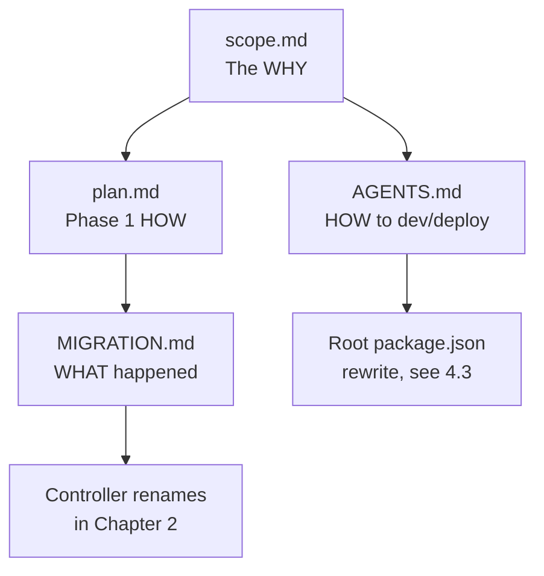

# 4.2 — Root Documents and Plans

This PR adds three large design documents at the repo root and modifies a
fourth (`AGENTS.md`). Together they are the **spec** that motivates and
constrains everything else in the diff.

| File | Status | Lines | Role |
|---|---|---|---|
| `MIGRATION.md` | Added | ~115 | Phase tracker for the controller refactor |
| `plan.md` | Added | ~360 | Step-by-step playbook for Phase 1 (engines module) |
| `scope.md` | Added | 464 | Pi agent integration scope (the *why* for the whole PR) |
| `AGENTS.md` | Modified | -7/+5 net | Removed Docker staging path; pivoted to local Mac dev |

There are also pre-existing root docs that this PR does **not** touch:

| File | Status |
|---|---|
| `README.md` | Unchanged |
| `CHANGELOG.md` | Unchanged (stops at v1.18.5) |
| `CONTROLLER_SCOPE.md` | Unchanged |
| `LICENSE` | Unchanged |

These are the docs that anyone reviewing this PR should read *first*. The code
diff only makes sense once you know the planned refactor.

---

## `scope.md` — Pi Agent Integration

### What it is

A 464-line design document with the header:

> # Scope: Pi Agent Integration for vLLM Studio
>
> > **Branch:** `scope/pi-agent-integration`
> > **Date:** 2026-04-26
> > **Goal:** Deeply integrate Pi coding agent capabilities into vLLM
> > Studio's chat, transforming it from a model-chat interface into a full
> > coding-agent platform with reliable, scalable, multi-week uptime.

### Structure

| §   | Section | Purpose |
|-----|---------|---------|
| 1   | Reference Architecture Overview | Pi-mono 3-layer stack and T3 Code reference |
| 2   | What We Can Implement from Pi Packages | Feature-by-feature gap analysis |
| 3   | Token Tracking | Data model and capture points |
| 4   | API Stability & Performance for Multi-Week Uptime | SLOs, scalability targets |
| 5   | Agent & Coding Agent Deep Integration into Chat | UI redesign, tool system, sessions |
| 6   | Implementation Phases | 5 phases, weeks 0–10 |
| 7   | Architecture Decisions | Decision table |
| 8   | Risks & Mitigations | Risk register |

### The reference stack

```
┌─────────────────────────────────────────────────────┐
│  @mariozechner/pi-coding-agent                       │
│  (Coding agent: filesystem tools, sessions,          │
│   extensions, skills, modes, config, auth)           │
├─────────────────────────────────────────────────────┤
│  @mariozechner/pi-agent-core                         │
│  (Agent loop: events, tools, steering, follow-up,    │
│   message flow, parallel/sequential exec)            │
├─────────────────────────────────────────────────────┤
│  @mariozechner/pi-ai                                 │
│  (Unified LLM API: models, streaming, tokens, cost,  │
│   cross-provider handoff, OAuth, env-auth)           │
└─────────────────────────────────────────────────────┘
```

The PR's branch name — `feat/plop-t3code-with-pi` — is essentially
"plop t3code (the web UI) with pi (the agent stack)". `scope.md` is the
contract document for that effort.

### Key quote — what's already done vs. coming

> ### 1.3 vLLM Studio (Current State)
>
> Already has significant agent infrastructure:
> - **Controller:** Pi agent core integration (`@mariozechner/pi-agent-core` v0.0.50), run manager, tool registries (agentFS/local/plan/circuit-breaker), SSE streaming, SQLite persistence, message mapping, compaction
> - **Frontend:** Chat UI with message list, artifacts, agent files panel, computer viewport, tool belt, sidebar activity/turn groups, plan drawer

That paragraph is the baseline; the rest of the document is the gap.

### Phase plan (§6)

| Phase | Weeks | Focus |
|---|---|---|
| 1 | 0–2 | Token tracking, cross-provider context, stream proxy, command approval, steering/follow-up, composer |
| 2 | 2–4 | T3 Code UI parity: command palette, plan sidebar, diff panel, terminal drawer, session tree |
| 3 | 4–6 | Coding agent depth: skills, grep/search, checkpoints, OAuth |
| 4 | 6–8 | Platform stability: auto-restart, WAL mgmt, stress tests |
| 5 | 8–10 | Extensions: package API, themes, templates, modes |

This PR almost certainly lands somewhere in **Phase 1–2**.

### Architecture decision table (§7)

| Decision | Choice |
|---|---|
| State management | Zustand + derivation layer |
| Routing | TanStack Router (future) |
| Streaming | SSE |
| Persistence | SQLite |
| Agent loop | Pi agent-core |
| UI framework | Next.js + Tailwind |
| Compaction | LLM-based |
| Approval flow | SSE events + React dialog |

These map 1:1 onto the changes in `frontend/` and `controller/`.

---

## `plan.md` — Phase 1 Engines Module Playbook

### What it is

A ~360-line refactor playbook scoped to a single phase.

> # vLLM Studio Refactor — Phase 1: Engines Module
>
> **Branch:** `refactor/engines-module`
> **Start date:** 2026-04-27
> **Status:** planning

### Migration table (top of plan.md)

| Domain       | Phase | Controller Old Dir | Controller New Dir |
|-------------|-------|--------------------|--------------------|
| engines     | 🟢 done | lifecycle/ + downloads/ | engines/ |
| system      | 🔴 old | lifecycle/ + monitoring/ | system/ |
| models      | 🔴 old | models/ + lifecycle/recipes/ | models/ |
| chat        | 🔴 old | chat/ + agent-files/ | chat/ |
| pass-through| 🔴 old | proxy/ | api-proxy/ |

This is *the* root cause of every controller rename in Chapter 2.

### Step-by-step structure

`plan.md` defines 10 steps for the engines refactor:

1. Define `EngineService` interface
2. Implement state machines (`engine-lifecycle-machine.ts`, `download-machine.ts`)
3. Wire the coordinator
4. Move and clean up layer files
5. Create routes (`engines/routes.ts`)
6. Register routes and wire context
7. Update consumers and delete old code
8. Frontend domain store (`frontend/src/app/engines/`)
9. Tests
10. Update `MIGRATION.md`

### "Rules of Engagement" quote

> 1. **Every commit updates MIGRATION.md if phase status changes.**
> 2. **State is always advanced via `dispatch(event, context)`, never `setState()`.**
> 3. **Routes never call layer code directly. Routes → EngineService → coordinator → state machine → layers.**
> 4. **All state transitions emit a CONTROLLER_EVENT. The frontend never polls for engine state.**
> 5. **Old code is only deleted in Step 7, after all consumers are migrated and verified.**
> 6. **No feature changes during refactor. If a bug is found in old code, fix it in the old code, then port the fix to new code.**

These rules are the contract Chapter 2 should be measured against.

### Note on stale-ness

`plan.md` calls itself "Phase 1: planning" but `MIGRATION.md` (see below) marks
**all five phases as done**. The plan was kept in tree as a historical
artifact rather than updated to reflect completion. That's a Chapter 7
suggestion: either update `plan.md` to phase-2/3/4/5, or delete it now that
`MIGRATION.md` supersedes it.

---

## `MIGRATION.md` — Phase Tracker

### What it is

The actual execution log of the refactor. The header table is the single
source of truth for "what's done":

| Domain       | Phase | Status       |
|-------------|-------|-------------|
| engines     | 1     | 🟢 done     |
| system      | 2     | 🟢 done     |
| models      | 3     | 🟢 done     |
| chat        | 4     | 🟢 done     |
| pass-through| 5     | 🟢 done     |

### Per-phase contents

Each phase section has:

- **Summary** — narrative of what moved
- **What moved** table (old → new path)
- **What was deleted** list
- **What stays** (deferred to later phases, or preserved)
- **Wiring changes** (AppContext, route registration)
- **New constructs** (state machines, services)
- **Verification** (tests pass / typecheck pass)

### Quote — engines phase verification

> ### Verification
>
> - `npx tsc --noEmit` passes (controller) ✓
> - `bun test` passes (113/114, 1 pre-existing failure) ✓
> - `npx next build` passes (frontend) ✓

Every phase has a verification clause. Reviewers should be able to re-run
those commands locally; if the controller's `bun test` no longer passes
175/179, the discrepancy needs explanation.

### Why MIGRATION.md outranks plan.md

`plan.md` is a *plan* (forward-looking). `MIGRATION.md` is a *log*
(backward-looking). The diffs in this PR should match `MIGRATION.md`'s "What
moved" tables exactly. They do — that's what the rename-based `git diff
--name-status` output proves.

---

## `AGENTS.md` — Modified

### What changed

The diff is small but pivots the dev workflow:

**Removed:** the entire "Staging — Local Docker (macOS)" block:

```diff
-### Staging — Local Docker (macOS)
-
-- **Image**: `vllm-studio-frontend`
-- **Container**: `vllm-studio-staging`
-- **URL**: `http://localhost:3000`
-- **Build**: `docker build -f frontend/Dockerfile -t vllm-studio-frontend .`
-- **Run**: `docker run -d --name vllm-studio-staging -p 3000:3000 ...`
```

**Added:** a leaner local-Mac dev block:

```diff
+### Local Mac Dev / Verification
+
+- **Agent surface**: `http://localhost:3001/agent`
+- **Run**: `cd frontend && PORT=3001 npm run dev`
+- Use this local server for fast browser verification unless the user explicitly asks for a different port or deployment target.
```

**Removed:** Docker staging from the deployment checklist (steps 2–3 on `main`
were Docker-related; now removed).

**Removed:** the "controller + frontend run natively; postgres + litellm in
Docker" qualification on remote prod, replaced by a flat
"Controller (bun :8080) and frontend (next :3000) run natively." (Postgres +
LiteLLM are still in `docker-compose.yml` — see [4.3](./build-and-package.md) —
but the operator docs no longer mention them.)

### What's preserved

- Sensitive config rules (`.env.local`, gitignored)
- Remote production deploy via `./scripts/deploy-remote.sh`
- The strict desktop-Electron update workflow (`/Applications/vLLM Studio.app`,
  `org.vllm.studio.desktop` bundle id, `desktop:dist`, `ditto`, relaunch)
- Verification commands

### Why this matters

The AGENTS.md edits and the root `package.json` rewrite (see
[4.3](./build-and-package.md)) together signal a **shift in primary surface**:

- Was: web app at `localhost:3000` plus a desktop bundle
- Now: agent surface at `localhost:3001/agent` plus a desktop bundle, with
  the latter elevated to a first-class deliverable

The branch name's "plop t3code with pi" maps directly onto this: the new
agent surface is the t3code-style chat UI wired to the Pi agent core, served
via either Next dev server or the Electron desktop app.

---

## How these documents relate



Reviewers should follow that order: scope → plan → migration → diff. Without
`scope.md`, the code diff looks like a random refactor; with it, every move
is justified by the Pi+T3Code integration.
