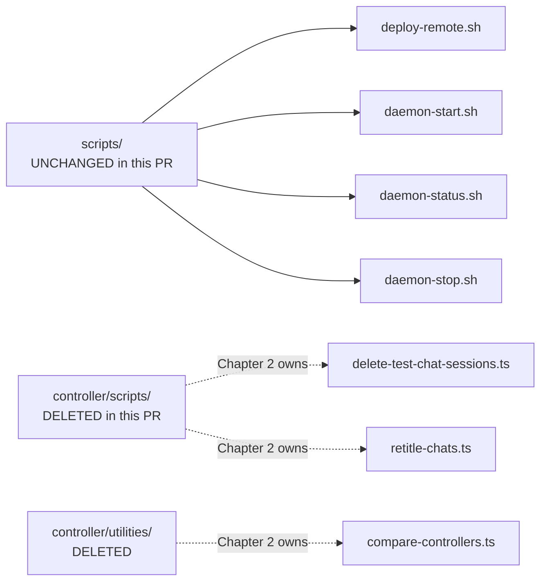

# 4.5 — Scripts and Tooling

The repo-root `scripts/` directory is **unchanged** by this PR. This page
inventories what's there for orientation and cross-links to script-style
files that *were* deleted from the controller tree (covered in Chapter 2).

| Path | Lines | Status in this PR |
|---|---|---|
| `scripts/deploy-remote.sh` | 318 | Unchanged |
| `scripts/daemon-start.sh` | 28 | Unchanged |
| `scripts/daemon-status.sh` | 18 | Unchanged |
| `scripts/daemon-stop.sh` | 19 | Unchanged |

`git diff --stat origin/main...HEAD -- scripts/` returns nothing.

---

## `scripts/deploy-remote.sh` — The Critical Production Path

This is the one script `AGENTS.md` calls out by name. Its header documents
its responsibilities clearly:

> Deploy vLLM Studio from this machine to the remote GPU server.
>
> ─── Connection ───────────────────────────────────────────────────────────
>
>   Remote connection values are intentionally loaded from .env.local.
>   Required: REMOTE_HOST, REMOTE_USER, REMOTE_PATH.
>   Optional: REMOTE_SSH_KEY (defaults to ~/.ssh/id_ed25519).
>
> ─── What runs where ─────────────────────────────────────────────────────
>
>   Docker (infra only, stays up across deploys):
>     postgres:16       :5432   LiteLLM database
>     litellm           :4100   API gateway
>
>   Native on host (needs nvidia-smi + host process visibility):
>     controller (bun)  :8080   Model lifecycle, GPU stats, chat, recipes
>     frontend (next)   :3000   Web UI
>
>   Managed separately:
>     vLLM / SGLang     :8000   Inference (launched via controller or manually)
>
> ─── How it works ─────────────────────────────────────────────────────────
>
>   1. rsync  — push controller/src, frontend/src, shared/, config/ to remote
>   2. install — bun install (controller), npm install (frontend)
>   3. restart — kill old process, start new one via nohup, wait for port
>   4. verify  — hit health endpoints, print GPU and model status

### Subcommands

> ```
> ./scripts/deploy-remote.sh              Deploy everything
> ./scripts/deploy-remote.sh controller   Controller only
> ./scripts/deploy-remote.sh frontend     Frontend only
> ./scripts/deploy-remote.sh infra        Restart Docker infra
> ./scripts/deploy-remote.sh status       Check what's running (no changes)
> ```

### Stale-reference issue

The header's "rsync — push controller/src, frontend/src, **shared/**, config/
to remote" still mentions `shared/`. After this PR, `shared/` does not exist
anymore (see [4.1](./shared-package-dissolution.md)). The script body needs a
read-through to confirm whether the rsync still tries to copy `shared/` and
fails silently, or whether the actual rsync command list was updated and only
the comment is stale.

> **Action item (Chapter 7):** review `scripts/deploy-remote.sh` for any
> remaining `shared/` references and either remove them or fix the comment.

### Config quirks worth knowing

```bash
: "${REMOTE_HOST:?Set REMOTE_HOST in .env.local}"
: "${REMOTE_USER:?Set REMOTE_USER in .env.local}"
: "${REMOTE_PATH:?Set REMOTE_PATH in .env.local}"

SSH_KEY="${REMOTE_SSH_KEY:-$HOME/.ssh/id_ed25519}"
```

The script will refuse to run unless `.env.local` defines the three connection
values. `.gitignore` lists `.env.*` and `*.local` so the actual values stay
off-tree. Nothing in this PR changes that.

### Why this script matters even though the PR doesn't touch it

`AGENTS.md` step 3 of the deploy checklist still depends on it:

> 3. **Remote deploy** (if needed): `./scripts/deploy-remote.sh` (syncs,
>    builds, restarts)

Any reviewer running through the deploy workflow will hit this script
unmodified. The change in `AGENTS.md` reframed surrounding steps but left
this one in place.

---

## `scripts/daemon-*.sh` — Background Controller Helpers

Three small bash scripts used to run the controller as a background process.
The `README.md` quick-start references them directly:

> 4. Run controller as a background daemon:
>
>    ```bash
>    ./scripts/daemon-start.sh
>    ./scripts/daemon-status.sh
>    ./scripts/daemon-stop.sh
>    ```

### `scripts/daemon-start.sh` (full)

```bash
#!/usr/bin/env bash
set -euo pipefail

ROOT="$(cd "$(dirname "$0")/.." && pwd)"
PID_FILE="${VLLM_STUDIO_PID_FILE:-$ROOT/data/controller.pid}"
LOG_FILE="${VLLM_STUDIO_LOG_FILE:-$ROOT/data/controller.log}"
BUN_BIN="${VLLM_STUDIO_BUN_BIN:-$HOME/.bun/bin/bun}"

if [ ! -x "$BUN_BIN" ]; then
  BUN_BIN="bun"
fi

if [ -f "$PID_FILE" ]; then
  EXISTING_PID="$(cat "$PID_FILE")"
  if kill -0 "$EXISTING_PID" 2>/dev/null; then
    echo "Controller already running (pid: $EXISTING_PID)"
    exit 0
  fi
fi

mkdir -p "$(dirname "$PID_FILE")"
mkdir -p "$(dirname "$LOG_FILE")"

nohup "$BUN_BIN" "$ROOT/controller/src/main.ts" >> "$LOG_FILE" 2>&1 &
echo $! > "$PID_FILE"
echo "Controller started (pid: $(cat "$PID_FILE"))"
```

### Behaviour summary

| Script | What it does |
|---|---|
| `daemon-start.sh` | Spawns `bun controller/src/main.ts` via `nohup`, writes PID to `data/controller.pid`, appends logs to `data/controller.log`. Idempotent — refuses to start if a live PID is recorded. |
| `daemon-status.sh` | Reads PID file, `kill -0`s the PID, exits 0 if alive, 1 if dead/stale. |
| `daemon-stop.sh` | Reads PID file, sends `SIGTERM`, removes the PID file. No `--force` mode. |

### Customisation hooks

All three scripts honour overrides via environment:

- `VLLM_STUDIO_PID_FILE` — defaults to `data/controller.pid`
- `VLLM_STUDIO_LOG_FILE` — defaults to `data/controller.log` (start only)
- `VLLM_STUDIO_BUN_BIN` — defaults to `$HOME/.bun/bin/bun`, falls back to
  `bun` on `PATH`

### Concerns (stack-rank)

| Concern | Severity | Notes |
|---|---|---|
| `daemon-stop.sh` doesn't graceful-then-force | Low | Only sends `SIGTERM`. If the controller hangs on `Ctrl+C` semantics, operator has to kill manually. |
| `data/` directory layout assumed | Low | All three assume `data/` exists at repo root. `mkdir -p` covers this in `start`, but `status` and `stop` will silently mis-report if the relative path resolves wrong. |
| No log rotation | Low | `controller.log` grows unbounded — should be paired with `logrotate` or be replaced by `journald`/`launchd`. |

These were pre-existing on `main` and are not regressions in this PR.

---

## Cross-link: scripts that *were* deleted (Chapter 2)

The PR deletes several script-like files **inside** `controller/src/`:

| Deleted file | Type | Owned by |
|---|---|---|
| `controller/scripts/delete-test-chat-sessions.ts` | TS maintenance script | Chapter 2 |
| `controller/scripts/retitle-chats.ts` | TS one-off DB migration | Chapter 2 |
| `controller/utilities/compare-controllers.ts` | TS comparison utility | Chapter 2 |

All three were Bun-runnable scripts under the controller tree, not under the
repo-root `scripts/`. Their deletion is part of the chat-module purge tracked
in Chapter 2; this chapter cross-references them only because reviewers
searching for "scripts" will find both directories.



---

## What's missing

There is **no `scripts/dev.sh`** or "one-command bring-up" for new
contributors. To start the local agent surface today, an operator must
follow `AGENTS.md`:

1. `cd frontend && PORT=3001 npm run dev`  *(in one terminal)*
2. `./scripts/daemon-start.sh`  *(in another, or assume controller is running)*
3. Browse `http://localhost:3001/agent`

A simple `scripts/dev.sh` that starts both processes and tails their logs
would tighten the onboarding path. Not a regression — just a Chapter 7 nudge.

---

## Bottom line

`scripts/` is byte-stable in this PR. Its contents — one production deploy
script and three controller daemon helpers — still describe the canonical
prod and dev workflows. The one stale reference worth flagging is the
`deploy-remote.sh` header still mentioning `shared/` after the workspace
package was dissolved (see [4.1](./shared-package-dissolution.md)).
