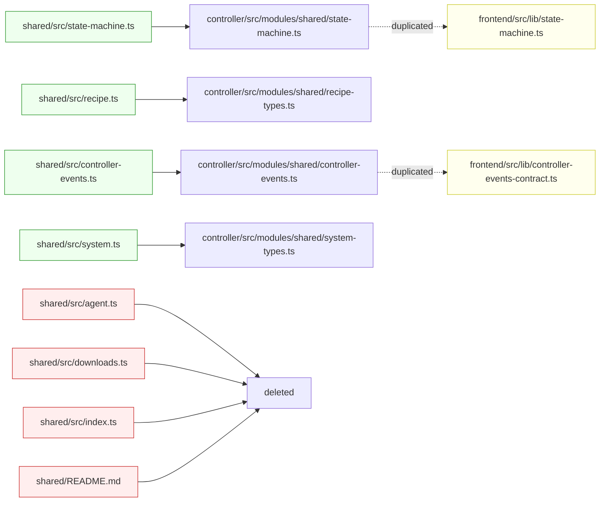

# 4.1 — The `shared/` Package Dissolution

The `shared/` workspace package, which used to hold the types contract between
controller and frontend, has been **removed** by this PR. Its contents were
either moved into the controller, duplicated into the frontend, or — in the
case of `agent.ts` and `downloads.ts` — deleted outright as part of the chat
module purge.

This is the single most architecturally meaningful change outside the three
main source trees, because it changes the *shape* of the monorepo.

## What `shared/` contained on `origin/main`

Per `shared/README.md` on `main`:

> Shared types and recipe contracts used across controller and frontend.
>
> ## Contents
> - src/index.ts: public exports
> - src/recipe.ts: recipe schema and helpers

The actual file list was:

| File | Purpose |
|---|---|
| `shared/README.md` | Package readme |
| `shared/src/index.ts` | Barrel: re-exports state-machine, recipe, controller-events, system, downloads, agent |
| `shared/src/state-machine.ts` | Pure FSM helper (`createStateMachine`, `StateMachineTransition`, etc.) |
| `shared/src/recipe.ts` | `RecipeBase`, `RecipePayload`, `Backend` union — wire-format recipe contract |
| `shared/src/controller-events.ts` | `CONTROLLER_EVENTS` const + `ControllerEventType`, `ControllerEventDomain`, channel mappings |
| `shared/src/system.ts` | `ServiceInfo`, `SystemConfig` runtime/system types |
| `shared/src/downloads.ts` | `DownloadStatus`, `DownloadFileInfo` (model download types) |
| `shared/src/agent.ts` | `AgentFileEntry` (agent filesystem entry) |

## What happened to each file



### Renames (verified via `git diff --name-status`)

| Old path | New path | Similarity |
|---|---|---|
| `shared/src/state-machine.ts` | `controller/src/modules/shared/state-machine.ts` | R100 |
| `shared/src/system.ts` | `controller/src/modules/shared/system-types.ts` | R097 |
| `shared/src/controller-events.ts` | `controller/src/modules/shared/controller-events.ts` | R069 |
| `shared/src/recipe.ts` | `controller/src/modules/shared/recipe-types.ts` | R061 |

The lower similarity scores on `controller-events.ts` (69%) and `recipe.ts`
(61%) reflect that types specific to *deleted* domains — chat session events,
agent file events, MCP events — were stripped along the way.

### Outright deletions

| Path | Reason |
|---|---|
| `shared/README.md` | Package no longer exists |
| `shared/src/index.ts` | Barrel — no consumers after dissolution |
| `shared/src/agent.ts` | `AgentFileEntry` only used by chat agent-files routes (deleted in Chapter 2's chat purge) |
| `shared/src/downloads.ts` | Download status types are now controller-internal under `engines/` (Chapter 2) |

## The frontend duplication trade-off

The frontend used to import directly from the workspace package:

```ts
// frontend/src/lib/controller-events-contract.ts (origin/main)
export {
  CONTROLLER_BROWSER_EVENT_CHANNEL,
  CONTROLLER_EVENTS,
  CONTROLLER_STREAM_EVENT_TYPES,
  getBrowserEventChannelForControllerEvent,
  getControllerEventDomain,
  isControllerStreamEventType,
} from "../../../shared/src/controller-events";
```

After this PR, the same file is the **source of truth** on the frontend side —
the entire `CONTROLLER_EVENTS` const, the helpers, and the type unions are
inlined verbatim:

```ts
// frontend/src/lib/controller-events-contract.ts (HEAD)
export const CONTROLLER_EVENTS = {
  STATUS: "status",
  GPU: "gpu",
  METRICS: "metrics",
  RUNTIME_SUMMARY: "runtime_summary",
  LAUNCH_PROGRESS: "launch_progress",
  MODEL_SWITCH: "model_switch",
  DOWNLOAD_PROGRESS: "download_progress",
  DOWNLOAD_STATE: "download_state",
  RECIPE_CREATED: "recipe_created",
  ...
} as const;
```

The same pattern applies to `frontend/src/lib/state-machine.ts`, which now
holds its own copy of `createStateMachine`.

### Why this is a regression in DRY

There are now **two separate definitions** of:

- `CONTROLLER_EVENTS` — controller has 40+ events; frontend keeps a subset (no
  chat / agent-files events because the frontend doesn't speak them after the
  chat purge).
- `createStateMachine` and its types — once a single function, now copy/pasted
  across both trees.

If a new event is added to the controller, *nothing* enforces that the
frontend's contract is updated. The compiler won't catch a typo in the event
name on either side. Only the runtime SSE stream will, by silently dropping
unknown event types.

### Why it's a win in workspace simplicity

- **No more workspace package**. The repo no longer needs `npm`/`bun`
  workspaces just to wire `shared/` into both apps. The root `package.json`
  (now repurposed for the Electron build — see [4.3](./build-and-package.md))
  doesn't have to declare workspaces at all.
- **No more relative-path imports** like `../../../shared/src/...` from
  frontend code, which were brittle against any frontend reorg.
- **No more cross-tree compile coupling**. Building the frontend used to
  require `shared/` to be type-checkable. Now the two trees are independently
  buildable.
- **Forces the contract to be small**. The frontend explicitly re-declares
  only the events it actually consumes — events related to deleted domains
  (chat sessions, agent files) never made it across.

### The "stable contract" theory

The renames into `controller/src/modules/shared/` strongly suggest the new
mental model: these types are still "shared" in the sense of *spanning chat,
engines, models, system, etc. inside the controller* — but they are the
controller's contract, not a third-party package the frontend co-owns. The
frontend pulls only the subset it needs, and inlines it.

This is a deliberate decoupling: the controller exposes a wire format (SSE
events, REST JSON), and the frontend writes its own types against that wire
format. Type duplication is the cost of the decoupling.

## Risk tagging

Cross-link this for **Chapter 6 (Complexity)** and **Chapter 7 (Files to
Improve)**:

| Concern | Severity | Mitigation hook |
|---|---|---|
| Drift between `controller/.../controller-events.ts` and `frontend/.../controller-events-contract.ts` | Medium | A repo-level test or codegen step could re-establish the link |
| `CONTROLLER_EVENTS` keys not validated at runtime | Low | Frontend already drops unknown SSE types defensively |
| `createStateMachine` duplicated; bug fixes need to be applied twice | Low | Function is small (~10 lines) and rarely changes |

## Bottom line

The `shared/` package is gone. Four files moved into the controller, two were
deleted as collateral of the chat purge, and two (state-machine,
controller-events) now live as **independent inlined copies** in the frontend.
This is a deliberate trade: monorepo simplicity in exchange for a small, stable
type-duplication tax.
