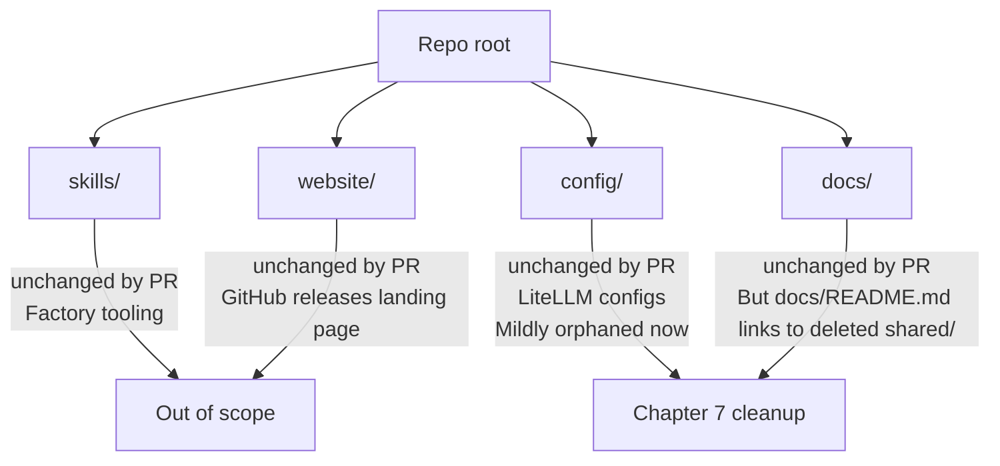

# 4.6 — Skills, Website, Config, Docs

This page documents four repo-root directories that **this PR does not touch**.
They exist on `main`, they exist on the branch tip, and `git diff
origin/main...HEAD -- skills/ website/ config/ docs/` returns nothing.

> **Verified:** `git diff --stat origin/main...HEAD -- skills/ website/ config/ docs/` produces no output.

They are documented here so that reviewers don't waste time looking for
changes that aren't there, and so that a wiki reader has a one-stop
orientation to "what else is at the repo root".

| Directory | PR diff | Purpose | Risk to this PR |
|---|---|---|---|
| `skills/` | None | Factory droid skill manifests | None |
| `website/` | None | Static download landing page | None |
| `config/` | None | LiteLLM YAML + Python think parser | Indirect — see below |
| `docs/` | None | Operator + environment docs | Indirect — stale references |

---

## `skills/` — Factory Droid Skill Definitions

```
skills/
  evidence-heavy-evaluator/
    SKILL.md
  visual-explainer/
    SKILL.md
    CHANGELOG.md
    README.md
    LICENSE
    package.json
    banner.png
    prompts/
    references/
    templates/
  vllm-studio/
    agents/
  vllm-studio-backend/
    agents/
```

### What's there

Four skill directories, two of which (`evidence-heavy-evaluator/`,
`visual-explainer/`) are full Factory droid skill packages with `SKILL.md`
front-matter:

```markdown
---
name: evidence-heavy-evaluator
description: Generate an evidence-first, read-only repository evaluation report
  with deterministic scoring and actionable recommendations...
---
```

The other two (`vllm-studio/`, `vllm-studio-backend/`) are bare directories
holding `agents/` subfolders only — these look like droid agent definitions
specific to this project's domain.

### Relevance to this PR

Zero direct relevance. None of these files are imported by frontend,
controller, or cli code, and `git diff` confirms no changes. They're tooling
for the *humans* building this project (and for any droid invoked against the
repo), not part of the runtime stack.

> **Note for Chapter 6:** The `skills/vllm-studio/` and
> `skills/vllm-studio-backend/` directories may be empty or near-empty. If
> they were intended as the canonical place to define this project's
> droid behaviour and they remain stubs, that's a Chapter 7 cleanup
> (either populate or remove).

---

## `website/` — Static Download Landing Page

```
website/
  index.html
  main.ts
  styles.css
  tsconfig.json
```

### What's there

A 4-file static site that renders a "Download vLLM Studio" landing page. The
HTML head:

```html
<title>vLLM Studio Download</title>
<meta name="description"
      content="Download fresh prebuilt vLLM Studio release artifacts from GitHub." />
```

The body links directly to GitHub releases:

```html
<a id="download-link" href="https://github.com/0xSero/vllm-studio/releases/latest">Latest release</a>
<a id="all-releases-link" href="https://github.com/0xSero/vllm-studio/releases">All releases</a>
```

`main.ts` (1.7 KB) presumably fetches the latest release tag via the GitHub
API and updates `#release-version` and the direct-download links.

### Relevance to this PR

None directly, but it's part of the larger **"Electron is the canonical
delivery mechanism"** posture established by this PR (see
[4.3](./build-and-package.md)). The website exists to deliver Electron
binaries; the PR makes the Electron build first-class via the new root
`package.json`. They're complementary even though `website/` itself is
unchanged.

`.gitignore` includes `website-dist`, so the build output is intentionally
excluded.

---

## `config/` — LiteLLM Runtime Configs

```
config/
  litellm.yaml      6.2 KB
  think_parser.py   4.4 KB
```

### What they are

These two files are mounted by the `litellm` service in `docker-compose.yml`:

```yaml
litellm:
  ...
  volumes:
    - ./config/litellm.yaml:/app/config.yaml
    - ./config/think_parser.py:/app/think_parser.py
```

- `litellm.yaml` — LiteLLM router configuration (model list, pricing,
  routing rules, retries). Per `CHANGELOG.md`: "reduced LiteLLM retry
  layering by setting router and client retries to zero in
  `config/litellm.yaml`" (v1.13.0 entry).
- `think_parser.py` — A Python custom hook parser for "think" / reasoning
  tokens. Loaded by LiteLLM at startup.

### Relevance to this PR

Both files are **unchanged** in this diff. But:

- They're consumed only by the LiteLLM Docker container.
- `AGENTS.md` no longer mentions Docker (see
  [4.3](./build-and-package.md)), and `scripts/deploy-remote.sh` doesn't
  invoke `docker compose up` directly.
- That makes `config/litellm.yaml` and `config/think_parser.py` **mildly
  orphaned** — they still work if someone runs `docker compose up litellm`
  manually, but they're no longer part of the documented happy path.

This is a Chapter 7 nudge, not a defect: either re-document Docker as the
LiteLLM deploy mechanism, or migrate these configs out of `config/` if
LiteLLM is being phased out.

---

## `docs/` — Operator and Environment Docs

```
docs/
  README.md             0.4 KB
  chat-scope-of-work.md 19 KB
  desktop-electron.md   2.3 KB
  environment.md        13 KB
  operations.md         4.7 KB
  plans/                directory
```

### `docs/README.md` (full content)

```markdown
# vLLM Studio Docs

## Start Here

- Operations and deployment: operations.md
- Environment variables: ../`.env.example`
- LiteLLM config: `../config/litellm.yaml`

## Module Docs

- Controller: ../controller/README.md
- Frontend: ../frontend/README.md
- Desktop app (Electron): desktop-electron.md
- CLI: ../cli/README.md
- Shared types: ../shared/README.md
```

### Stale reference flag

The last bullet — `Shared types: ../shared/README.md` — is now broken. The
`shared/` directory was deleted by this PR (see
[4.1](./shared-package-dissolution.md)). `docs/README.md` should be updated
in a follow-up to either remove that line or point at the new home
(`controller/src/modules/shared/`).

> **Action item (Chapter 7):** fix the broken cross-link in `docs/README.md`.

### File-by-file purpose

| File | Purpose | Touched by PR? |
|---|---|---|
| `README.md` | Doc index | No (but contains broken link) |
| `chat-scope-of-work.md` | Older planning doc, predates `scope.md` | No |
| `desktop-electron.md` | Electron build/release notes | No |
| `environment.md` | Long-form env var reference | No |
| `operations.md` | Runbook: deploy, verify, daemon ops | No |
| `plans/` | Earlier planning docs | No |

### Note on `chat-scope-of-work.md` vs the new `scope.md`

`docs/chat-scope-of-work.md` (19 KB, dated `2026-04-14` per `mtime`) is an
*earlier* scope-of-work for chat. The new `scope.md` at the repo root
(see [4.2](./root-docs-and-plans.md)) supersedes it for the Pi+T3Code
integration. Reviewers should treat root `scope.md` as canonical and
`docs/chat-scope-of-work.md` as historical context.

> **Chapter 7 nudge:** decide whether `docs/chat-scope-of-work.md` should be
> archived (`docs/archive/`) or deleted now that `scope.md` is the active
> design doc.

---

## Summary



None of these directories block the PR. Two of them (`config/`, `docs/`)
have **stale-reference debt** as a side effect of changes documented in
[4.1](./shared-package-dissolution.md) and [4.3](./build-and-package.md):

- `docs/README.md` references the deleted `../shared/README.md`
- `config/litellm.yaml` and `config/think_parser.py` are no longer pulled
  into the documented deploy flow

Both are Chapter 7 cleanup candidates, not Chapter 6 risks.
