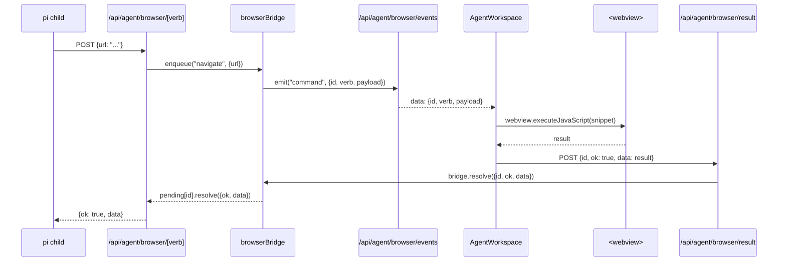

# Pattern 5 — Browser bridge: HTTP → SSE → webview executeJavaScript → POST result

The browser tool lets the agent `pi` driver navigate, click, scroll, fill,
and screenshot the embedded `<webview>` (Electron) or `<iframe>` (dev). It
is the most architecturally interesting subsystem in the PR — three
processes coordinate over four HTTP endpoints to make one tool call.

## The four moving pieces

| Process | File(s) | Role |
|---------|---------|------|
| `pi` child | `frontend/desktop/resources/pi-extensions/browser.ts` | Registers `browser_navigate`, `browser_click`, etc. as `pi` tools. Each `execute()` POSTs to `/api/agent/browser/<verb>` and awaits a JSON result. |
| Next route handler | `frontend/src/app/api/agent/browser/[verb]/route.ts` | Validates the verb, forwards the payload to `browserBridge.enqueue(verb, payload)`. |
| In-memory bridge | `frontend/src/lib/agent/browser-bridge.ts` | An `EventEmitter` singleton that holds a `Map<id, PendingCommand>`. Emits each command on the `command` event. |
| Renderer | `frontend/src/app/agent/_components/agent-workspace.tsx` | Subscribes to `/api/agent/browser/events` (SSE), runs each command against the active `<webview>` via `webview.executeJavaScript(...)`, then POSTs the result to `/api/agent/browser/result`. |

## The round-trip



The SSE channel is *long-lived*. The browser holds it open while the agent
panel is mounted; commands are emitted lazily as the agent calls tools.

## Code highlights

```ts
// browser-bridge.ts — enqueue()
enqueue(verb: string, payload): Promise<BrowserResult> {
  if (this.listenerCount("command") === 0) {
    return Promise.reject(
      new Error(`Browser command '${verb}' could not run because no browser panel is connected.`),
    );
  }
  const id = `browser-${Date.now().toString(36)}-${(++this.seq).toString(36)}`;
  return new Promise((resolve, reject) => {
    this.pending.set(id, { resolve, reject });
    this.emit("command", { id, verb, payload });
    // 30s timeout
  });
}
```

```ts
// /api/agent/browser/events route handler
const onCommand = (command: BrowserCommand) => {
  controller.enqueue(encoder.encode(`data: ${JSON.stringify(command)}\n\n`));
};
browserBridge.on("command", onCommand);
// keepalive ping every 25s, cleanup on request abort
```

```ts
// /api/agent/browser/result route handler
const handled = browserBridge.resolve(body);
return Response.json({ ok: handled });
```

## Why this pattern

- **The `pi` process and the renderer never link.** The pi extension only
  knows the public HTTP surface; it has no access to the renderer's
  `<webview>` ref. The renderer holds the only handle to the DOM-driving
  primitives.
- **Authority stays in the renderer.** The renderer can refuse to execute
  any command (e.g., disconnect the SSE on a sensitive page); the bridge
  blocks until a renderer re-attaches or until 30 seconds elapse.
- **No new IPC layer.** Electron's `ipcMain` could have done this, but
  the design uses HTTP + SSE so the same flow works in plain browser
  Next-dev mode (no Electron at all). The dev experience is identical to
  packaged.
- **Listener-count gating.** `enqueue` rejects if no SSE consumer is
  attached, so a "Browser tool" call without an open browser panel fails
  fast with a human-readable error.

## Trade-offs

- **In-memory singleton.** `browserBridge` is module-global. In a
  multi-process Next deployment (e.g., serverless), each function instance
  gets its own bridge and SSE delivery breaks. Acceptable here because the
  whole system runs as a single-process Electron + embedded Next server.
- **At most one panel.** The bridge has no concept of panel id. If two
  agent workspaces subscribe to `/events`, both will receive every
  command and both will POST results — only the first wins, the second
  is logged as `handled: false`.
- **No per-tab isolation.** The bridge is also shared across all `pi`
  sessions. If two pi turns issue browser tools concurrently, they share
  the renderer's single `<webview>`.
- **Timeout is hard-coded.** 30 seconds is enough for navigation, slim
  for a flaky network, and not enough for `pi` to wait through a captcha.
- **No CSRF protection on the result endpoint.** Anything in the local
  origin can POST `{id, ok}` and resolve a pending command. Mitigated by
  the local-only origin policy, but not eliminated.

## Cross-references

- [Chapter 1 — `agent-workspace-deep-dive.md`](../chapter-01-frontend/agent-workspace-deep-dive.md) — the renderer side of the bridge.
- [Chapter 1 — `electron-desktop.md`](../chapter-01-frontend/electron-desktop.md) — how the `<webview>` is hardened.
- [Chapter 1 — `api-routes.md`](../chapter-01-frontend/api-routes.md) — the four HTTP endpoints in the round-trip.
- [Pattern 13 — Extension injection](./extension-injection.md) — how the extension is loaded into pi.
