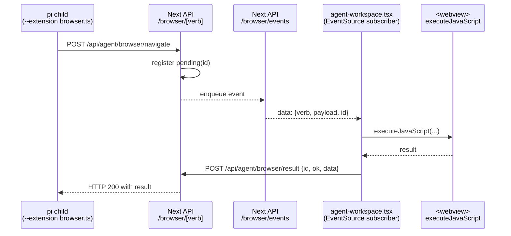

# 5 — Browser bridge round-trip

> **Severity:** High
> **Cross-link:** [Chapter 1 — agent-workspace deep dive](../chapter-01-frontend/agent-workspace-deep-dive.md), [api-routes](../chapter-01-frontend/api-routes.md), [electron-desktop](../chapter-01-frontend/electron-desktop.md)

## Verified surface

```
140 frontend/desktop/resources/pi-extensions/browser.ts        (extension)
 79 frontend/src/lib/agent/browser-bridge.ts                   (server-side bridge)
 45 frontend/src/app/api/agent/browser/[verb]/route.ts         (verb endpoint)
 53 frontend/src/app/api/agent/browser/events/route.ts         (SSE events)
 19 frontend/src/app/api/agent/browser/result/route.ts         (result POST)
```

Five collaborating files. Plus dispatcher logic embedded in
`agent-workspace.tsx` (1,145 LoC). Plus a runtime `<webview>` element. Plus
the pi child process loaded with `--extension <path>`.

## Why it's complex

A single agent action — say `browser_navigate({ url })` — travels through
**four trust boundaries**:



State for one in-flight call simultaneously lives in:

1. The pi child's command-id correlation map.
2. The Next bridge's pending registration map (in
   `frontend/src/lib/agent/browser-bridge.ts`).
3. The SSE connection holding open between Next and the renderer.
4. The renderer's `runBrowserCommand` execution and result-post.
5. The `<webview>`'s actual DOM.

If any of those drop the message, the agent hangs. There is a 12-second
`withBrowserTimeout` in the renderer, but no equivalent ceiling on the pi
side.

## Coupling problems

- The eight verbs (`navigate`, `get-url`, `get-text`, `get-html`,
  `screenshot`, `click`, `scroll`, `fill`) are defined in **three places**:
  the extension's tool registrations, the `[verb]` route's allowlist, and
  the renderer's `runBrowserCommand` switch. Adding a ninth verb requires
  three coordinated edits with no enforcing type.
- The address bar in `agent-workspace.tsx` and the `browser_navigate`
  verb resolve URLs through different paths. The renderer's
  `normalizeBrowserInput` does cwd-aware expansion (`./foo` → `file://`,
  `localhost:3000` → `http://localhost:3000`, raw text → Google search
  URL). The agent verb expects an "absolute http(s) URL". A user-typed
  URL and an agent-issued URL go through different pipelines.
- The fallback when there's no `<webview>` (dev mode) is a sandboxed
  `<iframe>` with very different cross-origin semantics. Most verbs no-op
  silently in iframe mode.
- `detectBotProtection` runs in the renderer and returns a refusal string
  the model reads back. The model has no signal that this string is
  synthesised by the bridge rather than by the page itself.
- The extension is loaded by pi via `--extension <absolutePath>`. The
  path is resolved by `resolveBrowserExtensionPath()` walking five
  candidates (env var → `process.resourcesPath/...` → dev paths). When it
  fails to find a path, browser tools simply don't register, and the
  agent gets a "tool not found" reply with no diagnostic explaining why.

## Single-source-of-truth violations

| Concern | Defined in | Risk |
|---------|------------|------|
| Verb list | extension + `[verb]/route.ts` + renderer switch | Three-way drift |
| Result envelope `{ ok, data, error }` | `[verb]` route + result route + bridge map + extension | Schema can drift silently |
| Per-verb timeout | renderer (12 s) only | pi has no upper bound |
| URL shape | renderer's `normalizeBrowserInput` vs. extension's "http(s) only" | User vs. agent inconsistency |

## What could simplify it

- Define the verb table in **one** typed module (verbs + payload shape
  + result shape) and import it from the extension, the route, and the
  renderer. Today three separate sources must agree.
- Move the timeout to the bridge (server side) so the pi caller gets a
  bounded latency without depending on the renderer being honest.
- Surface "extension path not found" as a one-time toast/log so silent
  feature loss stops being silent.
- Treat the SSE→executeJavaScript→POST round-trip as one logical RPC and
  move the orchestration out of `agent-workspace.tsx` into a small named
  module.
