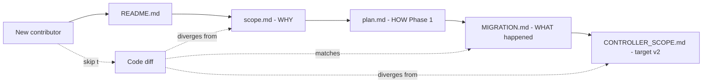

# 13 — Migration document fragmentation

> **Severity:** Low
> **Cross-link:** [Chapter 4 — root-docs-and-plans](../chapter-04-anything-else/root-docs-and-plans.md)

## The four overlapping documents

| Path | Status on this branch | What it claims |
|------|----------------------|----------------|
| `MIGRATION.md` | Added (~115 LoC) | Phase tracker; **all 5 phases done** |
| `plan.md` | Added (~360 LoC) | Phase 1 engines playbook; header says **status: planning** |
| `scope.md` | Added (~464 LoC) | Pi agent integration spec; **5 implementation phases**, 0–10 weeks |
| `CONTROLLER_SCOPE.md` | Pre-existing, unchanged | "v2" controller redesign, target ~4,500 LoC |

Plus `AGENTS.md` (modified), `README.md` (untouched), `CHANGELOG.md`
(stops at v1.18.5, untouched).

## Why it's complex

Each of the four docs is internally consistent, but they tell **partially
overlapping stories** about what the controller is and what it should
become. A new contributor cannot tell, without reading all four, which
parts are:

- **Done** — `MIGRATION.md` says yes for every phase.
- **In progress** — `plan.md` says "planning" but `MIGRATION.md` says
  Phase 1 is done.
- **Aspirational** — `scope.md`'s Phase 1–5 (token tracking,
  command-approval UI, T3 Code parity, skill system, extensions) are
  largely **not** implemented in this PR.
- **Out of scope altogether** — `CONTROLLER_SCOPE.md` calls for
  deletion of `audio/`, `jobs/`, `studio/`, `pi-agent-core` deps; **none
  of those deletions happened on this branch** (jobs/ still 623 LoC,
  audio/ routes still 410 LoC).

### Specific contradictions

- `plan.md` header: `**Status:** planning`. `MIGRATION.md`: phase 1 (the
  one `plan.md` describes) is `🟢 done`.
- `scope.md` §1.3 says the controller "Already has significant agent
  infrastructure" and lists `pi-agent-core v0.0.50`. The chat module
  (Phase 4 in `MIGRATION.md`) **deleted** that infrastructure on this
  branch.
- `CONTROLLER_SCOPE.md` says the target is "~4,500 LoC … 5 domains".
  Counting `engines/`, `system/`, `models/`, `proxy/`, `studio/`,
  `audio/`, `jobs/`, plus `core/` and `http/` and `shared/`, the
  controller is past 5 domains, with `audio/` and `jobs/` flagged for
  removal but not removed.

### Cross-document references that go stale

`scope.md` tells the reader to integrate Pi packages
(`pi-agent-core`, `pi-coding-agent`, `pi-ai`). On this branch
`pi-agent-core` is **gone from the controller** but `pi-coding-agent` is
spawned as an external binary by the frontend. The integration shape
changed; the document didn't.

## Reader sequencing

## What could simplify it

- Pick **one** living spec document per concern. Today `MIGRATION.md`
  serves "log of what happened" well; the other three could be merged
  into a single "current state and roadmap" doc.
- Update each doc's header with **Status: current / superseded /
  aspirational** so a reader can decide whether to keep reading.
- Move "future work" out of the repo if it isn't actively guiding work.
  `scope.md`'s Phase 3–5 features (skill system, extensions API,
  themes, modes) are months out and may never land in this exact shape.
- Sync `CONTROLLER_SCOPE.md` with `MIGRATION.md`. If the v2 redesign is
  still the target, mark the deltas (audio/jobs/studio/audit pending).
