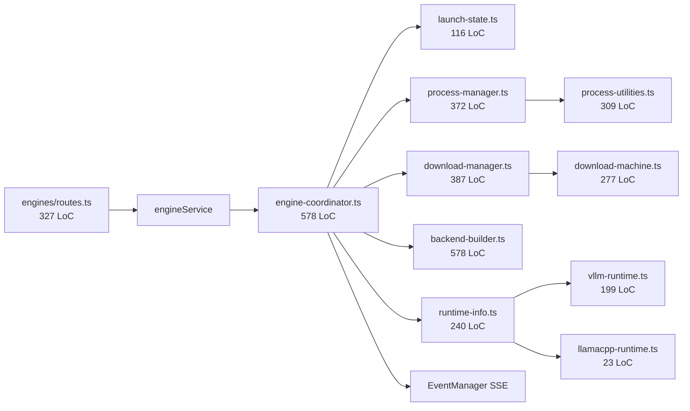

# 2 — Engine lifecycle orchestration

> **Severity:** Critical
> **Cross-link:** [Chapter 2 — engines module](../chapter-02-controller/engines-module.md)

## Verified file sizes

```
578 controller/src/modules/engines/layers/engine-coordinator.ts
578 controller/src/modules/engines/layers/backend-builder.ts
387 controller/src/modules/engines/layers/download-manager.ts
372 controller/src/modules/engines/layers/process-manager.ts
327 controller/src/modules/engines/routes.ts
309 controller/src/modules/engines/layers/process-utilities.ts
277 controller/src/modules/engines/layers/download-machine.ts
240 controller/src/modules/engines/layers/runtime-info.ts
199 controller/src/modules/engines/layers/vllm-runtime.ts
```

`engines/layers/` totals **~3,400 LoC across 19 files**. Two files dominate.

## Why it's complex

### `engine-coordinator.ts` (578 LoC) — too many responsibilities

Constructed in `app-context.ts` with **9 dependencies** (config, logger,
`processManager`, `downloadManager`, `eventManager`, `recipeStore`,
`downloadStore`, `peakMetricsStore`, `lifetimeMetricsStore`, plus an
`abortRunsForModel` thunk). It is the single chokepoint for:

- Lifecycle state transitions (`idle → launching(recipe) → ready`) tracked
  by a separate `LaunchState` machine in `launch-state.ts` (116 LoC).
- Killing the previous process (via `processManager.kill(pid)`).
- Spawning the new process with args from `backend-builder`.
- Polling the inference server's `/health` endpoint until it reports ready
  *or* the configurable `LIFECYCLE_READY_TIMEOUT_MS = 300_000` ms elapses.
- Honouring an externally-supplied `AbortSignal`.
- Triggering a download via `downloadManager.startDownload` when the
  recipe's model isn't on disk.
- Publishing typed events on the SSE bus
  (`recipe_launched`, `recipe_evicted`, `model_loading_progress`,
  `model_load_failed`).
- Reconciling `processManager` registry state against `ps`-detected
  processes via `process-utilities.ts`.

`abortRunsForModel: () => 0` is a deliberate no-op — the in-controller chat
runtime is gone (Chapter 2 deletions inventory). The hook is preserved as
a future seam, which means the field exists in the type system but does
nothing in practice. That's a subtle invariant for new contributors.

### `backend-builder.ts` (578 LoC) — multi-axis branching

One file, four engine arg builders:

- `buildVllmArgs(recipe, config)` — branches on `tensor_parallel_size`,
  `gpu_memory_utilization`, `max_model_len`, quantization variants
  (AWQ / GPTQ / FP8 / INT4), speculative decoding, draft model, KV cache
  options.
- `buildSglangArgs(recipe, config)`.
- `buildLlamacppArgs(recipe, config)` — ggml/gguf-specific flags.
- `buildExllamav3Args(recipe, config)`.
- `buildEnvironmentVisibleDevices(recipe)` — produces
  `CUDA_VISIBLE_DEVICES` / `ROCR_VISIBLE_DEVICES` from `gpu_indexes`.

The cross-product of (4 backends) × (per-backend quantization variants) ×
(per-platform GPU env vars) is one big switch tree. A bug in one branch
ships silently because the other branches still pass tests.

### `routes.ts` (327 LoC) — many handlers in one file

Fifteen route handlers in one file:

```
GET /recipes, GET /recipes/:id, POST /recipes, PUT /recipes/:id, DELETE /recipes/:id
POST /launch/:recipeId, POST /evict, POST /launch/:recipeId/cancel
GET /studio/downloads, POST /studio/downloads,
GET /studio/downloads/:id, POST /studio/downloads/:id/{pause,resume,cancel}
GET /v1/huggingface/models
GET /studio/runtimes, POST /studio/runtimes/:r/upgrade, GET /studio/runtimes/:r/help
```

Plus a module-level `launchAbortControllers: Map<string, AbortController>`
held by closure across all of those handlers — that mutable cross-handler
state is invisible from the outside and is the only mechanism that allows a
launch to be cancelled mid-flight.

### Token resolution implicit ordering

`resolveHfToken(ctx, body)` reads, in order: `body.hf_token`,
`X-HF-Token` header, `X-Huggingface-Token` header, `VLLM_STUDIO_HF_TOKEN`,
`HF_TOKEN`, `HUGGINGFACE_TOKEN`. Six locations, no diagnostic. If the
caller mis-types the body field they silently fall through to the env
default and a download succeeds with the wrong account.

## Coupling diagram



`engine-coordinator.ts` and `backend-builder.ts` are the two nodes a new
contributor cannot avoid reading; together they are 1,156 LoC.

## What could simplify it

- Make `engine-coordinator.ts` orchestrate **one** machine (the one in
  `launch-state.ts`) and delegate everything else (downloads, args,
  ready-poll, event emission) to dedicated callees with narrower types.
- Split `backend-builder.ts` into one file per backend
  (`vllm-args.ts`, `sglang-args.ts`, `llamacpp-args.ts`,
  `exllamav3-args.ts`) so a vLLM-specific change doesn't load the SGLang
  branches into your head.
- Move the in-flight `launchAbortControllers` map out of `routes.ts` and
  onto the engine service. Routes should not own cross-handler state.
- Extract `resolveHfToken` into a small typed resolver that reports the
  source it picked (so debugging "why was this token used?" is one log
  line away).
- Treat the no-op `abortRunsForModel: () => 0` as evidence that the type
  is wider than the implementation; either remove the seam or reify it.
