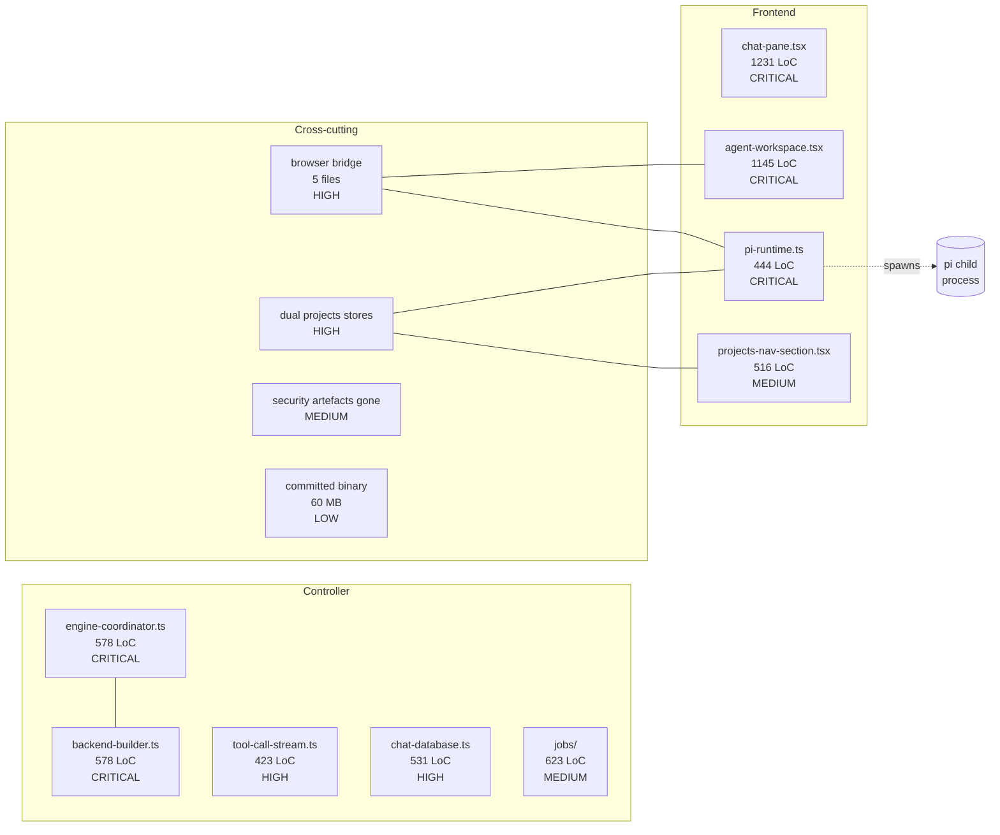

# Chapter 6 — Areas of Complexity

> Where reading the code is hard, where bugs are likely to lurk, where coupling
> is tight, where invariants are implicit, and where file size or branching
> density makes maintenance painful.

This chapter does **not** rehash the inventories from Chapters 1–4. It picks
out the places where complexity is concentrated on `feat/plop-t3code-with-pi`
and explains *why* each spot is hard. Concrete file-level fixes are deferred
to **Chapter 7 (Files to Improve)**.

## Severity rankings

Severity reflects a mix of (a) blast radius if it breaks, (b) likelihood of
introducing latent bugs during routine work, and (c) cost of onboarding a new
contributor against the code.

### Critical (read these first)

| # | Hotspot | One-line justification |
|--:|---------|------------------------|
| 1 | [Single 1000+ line UI files](./giant-frontend-files.md) | `chat-pane.tsx` (1,231 LoC) and `agent-workspace.tsx` (1,145 LoC) each pack ≥ 6 unrelated concerns into one file. |
| 2 | [Engine lifecycle orchestration](./engine-lifecycle-orchestration.md) | `engine-coordinator.ts` (578 LoC) and `backend-builder.ts` (578 LoC) — the central control surface; bugs here brick model launches. |
| 3 | [Pi subprocess management](./pi-subprocess-management.md) | `pi-runtime.ts` (444 LoC) holds an implicit 4-tuple identity, a `starting` promise, JSONL reassembly, command correlation, and process escalation in one class. |

### High

| # | Hotspot | One-line justification |
|--:|---------|------------------------|
| 4 | [Proxy tool-call streaming](./proxy-streaming.md) | `tool-call-stream.ts` (423 LoC) is a stateful SSE rewriter — the kind of thing that's correct only by accident under pressure. |
| 5 | [Browser bridge round-trip](./browser-bridge-coupling.md) | One agent action travels through 5 collaborating files and 4 trust boundaries; state lives in 5 places. |
| 6 | [Two parallel "projects" stores](./dual-projects-stores.md) | Renderer prefers Electron IPC; pi-runtime reads the *server* store; divergence is silent. |
| 7 | [Usage / metrics fragmentation](./usage-metrics-fragmentation.md) | 4 layers (`chat-database`, `pi-sessions`, `metrics-store`, `normalize-usage-stats`) negotiate one number. |

### Medium

| # | Hotspot | One-line justification |
|--:|---------|------------------------|
| 8 | [Dead-shape leftovers](./dead-shape-leftovers.md) | `types/chat.ts` orphaned (chat module deleted), `DEFAULT_CHAT_PROVIDER` flipped local→openai, security middleware test deleted. |
| 9 | [Jobs module survival](./jobs-module-survival.md) | `jobs/{auto,memory,orchestrator,job-manager,workflows/}` (623 LoC) still wired despite `CONTROLLER_SCOPE.md` flagging it. |
| 10 | [Next API → pi process lifetime](./next-api-process-lifetime.md) | A subprocess outlives the HTTP route that spawned it; lifetime is held by `globalThis` only. |
| 11 | [Implicit env / path resolution](./path-resolution-fallbacks.md) | Three resolvers each walk 5–6 candidate paths with no diagnostic when they pick the "wrong" one. |
| 12 | [Security posture gaps](./security-posture-gaps.md) | `.factory/threat-model.md` (600 LoC) and `.factory/security-config.json` deleted; `http/security-middleware.test.ts` deleted while implementation remains. |

### Low

| # | Hotspot | One-line justification |
|--:|---------|------------------------|
| 13 | [Doc fragmentation](./doc-fragmentation.md) | `MIGRATION.md`, `scope.md`, `plan.md`, `CONTROLLER_SCOPE.md` overlap; readers cannot tell aspirational from current. |
| 14 | [Committed CLI binary](./committed-binary.md) | `cli/vllm-studio` is a 60 MB pre-built binary in tree. |

## Heatmap

## Methodology

For each hotspot the chapter records:

1. **Why it's complex** — 3–8 sentences identifying the cognitive burden.
2. **File references** — full repo-root paths with line counts.
3. **Concrete coupling / branching points** — verified by `wc -l` and reads.
4. **What could simplify it** — *high-level* angles. Concrete refactors live
   in **Chapter 7**.
5. **Cross-link** to the relevant Chapter 1–4 page.

## Pages

| Page | Hotspot |
|------|---------|
| [giant-frontend-files.md](./giant-frontend-files.md) | #1 |
| [engine-lifecycle-orchestration.md](./engine-lifecycle-orchestration.md) | #2 |
| [pi-subprocess-management.md](./pi-subprocess-management.md) | #3 |
| [proxy-streaming.md](./proxy-streaming.md) | #4 |
| [browser-bridge-coupling.md](./browser-bridge-coupling.md) | #5 |
| [dual-projects-stores.md](./dual-projects-stores.md) | #6 |
| [usage-metrics-fragmentation.md](./usage-metrics-fragmentation.md) | #7 |
| [dead-shape-leftovers.md](./dead-shape-leftovers.md) | #8 |
| [jobs-module-survival.md](./jobs-module-survival.md) | #9 |
| [next-api-process-lifetime.md](./next-api-process-lifetime.md) | #10 |
| [path-resolution-fallbacks.md](./path-resolution-fallbacks.md) | #11 |
| [security-posture-gaps.md](./security-posture-gaps.md) | #12 |
| [doc-fragmentation.md](./doc-fragmentation.md) | #13 |
| [committed-binary.md](./committed-binary.md) | #14 |
