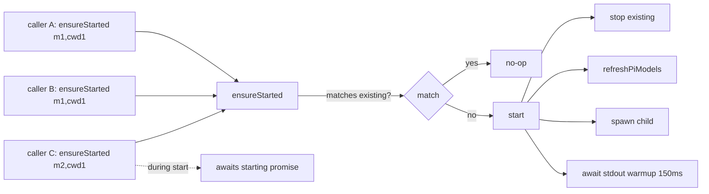

# 3 — Pi subprocess management

> **Severity:** Critical
> **Cross-link:** [Chapter 1 — pi-runtime](../chapter-01-frontend/pi-runtime.md)

## Verified file size

```
444 frontend/src/lib/agent/pi-runtime.ts   (~15 KB)
```

## Why it's complex

`pi-runtime.ts` is the only frontend module that knows how to spawn and
talk to the `@mariozechner/pi-coding-agent` binary. It does seven distinct
jobs in one class:

1. **Identity matching** — every `ensureStarted(modelId, cwd?, piSessionId?,
   browserToolEnabled?)` call compares the **4-tuple** `(modelId, cwd,
   piSessionId, browserToolEnabled)` against the running child to decide
   reuse vs. respawn. If any element differs, the child is killed and
   re-spawned. The 4-tuple is implicit; there is no named record type.
2. **Concurrency serialization** — concurrent callers race for `start()`.
   The class holds a `starting: Promise<void> | null` to coalesce them.
   Anyone awaiting `ensureStarted` while another caller is still warming up
   gets the same promise.
3. **JSONL stdout reassembly** — pi writes one JSON object per line.
   `handleStdout` accumulates partial lines, splits on `\n`, strips
   trailing `\r`, and invokes `handleLine` per complete line. Non-JSON
   lines are emitted as `{ type: "stdout", text: raw }` (silent fallback,
   easy to miss when debugging).
4. **Command-id correlation** — outgoing commands carry an `id`; pi's
   `{ type: "response", id, success, data, error }` is matched against a
   `Map<id, PendingCommand>`. Failure paths must reject *every* pending
   command on `process_exit` to avoid hangs.
5. **EventEmitter passthrough** — anything that isn't a response is
   `this.emit("event", parsed)`. A new event type added to pi shows up
   here automatically — but because the matcher is "is it a response?",
   a malformed response with `type: "response"` but no matching `id`
   is dropped silently.
6. **Process lifecycle** — `stop()` issues `SIGTERM`, waits 500 ms for
   `exit`, then `SIGKILL`. The 500 ms is hard-coded.
7. **Model materialization side-effect** — `start()` calls `refreshPiModels()`
   which writes `<dataDir>/pi-agent/models.json` with `chmod 0o600`. A
   spawn failure that occurs before the file write succeeds leaves the
   model list stale. A spawn failure after the write leaves a fresh file
   with no running pi.

## Implicit invariants

| Invariant | Where it lives | Risk |
|-----------|----------------|------|
| `sessionId === "default"` if caller doesn't provide one | `getSession(sessionId = "default")` | Two callers that both omit `sessionId` share one pi child. |
| The 4-tuple uniquely identifies a pi child | `ensureStarted` matcher | Adding a 5th identity dimension (e.g., model temperature) is silent until tested. |
| `starting` is cleared in a `finally` | `start()` | An exception that escapes `finally` would wedge every future call. |
| `pending.delete(id)` happens on response *and* on `process_exit` | Two separate code paths | Adding a third resolution path (timeout) requires updating both. |
| The 30-minute prompt timeout is a safety net only | `prompt()` | Timeout fires for legitimately slow runs; there's no escalation path. |
| The Manager singleton is on `globalThis.__vllmStudioPiRuntime` | bottom of file | Held across HMR; in production held implicitly by the Node process. |

## Race-condition surface



If caller C arrives during a `start()` for `m1` and asks for `m2`, it is
queued behind `starting` (which is for `m1`) and only re-evaluates the
4-tuple after `starting` resolves. The desired model can flip mid-flight
with no log message.

## What could simplify it

- Promote the 4-tuple to a named `PiSessionKey` type with a `equals`
  function — and make every `start`/`ensureStarted` log it explicitly.
- Split the class along its three concerns: process lifecycle (`spawn` /
  stop / SIGTERM→SIGKILL), JSONL transport (line buffer + command map),
  and model materialization (`refreshPiModels` is doing I/O work
  unrelated to subprocess RPC).
- Replace the silent "non-JSON line → `stdout` event" path with a counted
  warning so first-time spawn issues surface.
- Keep the `globalThis` singleton trick for HMR but document it; it's
  load-bearing in dev and easy to mistake for an oversight.
- Make the 30-minute prompt timeout configurable per pane, and emit a
  reason on rejection.
