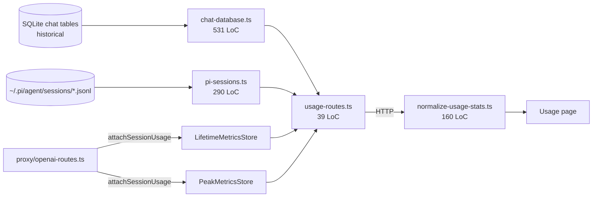

# 7 — Usage / metrics / chat-database fragmentation

> **Severity:** High
> **Cross-link:** [Chapter 2 — system module](../chapter-02-controller/system-module.md), [Chapter 2 — modifications inventory](../chapter-02-controller/modifications-inventory.md)

## Verified files

```
531 controller/src/modules/system/usage/chat-database.ts          (largest)
290 controller/src/modules/system/usage/pi-sessions.ts            (NEW)
227 controller/src/modules/system/metrics-store.ts                (Peak + Lifetime)
160 frontend/src/app/usage/lib/normalize-usage-stats.ts
 39 controller/src/modules/system/usage-routes.ts                 (thin shim)
126 controller/src/types/chat.ts                                  (orphan — see #8)
```

Plus tests: `chat-database.test.ts` (73 LoC), `pi-sessions.test.ts` (53 LoC),
`normalize-usage-stats.test.ts`.

## Why it's complex

The "usage" surface answers a single question — *how many tokens has the
user spent?* — by stitching data from **three sources**:

1. **`chat-database.ts` (531 LoC)** — reads two SQLite databases and merges
   per-message usage rows. The "chat" tree was deleted from the controller
   on this branch, but the SQLite files it wrote (and their schema) are
   still being read here.
2. **`pi-sessions.ts` (290 LoC)** — NEW. Reads `~/.pi/agent/sessions/*.jsonl`
   and parses pi's own session log format. This is the new source of truth
   for usage now that the in-controller chat runtime is gone.
3. **`metrics-store.ts` (227 LoC)** — Peak + Lifetime counters in SQLite,
   updated by the proxy's `attachSessionUsage` on every completion.

The frontend then runs **`normalize-usage-stats.ts` (160 LoC)** to flatten
those three shapes into one display payload.

## The "chat" shadow

The chat module is gone (Chapter 2). But:

- `controller/src/types/chat.ts` (126 LoC) is still present and exports
  `ChatSessionListItem`, `ChatSessionSummary`. It's flagged as `// CRITICAL`
  in the file header.
- `chat-database.ts` is now reading **historical** SQLite tables that no
  living code writes to. Its 531 LoC of SQL and aggregation exists to read
  the past.
- `pi-sessions.ts` is the new path for ongoing usage.
- The "usage" routes (`usage-routes.ts`, 39 LoC) merge both.

So **two providers of the same data** coexist, with subtly different
shapes:

| Field | chat-database | pi-sessions |
|-------|---------------|-------------|
| Identity | `session_id` (UUID) | session log filename / pi session id |
| Per-message usage | `request_prompt_tokens`, `request_completion_tokens`, `request_total_input_tokens` | parsed from JSONL `usage` events |
| Cache tokens | not present | possibly present per pi-ai's `Usage` type |
| Cost | not computed | not computed |
| Time range | from SQLite `created_at`/`updated_at` | from JSONL timestamps |

`normalize-usage-stats.ts` has to reconcile these. Adding a new field to
the display means edits in 4 files (chat-database SQL, pi-sessions parser,
metrics-store schema if persisted, normaliser).

## Coupling diagram



Four data sources, one display.

## Implicit invariants

- The chat SQLite tables exist and are readable. If a fresh install never
  ran the old chat module, `chat-database.ts` returns empty rows — the
  caller cannot distinguish "no usage" from "no historical data".
- pi's session JSONL files live under `~/.pi/agent/sessions/`. `pi-runtime`
  sets `PI_CODING_AGENT_DIR` to `<dataDir>/pi-agent` — but
  `pi-sessions.ts` reads the default `~/.pi/agent/sessions/` path. **The
  two locations may differ.** (See [path-resolution-fallbacks.md](./path-resolution-fallbacks.md).)
- `normalize-usage-stats.ts` decides which numbers to display. A new
  metric requires the normaliser to know about it; otherwise it's
  silently dropped.

## What could simplify it

- Pick one storage substrate for usage. If pi's JSONL is the future, write
  a one-time migration that imports historical SQLite usage into the
  pi-sessions index, then delete `chat-database.ts` and `types/chat.ts`.
- Promote `normalize-usage-stats.ts` to a typed union with one variant per
  source so the renderer knows where each datum came from.
- Make `pi-sessions.ts` and `pi-runtime.ts` agree on the agent-data
  directory by sharing a single resolver function. Today
  `pi-runtime.ts:getWritableDataDir()` and `pi-sessions.ts`'s read path
  are independent.
