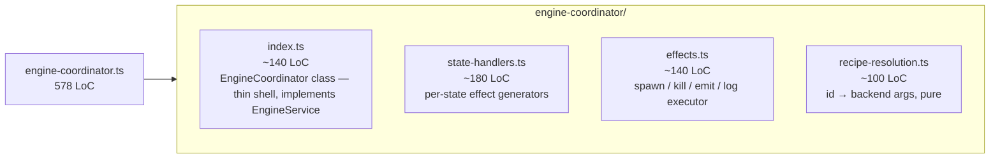
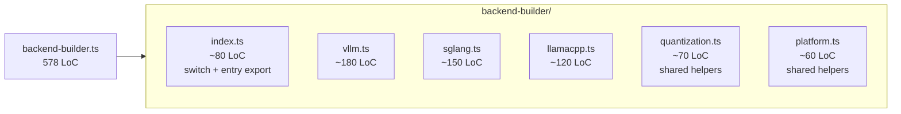
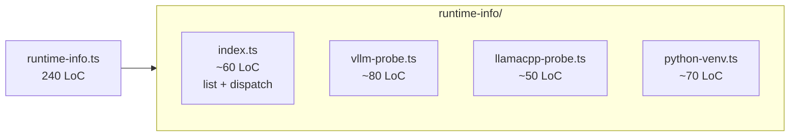
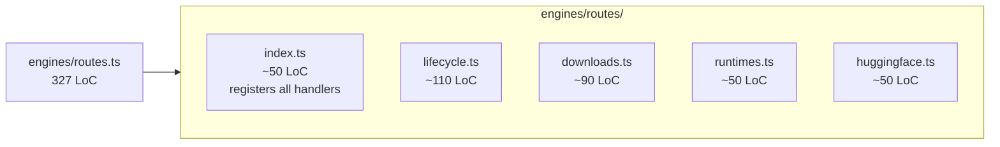
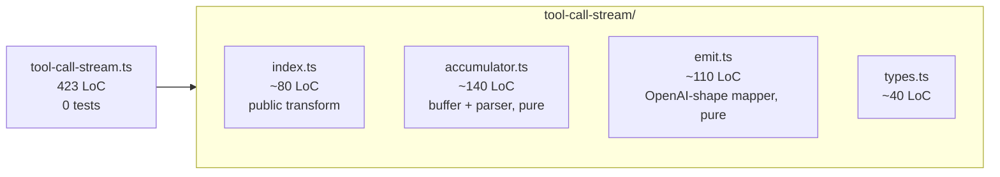
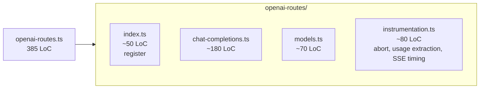
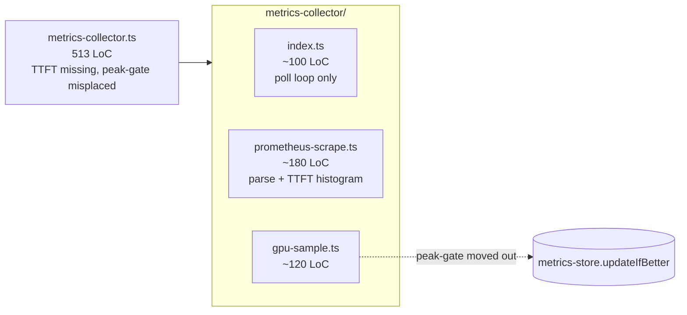

# B — Giant Controller Files

> Files in `controller/src/` that are doing too much. Per [CONTROLLER_SCOPE.md §3](../../CONTROLLER_SCOPE.md), the target controller fits in ~4,500 LoC across ~40 files. The files below are the heaviest blockers between today and that target.

---

## 5. `engine-coordinator.ts`

**Path:** `controller/src/modules/engines/layers/engine-coordinator.ts`
**Size:** **578 LoC** (verified).

### Symptoms

Single file owns:
- State-machine wiring (creates the engine-lifecycle machine, subscribes to transitions).
- Effect execution (spawn process, kill process, emit SSE event, write log).
- Event-bus integration (publishes `lifecycle.*` events).
- Recipe lookup (resolves recipe id → backend args).
- Download trigger (decides whether to launch a model download before launch).
- Abort plumbing (cancel-launch, force-evict).

Five reasons to change in one file. CONTROLLER_SCOPE.md target is to flatten lifecycle into `lifecycle/coordinator.ts` (~1,200 LoC across the whole domain) — splitting this file is the first step.

### Proposed refactor

Concrete paths:

| File | Owns |
|------|------|
| `controller/src/modules/engines/layers/engine-coordinator/index.ts` | `EngineCoordinator` class implementing `EngineService` (`launch`, `ensureActive`, `evict`, `cancelLaunch`); wires the rest |
| `controller/src/modules/engines/layers/engine-coordinator/state-handlers.ts` | for each state (`launching`, `running`, `evicting`, …) the side-effect generator function |
| `controller/src/modules/engines/layers/engine-coordinator/effects.ts` | the effect executor — translates `{ type: 'spawn', … }` into `processManager.spawn(...)` |
| `controller/src/modules/engines/layers/engine-coordinator/recipe-resolution.ts` | recipe id → resolved launch parameters; pure; unit-tested |

### Estimated impact

- Net LoC: ~0.
- Per-file LoC: 100–180.
- Effects executor becomes mockable in a test (currently all of `engine-coordinator.ts` has to be initialized to test even one transition).
- Risk: **high** — this file is the controller's spine. Migrate behind the existing `EngineService` contract (`controller/src/services/engine-service.ts`) so consumers don't change.
- Verification: `npx tsc --noEmit` and `bun test` (per [MIGRATION.md Phase 1 verification](../../MIGRATION.md)).

### Dependencies

- Should land **before** the CONTROLLER_SCOPE.md Phase 2 flattening (which renames `engines/` → `lifecycle/`). Splitting now means the rename is a `git mv` of a folder, not a rewrite.

---

## 6. `backend-builder.ts`

**Path:** `controller/src/modules/engines/layers/backend-builder.ts`
**Size:** **578 LoC** (verified).

### Symptoms

- Three engines in one file: vLLM, SGLang, llama.cpp.
- Quantization handling and platform detection (CUDA / ROCm / Metal) interleaved with each backend's args list.
- A single export switches over `recipe.backend`, but the body is "if vllm: 200 lines, else if sglang: 180 lines, else llamacpp: 150 lines".
- Adding a new flag to one backend touches the same file as adding a flag to a different backend → unnecessary merge conflicts.

### Proposed refactor

Concrete paths:

| File | Owns |
|------|------|
| `controller/src/modules/engines/layers/backend-builder/index.ts` | `buildArgs(recipe)` switch + the public export |
| `controller/src/modules/engines/layers/backend-builder/vllm.ts` | `buildVllmArgs(recipe)` |
| `controller/src/modules/engines/layers/backend-builder/sglang.ts` | `buildSglangArgs(recipe)` |
| `controller/src/modules/engines/layers/backend-builder/llamacpp.ts` | `buildLlamaCppArgs(recipe)` |
| `controller/src/modules/engines/layers/backend-builder/quantization.ts` | `resolveQuantization(recipe, platform)` |
| `controller/src/modules/engines/layers/backend-builder/platform.ts` | platform detection helpers (CUDA/ROCm/Metal) |

Note: CONTROLLER_SCOPE.md proposes `lifecycle/engines.ts` as a single file. That target is fine because per-backend logic *should* be small once the dead code is gone — but in the meantime, six files of 60–180 LoC are far easier to delete from than one file of 578.

### Estimated impact

- Net LoC: ~0 short term; sets up CONTROLLER_SCOPE.md Phase 2 to rip out unused arg builders → expected –200 LoC.
- Risk: **low** — pure functions, easy to verify by snapshotting `buildArgs(recipe)` output.

### Dependencies

- None. Can land at any time.

---

## 7. `runtime-info.ts`

**Path:** `controller/src/modules/engines/layers/runtime-info.ts`
**Size:** **240 LoC** (verified — earlier estimate was 11 KB / ~400; actual is smaller).

> Note: file is smaller than originally flagged. Still split-worthy but lower priority.

### Symptoms

- Mixes vLLM-server probing (over HTTP), Python venv detection (filesystem walks), and the runtime listing endpoint.
- HTTP probe and venv probe have different failure modes (HTTP timeout vs ENOENT) but share a generic `try/catch` block at the top level.

### Proposed refactor

Concrete paths:

| File | Owns |
|------|------|
| `controller/src/modules/engines/layers/runtime-info/index.ts` | `getRuntimeInfo()` aggregator |
| `controller/src/modules/engines/layers/runtime-info/vllm-probe.ts` | HTTP probe to `:8000/health`, version parse |
| `controller/src/modules/engines/layers/runtime-info/llamacpp-probe.ts` | binary check, `--version` parse |
| `controller/src/modules/engines/layers/runtime-info/python-venv.ts` | discover venvs under known paths |

### Estimated impact

- Net LoC: ~0.
- Per-file LoC: 50–80.
- Risk: **low**.

### Dependencies

- None.

---

## 8. `engines/routes.ts`

**Path:** `controller/src/modules/engines/routes.ts`
**Size:** **327 LoC** (verified — earlier estimate "13 KB" matches but LoC is lower than feared).

### Symptoms

- Holds every HTTP handler for the engines module: lifecycle (`launch`, `evict`, `cancel`), downloads (`POST /downloads`, `GET /downloads/:id`, `DELETE`), runtimes (`GET /runtimes`), and Hugging Face proxy (`GET /huggingface/search`).
- Existing test file `controller/src/modules/engines/routes.test.ts` already exercises a subset; harder to expand without the file blowing up further.

### Proposed refactor

Concrete paths:

| File | Owns |
|------|------|
| `controller/src/modules/engines/routes/index.ts` | `registerEngineRoutes(app, ctx)` |
| `controller/src/modules/engines/routes/lifecycle.ts` | `/launch`, `/evict`, `/cancel-launch` |
| `controller/src/modules/engines/routes/downloads.ts` | `/downloads/*` |
| `controller/src/modules/engines/routes/runtimes.ts` | `/runtimes` |
| `controller/src/modules/engines/routes/huggingface.ts` | `/huggingface/search` |

### Estimated impact

- Net LoC: ~0.
- Risk: **low** — handlers are independent.
- Test file `engines/routes.test.ts` stays put (one test file per route group can come later).

### Dependencies

- Should land **after** any in-flight work in `engines/routes.ts` to avoid conflicts.

---

## 9. `download-manager.ts`

**Path:** `controller/src/modules/engines/layers/download-manager.ts`
**Size:** **387 LoC** (verified — earlier estimate "13 KB" matches).

### Symptoms

- Mixes API client (talks to Hugging Face), state store updates (writes to `download-store.ts`), state-machine dispatch (download lifecycle machine), and filesystem writes (target paths).
- Each concern is small individually; the pile feels coherent today.

### Proposed action: **watch only** for now

This file is on the boundary: large enough to flag, small enough that splitting may not pay off until a feature lands that needs to evolve one of the four concerns. Keep it on the watch list.

**Trigger to revisit:** any of:
1. New download source added (S3, Modal, etc.) → split API client.
2. Download UI gains progress eventing distinct from the current single channel → split state store + machine.
3. File grows past 500 LoC → split immediately.

### Estimated impact

- Net LoC: 0.
- Risk: **low** (no action).

### Dependencies

- None.

---

## 10. `tool-call-stream.ts`

**Path:** `controller/src/modules/proxy/tool-call-stream.ts`
**Size:** **423 LoC** (verified).

### Symptoms

- Stateful stream transform (accumulates tokens, detects tool-call XML/JSON, emits OpenAI-shaped tool-call deltas).
- Currently has **no test file** — see [test-gaps.md](./test-gaps.md#tool-call-stream-tests).
- CONTROLLER_SCOPE.md targets ~300 LoC for `proxy/tool-calls.ts` after dead-path removal — splitting also clarifies which paths are actually live.

### Proposed refactor

Concrete paths:

| File | Owns |
|------|------|
| `controller/src/modules/proxy/tool-call-stream/index.ts` | the public stream-transform export; orchestrates accumulator + emit |
| `controller/src/modules/proxy/tool-call-stream/accumulator.ts` | character-by-character buffer with XML/JSON detection — pure, unit-testable |
| `controller/src/modules/proxy/tool-call-stream/emit.ts` | accumulator state → OpenAI tool-call deltas — pure, unit-testable |
| `controller/src/modules/proxy/tool-call-stream/types.ts` | shared types |

### Estimated impact

- Net LoC: ~0 (will drop ~100 LoC of dead paths once tests pin behavior — see [test-gaps](./test-gaps.md)).
- Per-file LoC: 40–140.
- Test coverage: from 0% to high (each pure module unit-tested).
- Risk: **medium** — touches the proxy hot path. Land tests first, then split.

### Dependencies

- Tests must land first. See [test-gaps.md](./test-gaps.md#tool-call-stream-tests).

---

## 11. `openai-routes.ts`

**Path:** `controller/src/modules/proxy/openai-routes.ts`
**Size:** **385 LoC** (verified — earlier estimate "13 KB" matches).

### Symptoms

- Hosts both `/v1/chat/completions` and `/v1/models` passthrough.
- Has abort-handling, usage extraction, and SSE relay logic mixed in.
- Existing test `controller/src/modules/proxy/openai-routes.test.ts` covers some scenarios; expanding it requires reading 385 LoC of context first.

### Proposed refactor

Concrete paths:

| File | Owns |
|------|------|
| `controller/src/modules/proxy/openai-routes/index.ts` | `registerOpenAIRoutes(app, ctx)` |
| `controller/src/modules/proxy/openai-routes/chat-completions.ts` | `POST /v1/chat/completions` |
| `controller/src/modules/proxy/openai-routes/models.ts` | `GET /v1/models` |
| `controller/src/modules/proxy/openai-routes/instrumentation.ts` | abort, usage extraction, SSE timing helpers shared by the two routes |

### Estimated impact

- Net LoC: ~0.
- Risk: **low** — handlers are independent; instrumentation already has clear seams.

### Dependencies

- None.

---

## 12. `chat-database.ts`

**Path:** `controller/src/modules/system/usage/chat-database.ts`
**Size:** **531 LoC** (verified).

### Symptoms

- Refers to "chat" semantics that have been deleted from controller (per [Chapter 2 deletions inventory](../chapter-02-controller/deletions-inventory.md)).
- Per CONTROLLER_SCOPE.md §6 Phase 1: `chat-database.ts` is in the explicit **delete list**. The "usage" concern collapses into the existing `LifetimeMetricsStore`.

### Proposed action

This is **not a split** — it's a deletion candidate. See [type-and-route-orphans.md](./type-and-route-orphans.md#chat-database-orphan).

If "usage" rows are still useful, rename/migrate them into `controller/src/modules/system/usage/usage-database.ts` with a slimmer schema (`session_id, prompt_tokens, completion_tokens, ts`) — at most ~80 LoC.

### Estimated impact

- LoC delta: **–531** (delete) or **–~450** (rename + slim).
- Risk: **low** — has to be confirmed there are no live writers; trivial to grep.

### Dependencies

- Verify zero writers. See [type-and-route-orphans.md](./type-and-route-orphans.md#chat-database-orphan).

---

## 13. `metrics-collector.ts`

**Path:** `controller/src/modules/system/metrics-collector/metrics-collector.ts`
**Size:** **513 LoC** (verified).

### Symptoms

- Polling loop + Prometheus scraper + GPU sampler + peak-gate logic, all in one file.
- Per [CONTROLLER_SCOPE.md §1](../../CONTROLLER_SCOPE.md):
  - **TTFT was never wired** (frontend dashboard expects it; collector doesn't compute it).
  - **Peak-gate "lives in the wrong place"** — the `generationThroughput > 5` conditional should be in the metrics store, not the collector.

### Proposed refactor

Concrete paths:

| File | Owns |
|------|------|
| `controller/src/modules/system/metrics-collector/metrics-collector.ts` (kept, slimmed) | 5 s poll loop only |
| `controller/src/modules/system/metrics-collector/prometheus-scrape.ts` | parse vLLM `/metrics`, **wire TTFT** from `vllm:time_to_first_token_seconds_*` quantile histogram |
| `controller/src/modules/system/metrics-collector/gpu-sample.ts` | `nvidia-smi`/`amd-smi` invocation + parsing |
| `controller/src/modules/system/metrics-collector/metrics-store.ts` (existing, edited) | absorbs `updateIfBetter()` peak-gate logic from collector |

### Estimated impact

- LoC delta: **–~150** (peak-gate removed; TTFT wired adds back ~30; net negative).
- Wires TTFT, which is currently displayed-but-zero in the dashboard.
- Risk: **medium** — touches the live metrics path; test by comparing scrape output before/after on the remote GPU box.

### Dependencies

- This is also a [CONTROLLER_SCOPE.md Phase 3](../../CONTROLLER_SCOPE.md) task; landing this split is the prerequisite.

---

## Summary table

| # | File | LoC | Action | Net delta | Risk |
|---|------|-----|--------|----------:|------|
| 5 | engine-coordinator.ts | 578 | split → 4 files | ~0 | High |
| 6 | backend-builder.ts | 578 | split → 6 files | ~0 (–200 later) | Low |
| 7 | runtime-info.ts | 240 | split → 4 files | ~0 | Low |
| 8 | engines/routes.ts | 327 | split → 5 files | ~0 | Low |
| 9 | download-manager.ts | 387 | watch | 0 | Low |
| 10 | tool-call-stream.ts | 423 | tests then split → 4 files | ~0 (–~100 later) | Medium |
| 11 | openai-routes.ts | 385 | split → 4 files | ~0 | Low |
| 12 | chat-database.ts | 531 | **delete** (or slim to ~80) | **–531 / –450** | Low |
| 13 | metrics-collector.ts | 513 | split → 3 files + move peak gate | **–~150** | Medium |

**Combined controller delta from this section alone: –~700 LoC** (without the deeper trims targeted by CONTROLLER_SCOPE.md).
