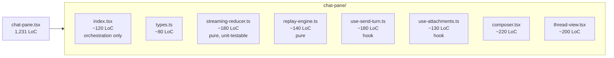
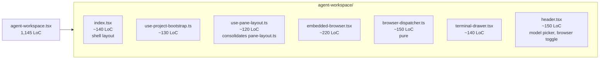
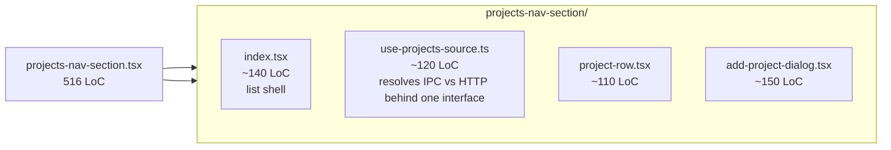
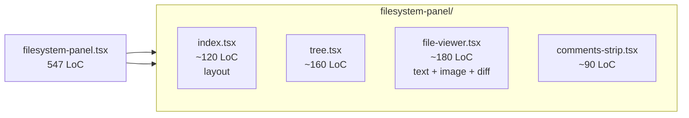

# A — Giant UI Files (Frontend)

> Four files. Three of them are >1000 LoC. They are the highest-leverage refactors on the frontend half of this branch — every Phase-1/Phase-2 task in [scope.md §6](../../scope.md) touches at least one of them.

---

## 1. `chat-pane.tsx`

**Path:** `frontend/src/app/agent/_components/chat-pane.tsx`
**Size:** **1,231 LoC** (verified `wc -l`).

### Symptoms

- Owns 8 distinct concerns:
  1. Type definitions for `ChatPaneProps`, replay frames, attachment shape, etc.
  2. Attachment intake (drag/drop, paste, image conversion).
  3. Streaming reducer (turning SSE deltas into a coherent message tree).
  4. Replay engine for the "scrub previous turn" feature.
  5. Send-turn lifecycle (POST → stream → abort handling).
  6. The composer view (textarea, command picker, attachment chips).
  7. The thread view (message list rendering).
  8. The empty-state and error-state views.
- Imports from `pi-runtime`, the agent store, the SSE client, the file IPC bridge, and 6 sub-components — every one of those imports survives even when the file is only re-rendering the textarea.
- Hot-reload during dev recompiles the entire 42 KB file for a single CSS change to a chip.
- A unit test for the streaming reducer is impossible without rendering React.

### Cross-references

- [Chapter 1 — chat-pane deep dive](../chapter-01-frontend/chat-pane-deep-dive.md) for the line-by-line responsibility map.
- The composer enhancements in [scope.md §5.2.2](../../scope.md) (file mentions, command palette, attachment preview) all land inside this file.

### Proposed refactor

Convert the single file into a directory:

Concrete file paths:

| File | Owns |
|------|------|
| `frontend/src/app/agent/_components/chat-pane/index.tsx` | exported `<ChatPane>`; layout-only; wires hooks/components |
| `frontend/src/app/agent/_components/chat-pane/types.ts` | shared types (`ChatPaneProps`, `Attachment`, `ReplayFrame`, etc.) |
| `frontend/src/app/agent/_components/chat-pane/streaming-reducer.ts` | pure reducer `(state, ssEvent) => state`. Tested in isolation. |
| `frontend/src/app/agent/_components/chat-pane/replay-engine.ts` | pure replay state machine |
| `frontend/src/app/agent/_components/chat-pane/use-send-turn.ts` | abort-controller-aware send hook |
| `frontend/src/app/agent/_components/chat-pane/use-attachments.ts` | drag/drop, paste, file-picker plumbing |
| `frontend/src/app/agent/_components/chat-pane/composer.tsx` | textarea + chips view |
| `frontend/src/app/agent/_components/chat-pane/thread-view.tsx` | virtualized message list |

Notes:
- Both reducer files become **pure modules** — no React imports — so they get test coverage without `@testing-library/react`. This is the lever for the [test-gaps](./test-gaps.md) story.
- `use-send-turn.ts` is the natural home for the `isSendingRef` + run-registry guards from [scope.md §4.1](../../scope.md).

### Estimated impact

- Net LoC: **~0** (split, not rewrite).
- Per-file LoC: 80–220, all individually understandable.
- Hot-reload time on a chip CSS change: down ~10×.
- Test coverage: reducer + replay engine become testable for the first time.
- Risk: **medium** — `chat-pane.tsx` is the surface for live agent interaction. Migrate behind a single export and verify with the existing manual SSE smoke test (the dev server at `localhost:3001/agent`) before committing.

### Dependencies

- None. Can land before any other Chapter 7 task.
- **Should** land before any new feature work in [scope.md Phase 1](../../scope.md) so the new code doesn't re-grow the same blob.

---

## 2. `agent-workspace.tsx`

**Path:** `frontend/src/app/agent/_components/agent-workspace.tsx`
**Size:** **1,145 LoC** (verified).

### Symptoms

- Single component covers:
  - Multi-pane layout (chat / browser / terminal / filesystem).
  - Project picker dialog and persisted "last project" logic.
  - Embedded webview (Electron + iframe) and its IPC.
  - Browser command dispatcher (open URL / back / forward / reload from agent tools).
  - Terminal drawer state.
  - URL-param resumption (`?session=...&project=...`).
  - Model picker.
- Has its own ad-hoc pane-layout state alongside the existing `pane-layout.ts` helper — duplication noted in [Chapter 1](../chapter-01-frontend/agent-workspace-deep-dive.md).
- Touched by: every command-palette feature in [scope.md §5.2.2](../../scope.md), every browser-tool change, every terminal-drawer change, and the model-discovery work in [scope.md §2.1](../../scope.md). It's a merge-conflict magnet.

### Proposed refactor

Concrete paths:

| File | Owns |
|------|------|
| `frontend/src/app/agent/_components/agent-workspace/index.tsx` | composition only |
| `frontend/src/app/agent/_components/agent-workspace/use-project-bootstrap.ts` | URL-param resumption, project picker open/close, persisted last-project read |
| `frontend/src/app/agent/_components/agent-workspace/use-pane-layout.ts` | merges with existing `frontend/src/app/agent/_components/pane-layout.ts` (delete the old, re-export from here) |
| `frontend/src/app/agent/_components/agent-workspace/embedded-browser.tsx` | iframe + Electron BrowserView IPC |
| `frontend/src/app/agent/_components/agent-workspace/browser-dispatcher.ts` | maps `browser_open_url`/`back`/`forward` agent tool calls into IPC events; pure & unit-testable |
| `frontend/src/app/agent/_components/agent-workspace/terminal-drawer.tsx` | drawer + command stream view |
| `frontend/src/app/agent/_components/agent-workspace/header.tsx` | model picker, browser toggle, "open in finder" |

Notes:
- The existing `pane-layout.ts` file (a few helpers) should fold into `use-pane-layout.ts` so there is one source of truth for layout state. Delete the old file.
- `browser-dispatcher.ts` has no React or Electron-specific imports → unit-testable.

### Estimated impact

- Net LoC: ~0; pane-layout consolidation actually removes a duplicate (~30 LoC).
- Per-file LoC: 120–220.
- Risk: **medium** — touches the desktop IPC shim. Verify Electron build with `cd frontend && npm run desktop:dist` after split.

### Dependencies

- Should land **after** chat-pane split or in parallel; `agent-workspace` imports `<ChatPane>` so the import path needs updating once.
- Independent of all controller refactors.

---

## 3. `projects-nav-section.tsx`

**Path:** `frontend/src/components/projects-nav-section.tsx`
**Size:** **516 LoC** (verified).

### Symptoms

- One file for: list rendering, "add project" dialog, dialog form state, IPC fallback (Electron), HTTP fallback (browser), and "delete project" confirm.
- The IPC-vs-HTTP fallback is interleaved with the rendering code (`if (isElectron) … else …` scattered in render).
- Adding a new project field (e.g. workspace path from [scope.md §5.5.1](../../scope.md)) requires touching three places.

### Proposed refactor

Concrete paths:

| File | Owns |
|------|------|
| `frontend/src/components/projects-nav-section/index.tsx` | section header, list, conditional empty state |
| `frontend/src/components/projects-nav-section/use-projects-source.ts` | hook returning `{ projects, addProject, deleteProject }` — picks IPC or HTTP at runtime; one boundary instead of N |
| `frontend/src/components/projects-nav-section/project-row.tsx` | one row + actions |
| `frontend/src/components/projects-nav-section/add-project-dialog.tsx` | dialog + form |

Notes:
- After this split, `use-projects-source.ts` is the **single** place where IPC vs HTTP branching lives. Future contracts (workspace path, agent files prefix from [scope.md §5.5](../../scope.md)) extend that one interface.
- `project-row.tsx` and `add-project-dialog.tsx` are now reusable from outside the nav section if needed.

### Estimated impact

- Net LoC: ~0.
- Removes IPC/HTTP scatter — boundary becomes one hook.
- Risk: **low** — pure UI; manual smoke test is "open project picker, add a project."

### Dependencies

- None. Independent of every other task in this chapter.

---

## 4. `filesystem-panel.tsx`

**Path:** `frontend/src/app/agent/_components/filesystem-panel.tsx`
**Size:** **547 LoC** (verified — earlier estimate of "18 KB" matches).

### Symptoms

- Mixes the file tree, the file viewer, the comments strip, and the diff toggle in one file.
- Comments-strip wiring (used by the agent's `add_comment`/`resolve_comment` events) is interleaved with tree state; the only reason the strip lives here is historical.

### Proposed refactor

Concrete paths:

| File | Owns |
|------|------|
| `frontend/src/app/agent/_components/filesystem-panel/index.tsx` | split panel layout, selection state |
| `frontend/src/app/agent/_components/filesystem-panel/tree.tsx` | virtualized tree with expand/collapse |
| `frontend/src/app/agent/_components/filesystem-panel/file-viewer.tsx` | renderer (markdown / image / text / diff) |
| `frontend/src/app/agent/_components/filesystem-panel/comments-strip.tsx` | comment list + add comment |

### Estimated impact

- Net LoC: ~0.
- Comments strip becomes reusable (the chat-pane's "inline comment chip" can import it).
- Risk: **low**.

### Dependencies

- None. Can land alongside any other UI split.

---

## Combined risk matrix

| File | Net LoC delta | Risk | Verification |
|------|---------------|------|--------------|
| chat-pane | 0 | Medium | manual SSE smoke; agent stream end-to-end |
| agent-workspace | –30 | Medium | electron `desktop:dist` + open/close project picker |
| projects-nav-section | 0 | Low | manual: add/delete project (IPC + HTTP) |
| filesystem-panel | 0 | Low | manual: open project, view file, add comment |

All four are framework-independent splits — no React rewrite, no logic change. The win is **per-file size + testability**, not LoC reduction.
