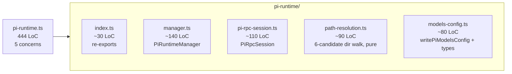

# C — Pi Runtime Split

> The pi-runtime helper is the bridge between the frontend and the Pi coding-agent runtime. As of this branch it is one 444-LoC file doing five jobs.

---

## 14. `pi-runtime.ts`

**Path:** `frontend/src/lib/agent/pi-runtime.ts`
**Size:** **444 LoC** (verified — earlier estimate "15 KB" matches).

### Symptoms

- Single file owns:
  1. `PiRpcSession` class — JSON-RPC pump over Pi's child-process IPC.
  2. `PiRuntimeManager` — lifecycle of the Pi runtime process (spawn, ready-probe, restart, shutdown).
  3. **Path resolution** — six-candidate directory walk to find `pi-mono` install (npm prefix, `~/.pi`, monorepo workspace, dev override, etc.).
  4. **Models config** — `writePiModelsConfig()` materializes the controller's discovered models into Pi's `models.json`.
  5. Dozens of small helpers (json-line parsing, env merge, log-tail).
- Cross-references: see [Chapter 1 — pi-runtime](../chapter-01-frontend/pi-runtime.md) for the responsibility map.
- Per [scope.md §1.1](../../scope.md), Pi integration is the spine of the new chat surface — this file is the only place that knows where Pi lives. Every Phase-1 task in [scope.md §6](../../scope.md) (token tracking, stream proxy, steering queue) extends one of the five concerns above.
- The path-resolution logic in particular is both fragile and untested; dev/prod path drift has caused outages noted in commit history.

### Proposed refactor

Convert to a directory; each helper file is testable without booting the runtime.

Concrete paths:

| File | Owns |
|------|------|
| `frontend/src/lib/agent/pi-runtime/index.ts` | re-exports `PiRuntimeManager`, `PiRpcSession`, `writePiModelsConfig`, type aliases — single import point for callers |
| `frontend/src/lib/agent/pi-runtime/manager.ts` | `PiRuntimeManager` class (spawn, ready, restart, shutdown) |
| `frontend/src/lib/agent/pi-runtime/pi-rpc-session.ts` | `PiRpcSession` class (JSON-RPC pump, request/notify/abort) |
| `frontend/src/lib/agent/pi-runtime/path-resolution.ts` | pure module: `resolvePiInstallDir()`, candidate enumeration, env-override hooks — fully unit-testable |
| `frontend/src/lib/agent/pi-runtime/models-config.ts` | `writePiModelsConfig(models)`, schema, default fallbacks |

### Why these splits matter

- `path-resolution.ts` becomes **pure** (no `child_process`, no `fs.spawnSync`) — every candidate path becomes a function returning a string; the orchestrator picks the first one that exists. Tests can cover all six branches by mocking `fs.existsSync`.
- `models-config.ts` becomes **schema-first** — the contract Pi expects is declared in one place. Future work in [scope.md §3](../../scope.md) (cost model, cache tokens) extends this file's schema only.
- `pi-rpc-session.ts` becomes **transport-only** — no knowledge of Pi paths or models, just a JSON-RPC pump. Reusable for any other JSON-RPC peer (e.g. a future MCP host).
- `manager.ts` becomes **lifecycle-only** — one class, one job (spawn/restart/shutdown).

### Estimated impact

- Net LoC: ~0.
- Per-file LoC: 30–140.
- Test coverage: `path-resolution.ts` and `models-config.ts` go from 0 to high (both pure).
- Risk: **medium** — this is the agent-spine import in the frontend. Migrate behind `pi-runtime/index.ts` re-exports so callers don't change their import paths in step 1; later cleanups can update imports per consumer.
- Verification: `cd frontend && npx next build` + manual `localhost:3001/agent` smoke (start a turn, see Pi spawn).

### Dependencies

- None upstream.
- **Should** land before [scope.md Phase 1](../../scope.md) tasks (token tracking, stream proxy) — those tasks all extend one of the four split files; landing the split first means each Phase-1 PR touches a 100-LoC file rather than a 444-LoC file.

---

## Note: this is the only file in section C

Section C exists as its own page because pi-runtime is the agent spine — it deserves a dedicated entry rather than being lumped with the giant-UI-files page. The scope of the change is the same as one of the splits in [section A](./giant-ui-files.md), but the impact is concentrated on Pi-integration work specifically.
