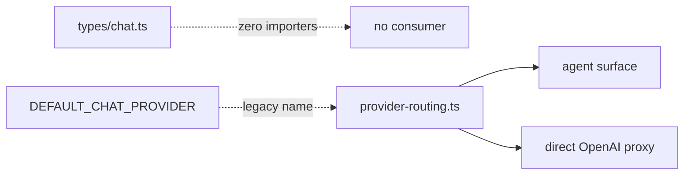

# Chat‑era leftovers: clean up after the agent surface migration

Two small leftovers from the chat→agent migration: a chat type sub‑tree
with no consumer, and a constant whose name still references chat.

## Both halves

### #19 — `controller/src/types/chat.ts`

| File                                                    | Status                                                       | LoC |
|---------------------------------------------------------|--------------------------------------------------------------|----:|
| `controller/src/types/chat.ts`                           | +16 LoC on this branch                                        | ~120 |
| Consumers in `controller/src`                            | **None.** `grep` for `from.*types/chat` finds nothing.         | — |

Chapter 2 says:

> `types/chat.ts` survived even though the chat *runtime* was deleted —
> the proxy still needs `ChatCompletionMessage`, `ToolCall`, etc. shapes
> to do its work.

But the file does not declare `ChatCompletionMessage` or `ToolCall`. It
declares `ChatSession`, `ChatMessage`, `ChatRun`, `ChatToolExecution`,
`ChatAgentFileRecord`, etc. — all of which are sqlite‑row shapes that no
longer have a writer.

The proxy's *actual* needs are `ChatCompletionMessage` / `ToolCall`, which
live elsewhere (in the proxy module itself).

### #20 — `DEFAULT_CHAT_PROVIDER`

```ts
// controller/src/services/provider-routing.ts
export const DEFAULT_CHAT_PROVIDER = "openai";
```

Used in:

- `controller/src/services/provider-routing.ts`
- `controller/src/services/provider-routing.test.ts`
- `controller/src/modules/proxy/openai-routes.ts`

The word "chat" is moot — provider routing is for any OpenAI‑compatible
endpoint, including the agent surface.

## Why they should go



- Dead types are still type‑checked, indexed, and shipped in source
  control. ~120 LoC of "could be useful" gone.
- A constant whose name suggests a deleted module risks orienting future
  readers wrong.

## Proposed merger

### #19 — Delete `types/chat.ts`

1. Verify zero importers: `rg "from .*types/chat"` (already empty).
2. `git rm controller/src/types/chat.ts`.
3. If the proxy ever needs the `ChatCompletionMessage` / `ToolCall` shapes
   later, declare them inside `modules/proxy/types.ts` next to the code
   that consumes them.

### #20 — Rename to `DEFAULT_PROVIDER`

```diff
- export const DEFAULT_CHAT_PROVIDER = "openai";
+ export const DEFAULT_PROVIDER = "openai";
```

…and update three call sites. Provide a one‑release `export const
DEFAULT_CHAT_PROVIDER = DEFAULT_PROVIDER` shim only if any downstream
package consumes it (unlikely — this is internal).

## Risk + effort

- **Risk: low.** Both changes are mechanical and type‑checked.
- **Effort: S.** ~15 minutes total.

## Cross‑links

- Chapter 1 — `deletions-inventory.md` lists the chat module deletion.
- Chapter 2 — `shared-types-and-app-context.md` mentions
  `types/chat.ts` (the +16 LoC line); this page corrects the assumption
  that anything still imports it.
