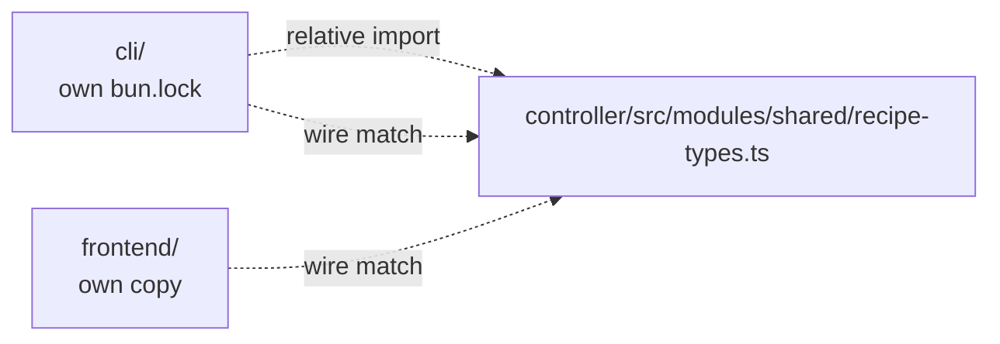

# CLI workspace + the deleted `shared/` package

Two related items: the CLI is a separate workspace with its own
`bun.lock` and `node_modules`, and the previous `shared/` workspace package
was deleted in this PR.

## Both halves

### #15 — CLI workspace

| Path                                              | Notes                                                      |
|---------------------------------------------------|------------------------------------------------------------|
| `cli/package.json` + `cli/bun.lock`               | Independent dependency tree                                 |
| `cli/node_modules/`                               | Independent install                                         |
| `cli/src/...`                                      | Imports `controller/src/modules/shared/recipe-types`        |

The CLI reaches *into* the controller's source tree to grab a type. That
tightly couples the CLI to the controller's filesystem layout while keeping
its package boundary nominally separate.

### #16 — Deleted `shared/` workspace package

Per Chapter 1/2 deletion inventories and `MIGRATION.md`, the previous
`shared/` workspace package was dissolved into
`controller/src/modules/shared/`. As a result there is no published cross‑
runtime types package.

## Why they're duplicate / near‑twin



The CLI and the frontend are **both** consumers of the controller's wire
types. Reaching into a sibling package's `src/` for types is exactly the
problem `shared/` was supposed to solve. Re‑introducing the package fixes
both at once.

## Proposed merger

1. Re‑introduce `shared/` (or `packages/shared/`) per
   [`shared-types-package.md`](./shared-types-package.md).
2. Make `cli/` a workspace member of the same monorepo (root `package.json`
   `workspaces`: `["frontend", "controller", "cli", "shared"]`).
3. CLI imports `@vllm-studio/shared` instead of relative paths into
   `controller/src/`.
4. Delete `cli/bun.lock` and `cli/node_modules/`; one root install pulls
   the dependency graph together.

```mermaid
graph LR
  subgraph "After"
    Pkg[@vllm-studio/shared]
    FE[frontend] --> Pkg
    Ctrl[controller] --> Pkg
    CLI[cli] --> Pkg
  end
```

## Risk + effort

- **Risk: medium.** Bun workspace + npm workspace mismatch is the main
  hazard (`frontend/` uses `npm`, `cli/` uses `bun`). Pick one
  package‑manager‑level workspace tool, and ensure CI installs both
  runtimes.
- **Effort: M.** A focused day to wire workspaces, fix import paths, and
  verify each runtime builds in isolation.

## Cross‑links

- [`shared-types-package.md`](./shared-types-package.md) — the types
  package this depends on.
- Chapter 3 — `cli/index.md` documents the CLI's current standalone setup.
