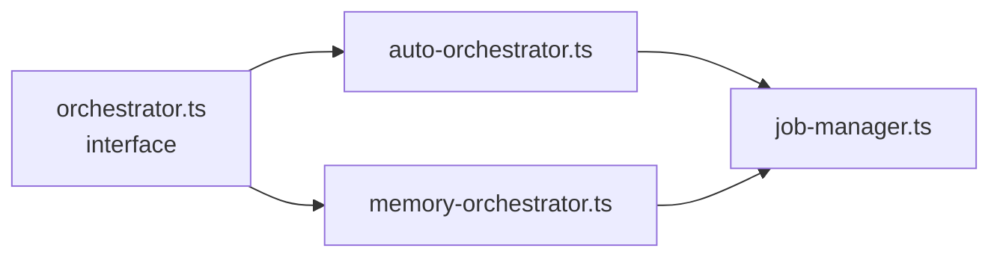

# Collapse the three "orchestrators" in `modules/jobs/`

Three files, all named `*-orchestrator.ts`, with overlapping
responsibilities and ~120 LoC together.

## Both halves

| File                                                  | Stated role                                        | LoC |
|-------------------------------------------------------|----------------------------------------------------|----:|
| `controller/src/modules/jobs/orchestrator.ts`          | Top‑level orchestrator interface                   | ~25 |
| `controller/src/modules/jobs/auto-orchestrator.ts`     | Auto‑run management for a job                      | ~80 |
| `controller/src/modules/jobs/memory-orchestrator.ts`   | In‑memory job tracking                             | ~50 |
| `controller/src/modules/jobs/job-manager.ts`           | The actual `IJobManager` implementation            | ~170 |

CONTROLLER_SCOPE.md §1:

> **Three overlapping "orchestrators"** in `jobs/` (`auto-orchestrator`,
> `memory-orchestrator`, `orchestrator`) — none have a single clear purpose.

## Why they're duplicate / near‑twin



- All three "orchestrators" eventually defer to `JobManager`.
- `JobManager` is itself the only consumer of the `JobStore`; the manager
  + store + interface form one logical unit.
- The agent surface does **not** consume the jobs module today (verified
  in Chapter 2 — `studio-audio-jobs-modules.md`).

## Proposed merger

Two options.

### Option A — Collapse into one helper

```
modules/jobs/
  job-runner.ts   # orchestrator + auto + memory merged. Public API:
                  #   start(input), cancel(id), get(id), list().
  job-store.ts    # absorbed from controller/src/stores/job-store.ts
  routes.ts       # /jobs HTTP (unchanged surface)
```

`job-manager.ts` becomes `job-runner.ts`. Roughly ~80 LoC instead of ~325.

### Option B — Delete the module entirely

If no current consumer exercises `/jobs`, delete the whole module
(routes + orchestrators + manager + store) and remove the route
registration from `http/app.ts`. CONTROLLER_SCOPE.md §6 Phase 1 lists this
as the preferred outcome.

## Risk + effort

- **Risk: low.** Either option is a pure code reduction; the test
  (`routes.test.ts`) lives next to the module and goes with whichever path
  is chosen.
- **Effort: S.** ~½ day for Option A, ~1 hour for Option B.

## Recommendation

**Option B (delete)** unless a frontend feature lights up `/jobs` between
now and the next refactor. The agent surface in this PR does not.

## Cross‑links

- Chapter 2 — `studio-audio-jobs-modules.md`.
- CONTROLLER_SCOPE.md §1 + §6 Phase 1.
- See [`controller-stores-collocation.md`](./controller-stores-collocation.md)
  for what to do with `JobStore` if the module survives.
