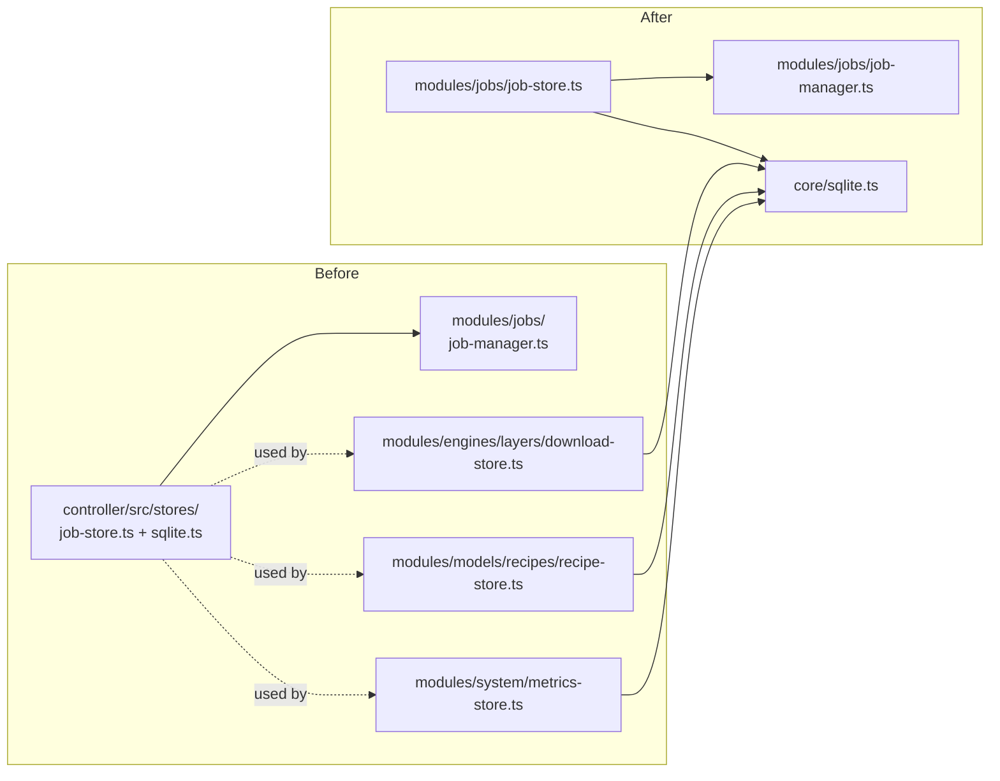

# Controller stores: collocate, then delete the top‑level `stores/`

The controller has a top‑level `controller/src/stores/` directory and a
parallel set of stores that live next to the modules that own them. The
top‑level dir holds two files only.

## Both halves

| Top‑level (`controller/src/stores/`)             | Module‑owned                                                       |
|--------------------------------------------------|--------------------------------------------------------------------|
| `stores/job-store.ts` (~125 LoC)                 | `modules/jobs/job-manager.ts` (the only consumer)                   |
| `stores/sqlite.ts` (~10 LoC, just `openSqliteDatabase`) | imported from many places — but it is one helper line              |
| —                                                | `modules/engines/layers/download-store.ts`                          |
| —                                                | `modules/models/recipes/recipe-store.ts`                            |
| —                                                | `modules/system/metrics-store.ts`                                   |

`controller/src/stores/sqlite.ts` is six lines:

```ts
import { Database } from "bun:sqlite";

export const openSqliteDatabase = (dbPath: string): Database => {
  const db = new Database(dbPath);
  db.run("PRAGMA busy_timeout = 5000");
  return db;
};
```

That belongs in `core/`.

## Why they're duplicate / near‑twin

The naming convention "module‑local store" already exists *everywhere
else*. Only `JobStore` is exiled to a top‑level directory, plus the tiny
sqlite helper. Two locations for one concept.

## Proposed merger

1. Move `stores/job-store.ts` → `modules/jobs/job-store.ts`. Update
   imports in `app-context.ts` and `job-manager.ts` (the only consumers).
2. Move `stores/sqlite.ts` → `core/sqlite.ts`. Keep the API
   (`openSqliteDatabase`) identical so import diffs are mechanical.
3. **Delete `controller/src/stores/`.**



## Risk + effort

- **Risk: low.** Pure renames; type‑check catches all errors.
- **Effort: S.** ~½ day, including running tests.

## Cross‑links

- Chapter 2 — `index.md` and `studio-audio-jobs-modules.md` describe the
  current layout and call this out as anomalous.
- See [`collapse-jobs-orchestrators.md`](./collapse-jobs-orchestrators.md)
  — if `jobs/` itself is deleted, `JobStore` goes with it.
