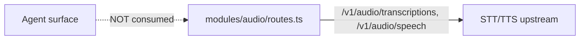

# Delete `controller/src/modules/audio/`

The audio module was supposed to leave in CONTROLLER_SCOPE.md Phase 1.
It is still in the tree.

## Both halves

This is technically a *deletion*, not a merge — but it is in scope because
the module is duplicate effort: nothing on the new agent surface consumes
STT/TTS.

| Path                                                   | LoC | Used by                         |
|--------------------------------------------------------|----:|---------------------------------|
| `controller/src/modules/audio/index.ts`                 |   1 | `http/app.ts` route registration |
| `controller/src/modules/audio/routes.ts`                | ~340 | `http/app.ts`                    |
| `controller/src/modules/audio/routes.test.ts`           | ~310 | jest harness                     |

CONTROLLER_SCOPE.md §6 Phase 1:

> Delete `modules/audio/` (STT/TTS) — move to a separate service if needed.
> Not core to "launch vLLM."

## Why it should go

- The agent surface (Chapter 1) renders chat, files, and a browser pane.
  None of those call audio routes.
- The routes proxy upstream STT/TTS providers; they hold no state, so
  removal is a single PR.
- Tests for the audio routes alone are ~310 LoC of test surface that drags
  the whole module forward.

## Proposed merger

1. Delete `controller/src/modules/audio/` outright.
2. Remove the `registerAudioRoutes(app, context)` call from `http/app.ts`
   (one line).
3. Remove any `engineService.ensureActive(...)` calls inside audio routes
   that no other module needs (they were the only consumer).
4. Update the controller scope tracker in CONTROLLER_SCOPE.md to mark this
   complete.

## Risk + effort

- **Risk: low.** The agent surface does not consume `/v1/audio/*`. If a
  future product needs STT/TTS, the routes can return as a sibling service
  (per CONTROLLER_SCOPE.md).
- **Effort: S.** ~30 minutes; the diff is dominated by deletes.

## Cross‑links

- Chapter 2 — `studio-audio-jobs-modules.md` documents the current state.
- CONTROLLER_SCOPE.md §6 Phase 1 — pre‑approved deletion.
