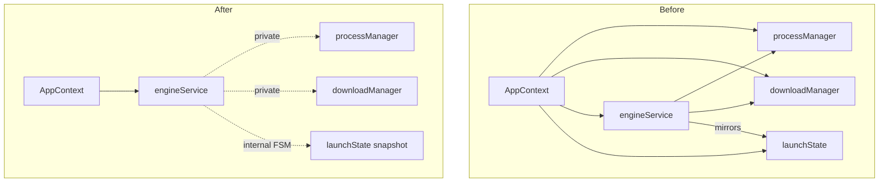

# Engine state machine layers

Two related cleanups: (a) `launchState` duplicates information already
present in the engine state machine, and (b) `processManager` /
`downloadManager` are still on `AppContext` even though `engineService`
already wraps them.

## Both halves

### #6 — `launch-state.ts` vs `engine-coordinator.ts` internal state

| File                                                                   | Tracks                                          | LoC |
|------------------------------------------------------------------------|-------------------------------------------------|----:|
| `controller/src/modules/engines/layers/launch-state.ts`                | `{ phase: idle\|launching\|preempting; recipeId }` | ~95 |
| `controller/src/modules/engines/layers/engine-coordinator.ts`           | The full engine FSM (with its own `launching` state and recipe payload) | ~580 |

`launchState` is exposed *separately* on `AppContext.launchState`:

```ts
// controller/src/types/context.ts
export interface AppContext {
  …
  launchState: LaunchState;
  engineService: EngineCoordinator;
  …
}
```

But `EngineCoordinator` already knows when it is launching — it is the only
caller that ever moves the launch state into "launching" or back to "idle".
The standalone `launchState` is a downstream cache.

### #7 — `processManager` / `downloadManager` exposed alongside `engineService`

```ts
// controller/src/types/context.ts
processManager: ProcessManager;     // legacy
downloadManager: DownloadManager;   // legacy
engineService: EngineCoordinator;   // wraps both
```

`MIGRATION.md` Phase 1 explicitly says:

> `processManager` and `downloadManager` remain in AppContext for backward
> compatibility with consumers not yet migrated.

## Why they're duplicate / near‑twin

- **#6.** A snapshot of "currently launching recipe id" lives in *both*
  `launchState` and the engine machine. Frontend reads `launchState`;
  internal logic reads the FSM. They cannot disagree today only because
  `engine-coordinator.ts` carefully calls `launchState.markLaunching(...)`
  on every transition. That is exactly the kind of "two writers, one truth"
  setup that drifts the moment someone forgets a callsite.
- **#7.** Every consumer that should be using `engineService` and still
  reaches into `processManager` / `downloadManager` is by definition a
  half‑migrated callsite. Each one is a chance for the lifecycle invariants
  encoded in `EngineCoordinator` (e.g. the `switchLock`) to be bypassed.

## Proposed merger

### #6 — derive `launchState` from `engineService.getState()`

1. Add a `getState()` accessor on `EngineCoordinator` that exposes the FSM
   snapshot (the structure already exists internally).
2. Replace `AppContext.launchState` with a thin selector
   `getLaunchingRecipeId(ctx)` that reads
   `ctx.engineService.getState()`.
3. Delete `controller/src/modules/engines/layers/launch-state.ts`.
4. Frontend `LAUNCH_PROGRESS` events already carry the recipe id, so the
   wire format does not change.

### #7 — finish the migration

1. `grep -r processManager controller/src` and
   `grep -r downloadManager controller/src` — every hit outside
   `engine-coordinator.ts` is a holdout.
2. Move each holdout to call `engineService.{cancelLaunch, …}` instead.
3. Remove `processManager` and `downloadManager` from `AppContext`. They
   become *internal* dependencies of `createEngineCoordinator(...)` only.



## Risk + effort

- **Risk: medium.** `launchState` has many readers; converting them to a
  selector touches a handful of routes. The `processManager` removal will
  reveal callers that took shortcuts (intentionally or not).
- **Effort: M.** A focused day or two. `bun test` covers most lifecycle
  paths; `engine-coordinator.test.ts` is the safety net.

## Cross‑links

- Chapter 2 — `engines-module.md` documents the FSM.
- Chapter 6 — `engine-coordinator.ts` is one of the largest files in the
  controller; this merge slightly reduces its public surface.
- `MIGRATION.md` — names this work as "Phase 1 backward compatibility" that
  was deferred.
