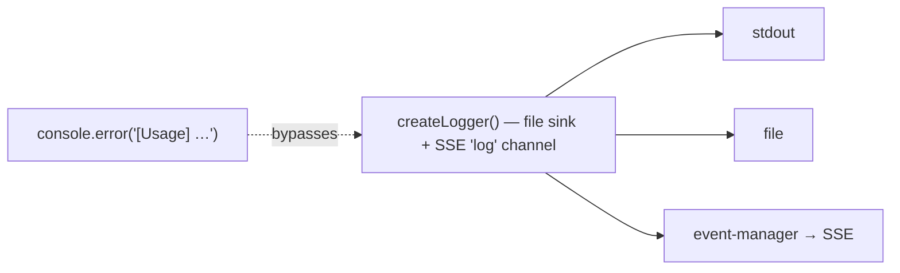

# One logger, no `console.*` sprinkles

The controller has a structured logger and a log‑file helper. A handful of
modules still call `console.*` directly.

## Both halves

| File                                           | Surface                                       | LoC |
|------------------------------------------------|-----------------------------------------------|----:|
| `controller/src/core/logger.ts`                 | `createLogger({ level, filePath, onLine })`   | ~95 |
| `controller/src/core/log-files.ts`              | `primaryLogPathFor`, `tailFileLines`, …       | ~140 |
| Residual `console.*` calls (verified)           |                                               |     |
| ↳ `controller/src/core/logger.ts:83-95`         | `console.{info,warn,error}` *inside* the logger itself (the sink). Acceptable. |
| ↳ `controller/src/modules/system/usage-routes.ts:35` | `console.error("[Usage] Error fetching usage stats:", error)` |
| ↳ `controller/src/modules/system/usage/chat-database.ts:526` | `console.error("[Usage] Error fetching usage stats from chats DB:", error)` |

Two ad‑hoc `console.error` calls in `system/usage/`. Everything else
already routes through the structured logger.

## Why they should merge



- The structured logger publishes to the SSE `log` channel; ad‑hoc
  `console.*` calls are invisible to the frontend log viewer.
- Each ad‑hoc call duplicates the `[Tag]` prefix that the logger already
  applies.

## Proposed merger

1. Each module that needs to log already has access to `ctx.logger` via
   `AppContext`. The `system/usage/` files own their `chatDb` consumer; pass
   the logger in or read it through the route handler closure.
2. Replace:

   ```ts
   console.error("[Usage] Error fetching usage stats:", error);
   ```

   with:

   ```ts
   ctx.logger.error("Usage stats fetch failed", { error });
   ```

3. Add a tiny lint rule (or a CI grep) that fails on
   `console\.(log|info|warn|error)` outside `core/logger.ts`.

## Risk + effort

- **Risk: low.** Two callsites; the change is mechanical.
- **Effort: S.** ~15 minutes plus the lint rule.

## Cross‑links

- Chapter 2 — `index.md` describes the logger.
- See [`metrics-and-usage-collapse.md`](./metrics-and-usage-collapse.md) —
  if `chat-database.ts` is deleted as part of the usage merge, one of the
  two callsites disappears for free.
