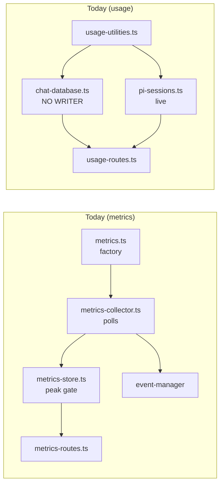
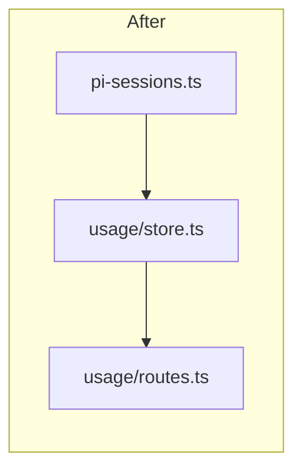

# Metrics + usage: collapse the parallel surfaces

Two related collapses in `controller/src/modules/system/`:

## Both halves

### #8 — Metrics quartet

| File                                                  | Role                                              | LoC |
|-------------------------------------------------------|---------------------------------------------------|----:|
| `system/metrics.ts`                                    | Counter / gauge factory + `prom-client` registry  | ~150 |
| `system/metrics-store.ts`                              | Sqlite‑persisted peak + lifetime metrics          | ~190 |
| `system/metrics-routes.ts`                             | `/metrics`, `/peak`, `/lifetime` HTTP handlers    | ~140 |
| `system/metrics-collector/metrics-collector.ts` (+ siblings) | 5s polling loop publishing to event manager       | ~360 |

CONTROLLER_SCOPE.md §6 Phase 2 explicitly proposes:

> Merge `metrics.ts` + `metrics-store.ts` + `metrics-collector.ts` into
> `telemetry/collector.ts` + `telemetry/metrics-store.ts`.

### #9 — Usage triad

| File                                                     | Source                                        | Status                                                   | LoC |
|----------------------------------------------------------|-----------------------------------------------|----------------------------------------------------------|----:|
| `system/usage/chat-database.ts`                           | Legacy `chat_*` tables (sqlite)               | Has **no writer** in this branch (chat module deleted)   | ~520 |
| `system/usage/pi-sessions.ts`                             | Pi agent session JSON files                   | The live ingestion path                                   | ~280 |
| `system/usage/usage-utilities.ts`                         | Aggregation helpers                           | Used by both                                              | ~50 |
| `system/usage-routes.ts`                                  | `/usage` HTTP handlers                        | Multiplexes the two sources                               | ~50 |

## Why they're duplicate / near‑twin



- **Metrics**: four files coordinate to do one job (collect → gate → emit →
  serve). The peak‑gate logic lives in the collector
  (`generationThroughput > 5`) but that decision belongs in the store, per
  CONTROLLER_SCOPE.md §3 Phase 3.
- **Usage**: two parallel "usage" stores share aggregation utilities. The
  legacy chat reader is dead (no chat writer ships in this branch), but its
  reader code is still wired into `/usage` responses.

## Proposed merger

### Metrics → 2 files

```
system/
  metrics-store.ts     # peak gate + lifetime counters (sqlite). Owns updateIfBetter().
  metrics-collector.ts # combines metrics.ts factory + polling + emission. Reads metrics-store.
  routes.ts            # absorb metrics-routes.ts; fold into the existing system/routes.ts
```

- Delete `metrics.ts` (its factory becomes private inside the collector).
- Delete `metrics-routes.ts` (~140 LoC) and inline into `routes.ts`.
- Move the peak gate from collector → `metrics-store.updateIfBetter`.

Estimated LoC saved: ~200, plus a clearer responsibility boundary.

### Usage → one store, two ingestion paths

```
system/usage/
  store.ts        # sqlite schema + read API. Owns aggregation helpers.
  pi-sessions.ts  # ingests pi session files → store.
  routes.ts       # absorbs system/usage-routes.ts
```

- Delete `chat-database.ts` (no writer; ~520 LoC of dead code path).
  Aggregation utilities for the legacy schema move to `store.ts` *only* if
  any historic data needs to be readable; otherwise dropped.
- Delete `usage-utilities.ts` (its helpers are tiny; inline).
- The `/usage` routes file becomes a thin handler over `store.read*()`.



## Risk + effort

- **Risk: medium.**
  - Metrics: behavioural change is small (the peak gate moves) but every
    metric currently emitted must continue to emit. Easy to verify with the
    frontend dashboard pages.
  - Usage: deleting `chat-database.ts` is safe *if* the API never returns
    legacy chat rows in production; verify by booting against an existing
    sqlite db.
- **Effort: M.** Two days total: one for metrics, one for usage. Both are
  pure restructuring with type‑level checks for safety.

## Cross‑links

- Chapter 2 — `system-module.md` lists every file we're collapsing.
- CONTROLLER_SCOPE.md §6 Phase 2/3 — these merges are pre‑approved
  refactors.
