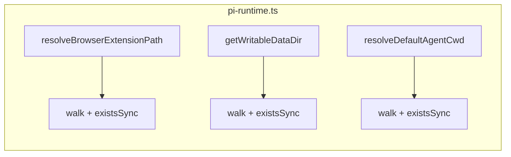

# `pi-runtime.ts`: extract a `firstExisting()` helper

`frontend/src/lib/agent/pi-runtime.ts` contains three near‑identical "walk
a candidate list and return the first that exists" loops.

## Both halves

The three offending blocks (verified):

```ts
// resolveBrowserExtensionPath()
const candidates = [
  process.env.VLLM_STUDIO_BROWSER_EXTENSION_PATH,
  process.resourcesPath ? path.join(process.resourcesPath, "desktop", …) : null,
  path.resolve(process.cwd(), "frontend", "desktop", …),
  path.resolve(process.cwd(), "desktop", …),
  path.resolve(process.cwd(), "..", "frontend", "desktop", …),
].filter((value): value is string => Boolean(value));
for (const candidate of candidates) {
  if (existsSync(candidate)) return candidate;
}
return null;
```

```ts
// getWritableDataDir()
const candidates = [
  process.env.VLLM_STUDIO_DATA_DIR,
  path.join(process.cwd(), "data"),
  path.join(process.cwd(), "..", "data"),
  path.join(process.cwd(), "frontend", "data"),
  path.join(homedir(), ".vllm-studio"),
  path.join(tmpdir(), "vllm-studio"),
].filter((dir): dir is string => Boolean(dir));
for (const candidate of candidates) {
  if (existsSync(candidate)) return candidate;
}
return candidates[0] ?? path.join(tmpdir(), "vllm-studio");
```

```ts
// resolveDefaultAgentCwd() — same shape, slightly different fallback
const projects = listProjectsFromStore();
const usable = projects.find((entry) => entry.exists);
if (usable) return usable.path;
// (cwd / homedir fallback)
```

## Why they're duplicate / near‑twin



The "first existing entry from a candidate list" pattern repeats three
times. The fallbacks differ slightly (one returns `null`, another returns
the first candidate, the third returns `homedir()`), but the core loop is
the same.

## Proposed merger

```ts
function firstExisting(
  candidates: ReadonlyArray<string | null | undefined>,
): string | null {
  for (const candidate of candidates) {
    if (typeof candidate === "string" && candidate && existsSync(candidate)) {
      return candidate;
    }
  }
  return null;
}
```

Each callsite becomes a single line:

```ts
function resolveBrowserExtensionPath(): string | null {
  return firstExisting([
    process.env.VLLM_STUDIO_BROWSER_EXTENSION_PATH,
    process.resourcesPath
      ? path.join(process.resourcesPath, "desktop", "resources", "pi-extensions", "browser.ts")
      : null,
    path.resolve(process.cwd(), "frontend", "desktop", "resources", "pi-extensions", "browser.ts"),
    path.resolve(process.cwd(), "desktop", "resources", "pi-extensions", "browser.ts"),
    path.resolve(process.cwd(), "..", "frontend", "desktop", "resources", "pi-extensions", "browser.ts"),
  ]);
}

function getWritableDataDir(): string {
  return firstExisting([
    process.env.VLLM_STUDIO_DATA_DIR,
    path.join(process.cwd(), "data"),
    path.join(process.cwd(), "..", "data"),
    path.join(process.cwd(), "frontend", "data"),
    path.join(homedir(), ".vllm-studio"),
    path.join(tmpdir(), "vllm-studio"),
  ]) ?? path.join(tmpdir(), "vllm-studio");
}
```

`resolveDefaultAgentCwd()` keeps its bespoke fallback chain but uses
`firstExisting` for any list‑style steps.

## Risk + effort

- **Risk: low.** Pure refactor; behaviour preserved.
- **Effort: S.** ~10 minutes.

## Cross‑links

- Chapter 1 — `pi-runtime.md` documents the runtime resolver.
