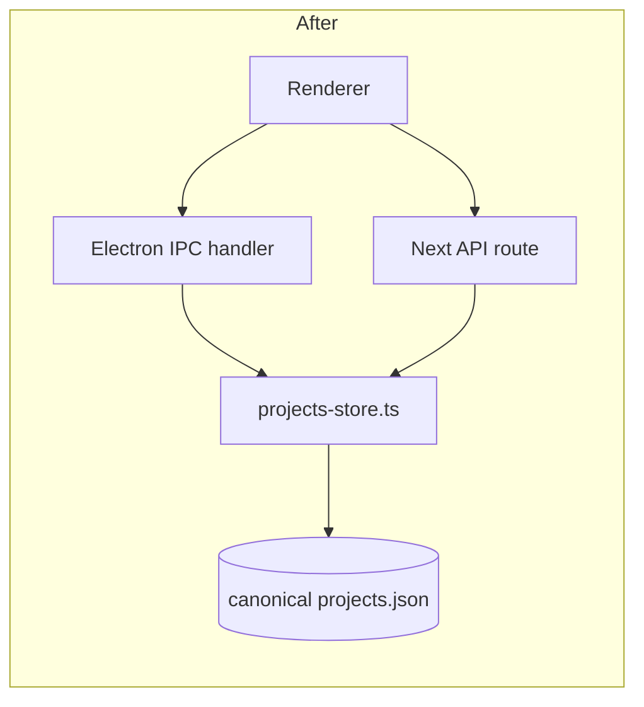

# Unify the two `projects-store` implementations

Two parallel filesystem stores both write a JSON file containing the same
shape (`{ projects: ProjectRecord[] }`). The renderer talks to whichever one
is reachable.

## Both halves

| File                                                       | Runtime           | Path it writes to                                              | LoC |
|------------------------------------------------------------|-------------------|----------------------------------------------------------------|----:|
| `frontend/desktop/logic/projects-store.ts`                 | Electron main     | `app.getPath("userData")/projects.json`                         | ~150 |
| `frontend/src/lib/agent/projects-store.ts`                 | Next server route | `<repo>/data/agentfs/projects.json` (resolved from `cwd`)       | ~150 |

Both expose the same operations with slightly different naming:

```ts
// Electron
listProjectsWithMeta() / addProject(rawPath) / removeProject(id)
// Next server
listProjectsFromStore() / addProjectToStore(rawPath) / removeProjectFromStore(id)
```

Both contain *literally identical* helper functions: `gitBranchFor()`,
`basenameOf()`, `isExistingDirectory()`, `newProjectId()`,
`readDocument()`, `writeDocument()`. The only structural difference is the
path resolver and the meta‑shape (`ProjectListEntry` vs `ProjectEntry` —
same fields, different name).

## Why they're duplicate / near‑twin

```mermaid
graph TD
  Renderer[Renderer / browser] -- IPC --> Electron[projects-store.ts (Electron)]
  Renderer -- HTTP --> Next[projects-store.ts (Next server)]
  Electron --> A[(userData/projects.json)]
  Next --> B[(data/agentfs/projects.json)]
  A -. content drifts .- B
```

Two independent JSON files mean two sources of truth. In Electron the
renderer prefers the IPC path; on the local Next dev server the API route
path is used. A user who launches both during development gets two
non‑mirrored project lists.

## Proposed merger

**Pick one canonical writer.** Two options; pick one.

### Option A — Electron writes; Next server reads from the same file

The Electron `userData` location is the canonical store. The Next server
(when running outside Electron, e.g. dev mode) reads/writes the same path,
resolved via env var:

```ts
// shared resolver
function projectsFilePath(): string {
  if (process.env.VLLM_STUDIO_PROJECTS_FILE) return process.env.VLLM_STUDIO_PROJECTS_FILE;
  if (typeof process.versions === "object" && "electron" in process.versions) {
    return path.join(app.getPath("userData"), "projects.json");
  }
  return path.resolve(process.cwd(), "..", "data", "agentfs", "projects.json");
}
```

### Option B — Next server is canonical; Electron forwards via HTTP

Drop the Electron file write entirely. Renderer always calls
`/api/agent/projects`, the Next server (which Electron embeds) writes the
file. One code path.

### Recommended consolidated module

```ts
// frontend/src/lib/agent/projects-store.ts
export interface ProjectEntry { /* ... unchanged ... */ }
export function listProjectsFromStore(): ProjectEntry[];
export function addProjectToStore(rawPath: string): ProjectEntry;
export function removeProjectFromStore(id: string): void;
```

Both Electron IPC handlers and Next API routes call this single module.



## Risk + effort

- **Risk: medium.** The renderer detects Electron at runtime and switches
  paths; merging the two stores forces a single resolver. Test both
  Electron‑packaged and bare Next‑dev startup paths.
- **Effort: M.** One day to extract the shared module, wire it up to both
  callers, and migrate any pre‑existing `userData/projects.json` content
  into the new canonical location (or vice versa) on first run.

## Cross‑links

- Chapter 1 — `agent-workspace-deep-dive.md` documents the renderer's
  Electron‑vs‑HTTP detection.
- Chapter 4 — `electron-desktop.md` describes the Electron data layout.
