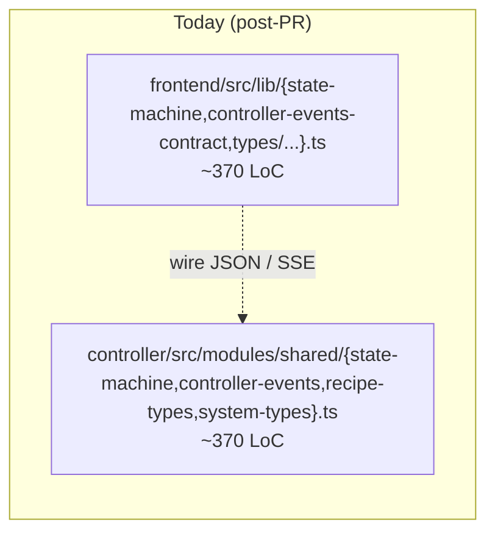
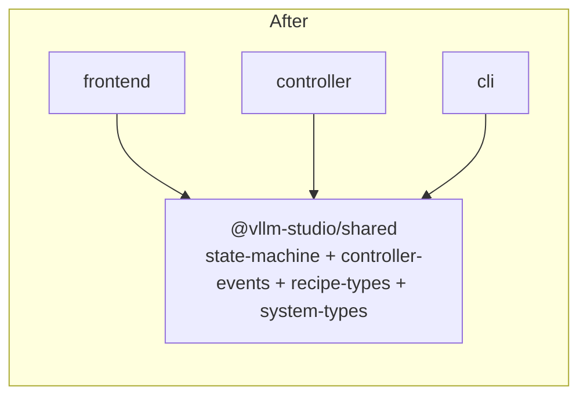

# Re‑introduce a tiny `@vllm-studio/shared` types package

The branch dissolved the previous `shared/` workspace package and pasted four
of its modules into `controller/src/modules/shared/`. The frontend keeps its
own copies under `frontend/src/lib/`. Across the four files, the contents
are *byte‑for‑byte equivalent* (controller ↔ frontend) — they are the wire
contract between the two runtimes and any drift becomes a runtime bug.

## Both halves

| Topic                | Frontend file                                                | Controller file                                       | LoC (each) | State                  |
|----------------------|--------------------------------------------------------------|-------------------------------------------------------|-----------:|------------------------|
| State‑machine helper | `frontend/src/lib/state-machine.ts`                          | `controller/src/modules/shared/state-machine.ts`      |        ~50 | **Identical** (verified) |
| Controller events    | `frontend/src/lib/controller-events-contract.ts`             | `controller/src/modules/shared/controller-events.ts`  |       ~120 | Identical structure; same constants |
| Recipe types         | `frontend/src/lib/types/recipes/recipes.ts` (subset)         | `controller/src/modules/shared/recipe-types.ts`       |        ~80 | `Backend` + `RecipeBase` are field‑for‑field identical; downloads also mirror |
| System types         | `frontend/src/lib/types/system/config.ts` (subset)           | `controller/src/modules/shared/system-types.ts`       |       ~120 | Identical structure (frontend has a few extra UI‑only types) |

The controller side already pretends this is "shared" — the directory is
literally named `modules/shared/`. It is "shared" only by accident: nothing
outside the controller reads from it.

## Why they're duplicate / near‑twin



- The wire format is the same → the types must be the same.
- The state‑machine helper is pure (no runtime deps) → there is no reason it
  should exist twice.
- The previous repo *already had* a `shared/` workspace package; the PR
  removed it explicitly. Reverting that part of the move is the cheapest
  fix.

## Proposed merger

Re‑add a workspace package `shared/` (or `packages/shared/`) with **only
types and pure helpers**:

```
shared/
  package.json          # name: @vllm-studio/shared, no runtime deps
  src/
    state-machine.ts    # one copy
    controller-events.ts
    recipe-types.ts
    system-types.ts
    index.ts            # barrel
```

Both runtimes consume it:

```ts
// controller/src/modules/engines/layers/launch-state.ts
import { createStateMachine } from "@vllm-studio/shared";

// frontend/src/hooks/use-machine.ts
import type { StateMachineContainer } from "@vllm-studio/shared";

// controller/src/contracts/controller-events.ts (delete or shrink to a re-export)
export * from "@vllm-studio/shared/controller-events";
```



CLI already imports `controller/src/modules/shared/recipe-types` directly
(see #15) — moving these to a real package fixes that too.

## Risk + effort

- **Risk: low** for `state-machine.ts` (no exports outside the module). The
  events table and recipe/system types touch many call sites, but the
  *content* doesn't change — only import paths do. Type‑level breakage will
  surface at compile time.
- **Effort: M.** One day to set up the package, rewire imports, and run
  full type‑check on both runtimes.
- The frontend `RecipeEditor` / `RecipeWithStatus` types stay frontend‑only
  (they encode UI‑only concerns); only `Backend` + `RecipeBase` move.

## Cross‑links

- Chapter 6 — `controller-events-contract.ts` shows up as a "duplicated
  protocol" hot‑spot.
- Chapter 7 — none of these files need to be split; they need to merge.
- See [`cli-workspace-integration.md`](./cli-workspace-integration.md) for
  the CLI side.
