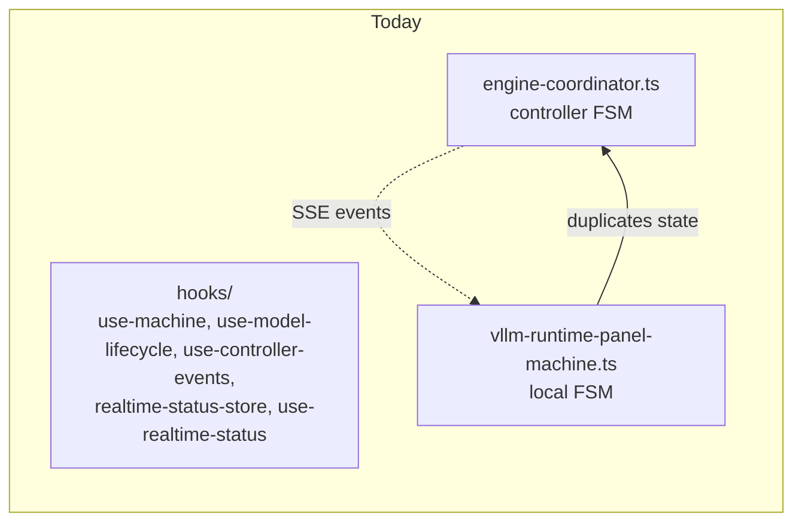
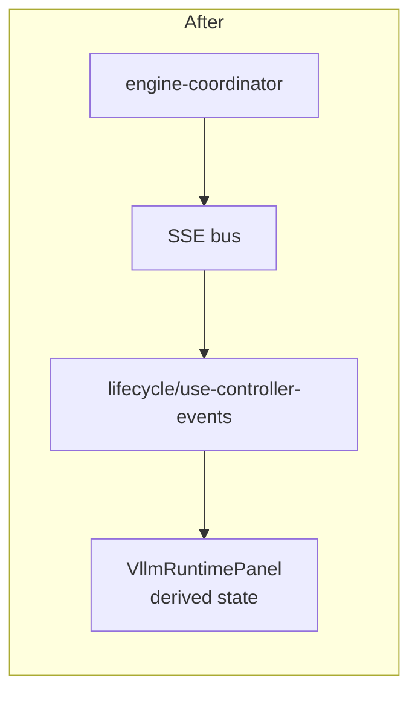

# UI hooks: cohesion + drift removal

Two related items: (a) co‑locate the lifecycle hooks; (b) derive the
`vllm-runtime-panel-machine` from controller events instead of re‑declaring
its states locally.

## Both halves

### #10 — `use-machine.ts` and `use-model-lifecycle.ts`

| File                                                       | Role                                               | LoC |
|------------------------------------------------------------|----------------------------------------------------|----:|
| `frontend/src/hooks/use-machine.ts`                         | Generic `useMachine(machine, context)` wrapper     | ~30 |
| `frontend/src/hooks/use-model-lifecycle.ts`                 | Domain‑specific lifecycle hook (status, start/stop) | ~95 |
| `frontend/src/hooks/use-controller-events.ts`               | SSE subscription                                    | ~60 |
| `frontend/src/hooks/use-controller-events/`                 | Helpers split from the above                        | ~150 |
| `frontend/src/hooks/realtime-status-store.ts`               | Zustand store backing `useRealtimeStatus`           | ~280 |

These all collaborate: SSE → `realtime-status-store` → `use-realtime-status`
→ `use-model-lifecycle`. They live as siblings under `hooks/` with no
visible grouping.

### #11 — `vllm-runtime-panel-machine.ts` vs controller events

| File                                                                              | Role                                            |
|-----------------------------------------------------------------------------------|-------------------------------------------------|
| `frontend/src/app/recipes/_components/vllm-runtime-panel-machine.ts` (~340 LoC)   | Frontend state machine for the runtime panel    |
| `controller/src/modules/engines/layers/engine-coordinator.ts` (engine FSM)        | Authoritative server‑side lifecycle FSM         |

The frontend machine encodes its own version of "which runtimes are
upgrading / which versions are installed / which is the current selection".
The controller already emits `runtime_*_upgraded`, `runtime_summary`, and
`launch_progress` events that contain everything the panel needs.

## Why they're duplicate / near‑twin



- The hooks family is one logical layer (SSE → store → React) presented as
  six unrelated files in `hooks/`.
- The runtime‑panel machine *re‑implements* a subset of the controller's
  FSM, with its own `RuntimePanelState`, `RuntimePanelRuntimePayload`, etc.
  Drift risk: when the controller adds a runtime kind (e.g. `exllamav3`),
  the panel must independently learn about it.

## Proposed merger

### Co‑locate the lifecycle hooks

```
frontend/src/hooks/lifecycle/
  index.ts                  # barrel
  use-machine.ts            # moved
  use-model-lifecycle.ts    # moved
  use-controller-events.ts  # moved
  use-realtime-status.ts    # moved
  realtime-status-store.ts  # moved
```

This is a pure rename with no behavioural change; touchups are limited to
import paths. It signals the boundary clearly and makes the file split in
Chapter 7 (Zustand slices) easier to find.

### Derive the runtime‑panel machine from controller events

1. Define the panel's React state as a *projection* of the SSE payloads:

   ```ts
   interface RuntimePanelState {
     runtimes: SystemRuntimeInfo["backends"]; // from `runtime_summary`
     upgrading: RuntimeBackendKind | null;    // from `runtime_*_upgraded` events
     upgradeResult: UpgradeResultState | null; // from `runtime_*_upgraded` payload
   }
   ```

2. Replace the bespoke FSM with a `useReducer` driven by `useControllerEvents`:

   ```ts
   const events = useControllerEvents();
   const state = useMemo(() => projectRuntimePanelState(events), [events]);
   ```

3. Delete `vllm-runtime-panel-machine.ts` (~340 LoC).



## Risk + effort

- **Risk: medium.** The panel machine is the most complex piece of frontend
  state in this PR. Re‑expressing it as a projection requires checking every
  state transition against an event sequence.
- **Effort: M.** A focused day for the co‑location move (#10), a couple of
  days for the projection rewrite (#11). The hook tests
  (`use-model-lifecycle.test.ts`) can be reused as the safety net.

## Cross‑links

- Chapter 1 — `stores-and-state.md` lists the hook family.
- Chapter 7 — proposes splitting `realtime-status-store.ts` into Zustand
  slices; this co‑location supports that.
- See [`shared-types-package.md`](./shared-types-package.md) — once the
  state‑machine helper is shared, the panel machine's deletion gets even
  cheaper.
