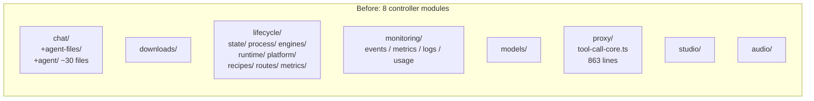
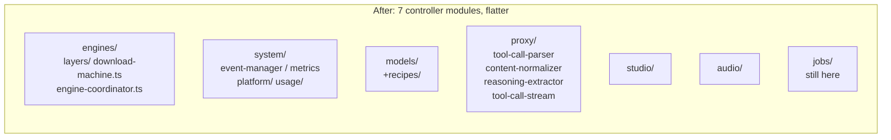

# Architecture After This PR

The big shift: the controller stops trying to *be* a coding agent. It becomes a thin OpenAI-compatible proxy and engine orchestrator. The Next.js frontend becomes the agent host — it spawns the `pi` binary as a subprocess (`pi-runtime.ts`) and talks to it over JSON-RPC on stdio.

## Topology

```mermaid
graph TB
    subgraph Desktop[Electron Desktop App]
        MainProc[Electron main.ts<br/>process.platform=darwin]
        WebView[BrowserWindow<br/>Next.js renderer]
        Preload[preload.ts<br/>desktop:* IPC bridge]
        ProjectsStore[projects-store.ts<br/>~/.vllm-studio/projects.json]
        MainProc --> WebView
        MainProc --> Preload
        MainProc --> ProjectsStore
    end

    subgraph Frontend[Next.js Frontend :3000]
        AgentUI[app/agent/_components<br/>AgentWorkspace + ChatPane]
        AgentAPI[app/api/agent/*<br/>turn / sessions / fs / browser / abort]
        PiRuntime[lib/agent/pi-runtime.ts<br/>PiRpcSession]
        ProxyAPI[app/api/proxy/[...path]<br/>OpenAI compat]
    end

    subgraph PiBinary[pi subprocess]
        PiCore[pi --mode rpc<br/>per session/cwd]
        BrowserExt[browser.ts extension<br/>HTTP -> /api/agent/browser/*]
    end

    subgraph Controller[Bun controller :8080]
        EngineSvc[modules/engines/<br/>EngineService coordinator]
        Proxy[modules/proxy/<br/>OpenAI passthrough]
        System[modules/system/<br/>events / metrics / logs / usage]
        Models[modules/models/<br/>recipes + browser]
        Studio[modules/studio/]
    end

    subgraph Backends[Inference Backends]
        vLLM[vLLM :8000]
        SGLang[SGLang]
        Llama[llama.cpp]
    end

    WebView -->|HTTP| AgentAPI
    AgentAPI --> PiRuntime
    PiRuntime -->|spawn stdio JSON| PiCore
    PiCore -->|HTTP /v1/chat/completions| ProxyAPI
    ProxyAPI -->|proxy| Proxy
    PiCore -.->|--extension| BrowserExt
    BrowserExt -->|HTTP| AgentAPI

    Proxy -->|OpenAI| vLLM
    Proxy -->|OpenAI| SGLang
    Proxy -->|OpenAI| Llama
    EngineSvc -->|spawn / signal| vLLM
    EngineSvc -->|spawn / signal| SGLang
    EngineSvc -->|spawn / signal| Llama

    WebView -->|SSE| System
    WebView -->|HTTP| EngineSvc
```

## Three runtimes, three responsibilities

| Runtime | Process | Responsibility |
|---|---|---|
| **Controller** (Bun) | `bun controller/src/main.ts`, port 8080 | Launch/stop/monitor inference backends, OpenAI-compatible proxy, telemetry SSE, recipes, model downloads |
| **Frontend** (Next.js) | `next start`, port 3000 (3001 in dev) | Renders UI, hosts pi-runtime per session, exposes `/api/agent/*` to renderer and to pi browser extension |
| **Pi** (Node) | `pi --mode rpc --session <uuid>`, spawned per session | Runs the actual coding agent loop with filesystem/exec/browser tools, talks OpenAI to the proxy |

## What got merged together

Two diagrams of the controller before/after capture the dominant structural change.





The frontend mirror change: the entire `app/chat/` (159 files) is replaced by `app/agent/` (7 files in `_components` + 9 thin API routes), with state moved into `lib/agent/*` stores.
